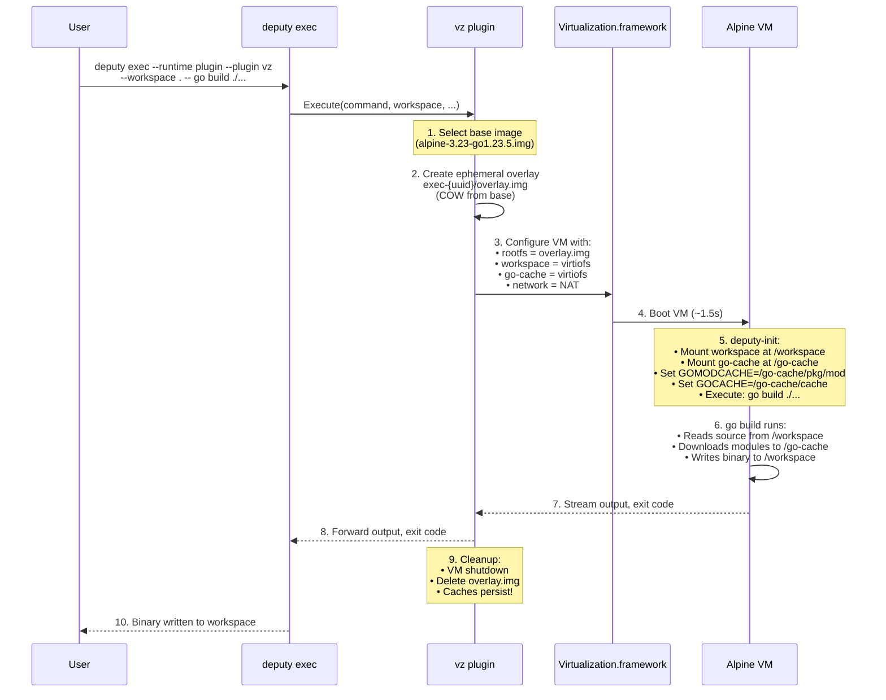
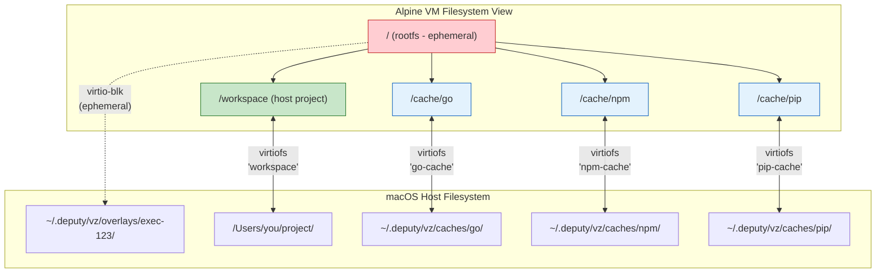

# Deputy VZ Plugin Architecture

## Executive Summary

This document proposes a redesigned architecture for Deputy's VZ (Virtualization.framework) sandbox plugin that provides Docker-like ephemeral execution with persistent layer caching for developer toolchains (Go, npm, Python, etc.).

## Goals

1. **Ephemeral by Default**: Each `deputy exec` starts from a clean, reproducible state (like Docker)
2. **Fast Toolchain Caching**: Go modules, npm packages, pip wheels persist across executions
3. **Developer-Friendly**: Seamless experience for `go build`, `npm install`, `pip install`
4. **Secure**: VM-level isolation with minimal attack surface
5. **Efficient**: Sub-second start times after initial setup

## Current State vs Proposed

| Aspect | Current | Proposed |
|--------|---------|----------|
| Rootfs behavior | Persistent (accumulates state) | Ephemeral (COW from base) |
| Toolchain caches | Persist in rootfs | Separate persistent volume |
| Go module cache | `/root/go/pkg/mod` in rootfs | Dedicated cache volume |
| npm cache | `/root/.npm` in rootfs | Dedicated cache volume |
| Reproducibility | Poor (state drifts) | High (clean base each time) |
| Disk usage | Single 8GB image | Base + overlay + caches |

## Architecture Overview

```
┌─────────────────────────────────────────────────────────────────────────────┐
│                           Deputy VZ Storage Model                            │
├─────────────────────────────────────────────────────────────────────────────┤
│                                                                              │
│  ~/.deputy/vz/                                                               │
│  ├── bases/                          # Immutable base images (like Docker)   │
│  │   ├── alpine-3.23-go1.23.5.img    # Base with Go toolchain               │
│  │   ├── alpine-3.23-node22.img      # Base with Node.js                    │
│  │   └── alpine-3.23-minimal.img     # Minimal base                         │
│  │                                                                           │
│  ├── overlays/                       # Per-execution ephemeral layers        │
│  │   └── exec-{uuid}/                # Created at exec start, deleted after  │
│  │       └── overlay.img             # COW overlay (qcow2 or APFS clone)     │
│  │                                                                           │
│  ├── caches/                         # Persistent toolchain caches           │
│  │   ├── go/                         # Go caches (mounted as virtio-fs)      │
│  │   │   ├── pkg/mod/                # GOMODCACHE                           │
│  │   │   └── cache/                  # GOCACHE                              │
│  │   ├── npm/                        # npm cache                            │
│  │   │   └── .npm/                   # npm cache directory                  │
│  │   └── pip/                        # pip cache                            │
│  │       └── .cache/pip/             # pip cache directory                  │
│  │                                                                           │
│  └── kernel/                         # Shared kernel assets                  │
│      ├── vmlinuz                     # Linux kernel                         │
│      └── initrd.img                  # Initramfs                            │
│                                                                              │
└─────────────────────────────────────────────────────────────────────────────┘
```

## Execution Flow



## Storage Strategies

### Option A: QCOW2 with Backing Files (Recommended for Now)

Uses QCOW2's native COW support. Requires converting base images to qcow2 format.

```bash
# Create base image (one-time)
qemu-img create -f qcow2 bases/alpine-go.qcow2 8G
# ... populate with Alpine + Go ...

# Per-execution overlay (instant, ~sparse file)
qemu-img create -f qcow2 -b bases/alpine-go.qcow2 -F qcow2 overlays/exec-123/overlay.qcow2

# VM sees overlay.qcow2 as its rootfs
# Writes go to overlay, reads fall through to base
```

**Pros:**
- Native COW support in qcow2 format
- Lima uses this approach (proven)
- Works with go-qcow2reader library

**Cons:**
- Requires qemu-img or native qcow2 creation
- Slightly more complex disk attachment

### Option B: APFS Clonefile (macOS-native)

Uses macOS's copy-on-write clonefile syscall for instant copies.

```bash
# Create base image (one-time)
# ... same as current rootfs.img ...

# Per-execution overlay (instant copy via clonefile)
cp -c bases/alpine-go.img overlays/exec-123/rootfs.img

# VM sees rootfs.img as its rootfs
# macOS APFS handles COW at filesystem level
```

**Pros:**
- Native macOS, no external tools
- Works with raw ext4 images
- Simple to implement

**Cons:**
- Only works on APFS volumes
- Full file appears in disk usage (even if sparse)
- Not portable to Linux hosts (future)

### Option C: Overlay Filesystem in Guest (Like Docker)

Mount base read-only, overlay filesystem on top.

```bash
# Two separate images attached to VM:
# /dev/vda = base image (read-only)
# /dev/vdb = overlay image (read-write, small)

# In VM initrd:
mount -t ext4 -o ro /dev/vda /lower
mount -t ext4 /dev/vdb /upper-work
mkdir -p /upper-work/upper /upper-work/work
mount -t overlay overlay -o lowerdir=/lower,upperdir=/upper-work/upper,workdir=/upper-work/work /merged
switch_root /merged /deputy-init
```

**Pros:**
- Most Docker-like behavior
- True overlay semantics
- Works with raw images

**Cons:**
- Requires overlayfs in kernel (need to verify Alpine kernel)
- More complex initrd logic
- Two disk attachments per execution

### Recommendation

**Phase 1: APFS Clonefile** (simplest, macOS-native)
- Use `clonefile()` syscall for instant COW copies
- Keep current raw ext4 format for base images
- Implement cache volumes via additional virtiofs mounts

**Phase 2: QCOW2 Backing Files** (if APFS proves problematic)
- Convert to qcow2 format using lima's go-qcow2reader
- Use qcow2 backing file support for overlays

## Cache Volume Architecture

Toolchain caches are mounted as separate virtiofs shares, not part of rootfs:



### Benefits of Separate Cache Volumes

1. **Rootfs stays clean**: Caches don't pollute the overlay
2. **Shared across bases**: Same Go cache works with different base images
3. **Easy to clear**: `rm -rf ~/.deputy/vz/caches/go/` resets Go cache
4. **Size management**: Can set limits per cache type
5. **Parallelism**: Multiple VMs can share read-only cache access

### Environment Configuration in deputy-init

```bash
# In deputy-init script

# Mount cache volumes (if provided via kernel cmdline)
for cache_tag in $(cat /proc/cmdline | tr ' ' '\n' | grep '^deputy.cache=' | cut -d= -f2 | tr ',' ' '); do
    case "$cache_tag" in
        go)
            mkdir -p /cache/go
            mount -t virtiofs go-cache /cache/go
            export GOMODCACHE=/cache/go/pkg/mod
            export GOCACHE=/cache/go/cache
            export GOTMPDIR=/cache/go/tmp
            mkdir -p $GOMODCACHE $GOCACHE $GOTMPDIR
            ;;
        npm)
            mkdir -p /cache/npm
            mount -t virtiofs npm-cache /cache/npm
            export npm_config_cache=/cache/npm
            ;;
        pip)
            mkdir -p /cache/pip
            mount -t virtiofs pip-cache /cache/pip
            export PIP_CACHE_DIR=/cache/pip
            ;;
    esac
done
```

## CLI Interface Evolution

### Current

```bash
deputy exec --runtime plugin --plugin vz \
    --workspace . \
    --network host \
    --cpu 4 \
    --memory 4g \
    -- go build ./...
```

### Proposed

```bash
# Basic (ephemeral, with Go cache)
deputy exec --runtime plugin --plugin vz \
    --workspace . \
    --network host \
    --cache go \
    -- go build ./...

# Multiple caches
deputy exec --runtime plugin --plugin vz \
    --workspace . \
    --network host \
    --cache go,npm \
    -- npm install && go generate ./...

# Persistent mode (like current behavior)
deputy exec --runtime plugin --plugin vz \
    --workspace . \
    --network host \
    --persist \
    -- go build ./...

# Specific base image
deputy exec --runtime plugin --plugin vz \
    --workspace . \
    --base alpine-node22 \
    --cache npm \
    -- npm install

# Cache management
deputy vz cache list
deputy vz cache clear go
deputy vz cache clear --all
```

## Security Considerations

### Cache Poisoning

**Risk**: Malicious code could poison shared caches (Go modules, npm packages).

**Mitigations**:
1. **Checksums**: Go and npm both verify package checksums
2. **Read-only base**: Base image is never modified
3. **Cache isolation**: Can run with `--no-cache` for untrusted code
4. **Cache clearing**: Easy to reset caches if compromised

### Network Isolation

```bash
# Full network access (default for builds)
deputy exec --network host -- go build ./...

# No network (for running untrusted binaries)
deputy exec --network none -- ./untrusted-binary

# Future: Network allowlists
deputy exec --network-allow proxy.golang.org,registry.npmjs.org -- go build
```

## Implementation Plan

### Phase 1: APFS Clone + Cache Volumes

1. **Storage layer**:
   - Implement `clonefile()` wrapper for instant copies
   - Add base image versioning (SHA256 hash in filename)
   - Create cache directory structure

2. **VM configuration**:
   - Add multiple virtiofs shares (workspace, go-cache, npm-cache)
   - Update deputy-init to mount cache volumes
   - Pass cache configuration via kernel cmdline

3. **CLI**:
   - Add `--cache` flag to `deputy exec`
   - Add `deputy vz cache` subcommand

### Phase 2: Base Image Management

1. **Base image building**:
   - Script to create versioned base images
   - Support for different toolchain combinations
   - Automated updates when upstream changes

2. **Base image selection**:
   - Auto-detect from project (go.mod → Go base)
   - Manual override with `--base`

### Phase 3: Performance Optimization

1. **Warm pool**: Pre-started VMs for instant execution
2. **Shared kernel**: Reuse kernel/initrd across executions
3. **Module pre-population**: Pre-download common modules

## Appendix: Lima's Approach

Lima uses a **basedisk + diffdisk** model:

```
basedisk: Original downloaded image (read-only after first boot)
diffdisk: COW layer for all changes (qcow2 with basedisk as backing file)
```

Key insights from Lima:
- Uses `qemu-img create -b` for COW overlays
- Converts downloaded images to raw format for VZ compatibility
- Snapshots are qcow2 internal snapshots (via `qemu-img snapshot`)
- VZ driver uses raw format + fsync for data integrity

For Deputy, we adapt this:
- Our "basedisk" = curated base images with toolchains
- Our "diffdisk" = ephemeral overlay per execution
- Cache volumes = separate from disk hierarchy (virtiofs)

## Appendix: Docker's Approach

Docker uses overlay2 storage driver:

```
/var/lib/docker/overlay2/
├── l/                      # Symlinks for shortened paths
├── {layer-id}/            # Each layer
│   ├── diff/              # Layer contents
│   ├── link               # Short ID
│   ├── lower              # Parent layer reference
│   └── work/              # overlayfs workdir
└── {container-id}-init/   # Container init layer
```

Key insights:
- Layers are content-addressable (SHA256)
- Overlay filesystem merges layers at runtime
- Container writes go to top layer only
- Volumes are mounted outside overlay

For Deputy:
- Simpler model (one base + one overlay vs many layers)
- Cache volumes similar to Docker volumes
- Don't need layer sharing (single-purpose VMs)
