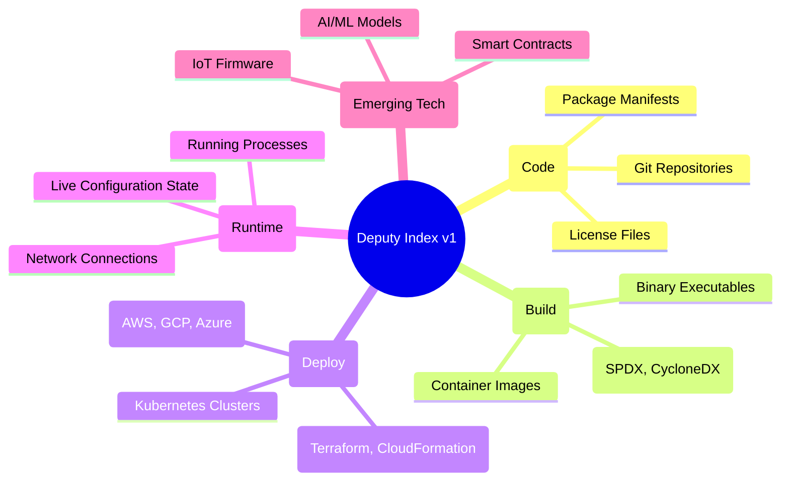
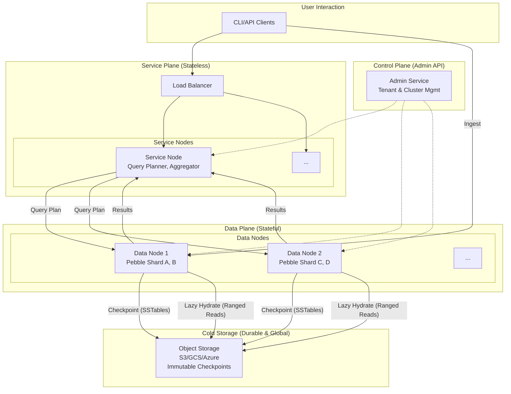
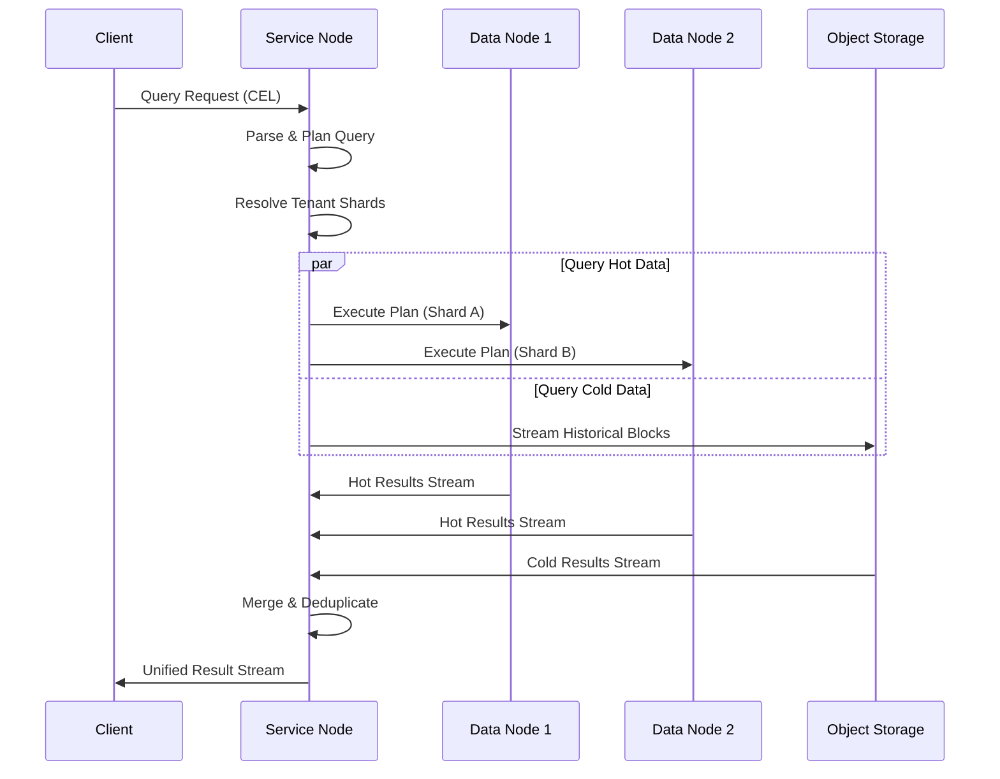
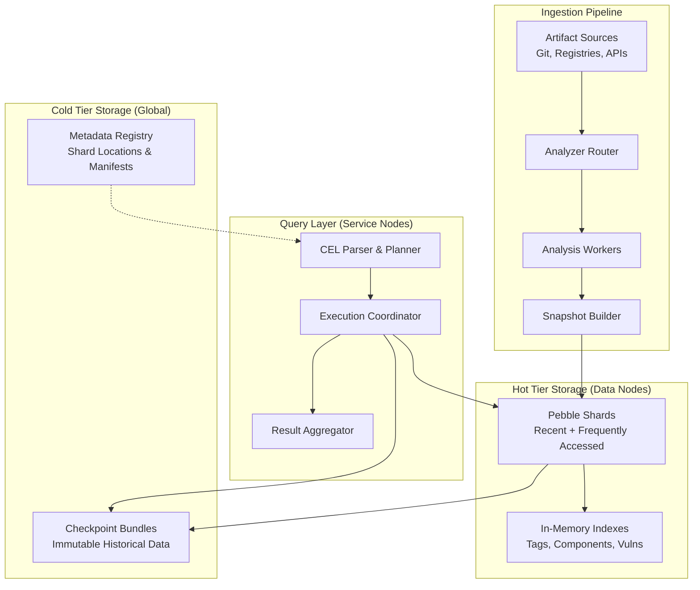
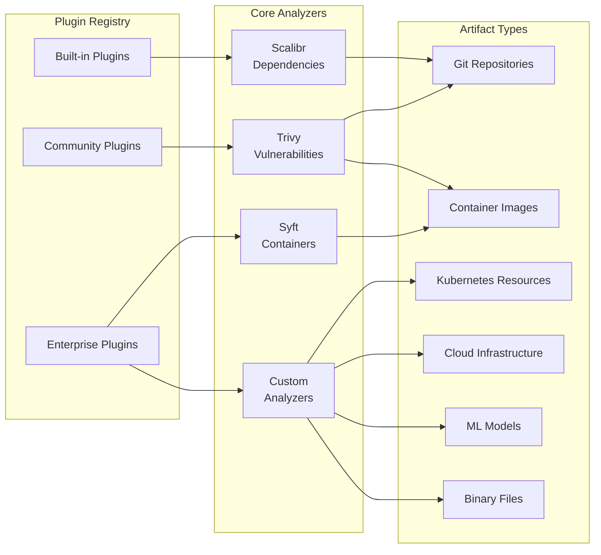
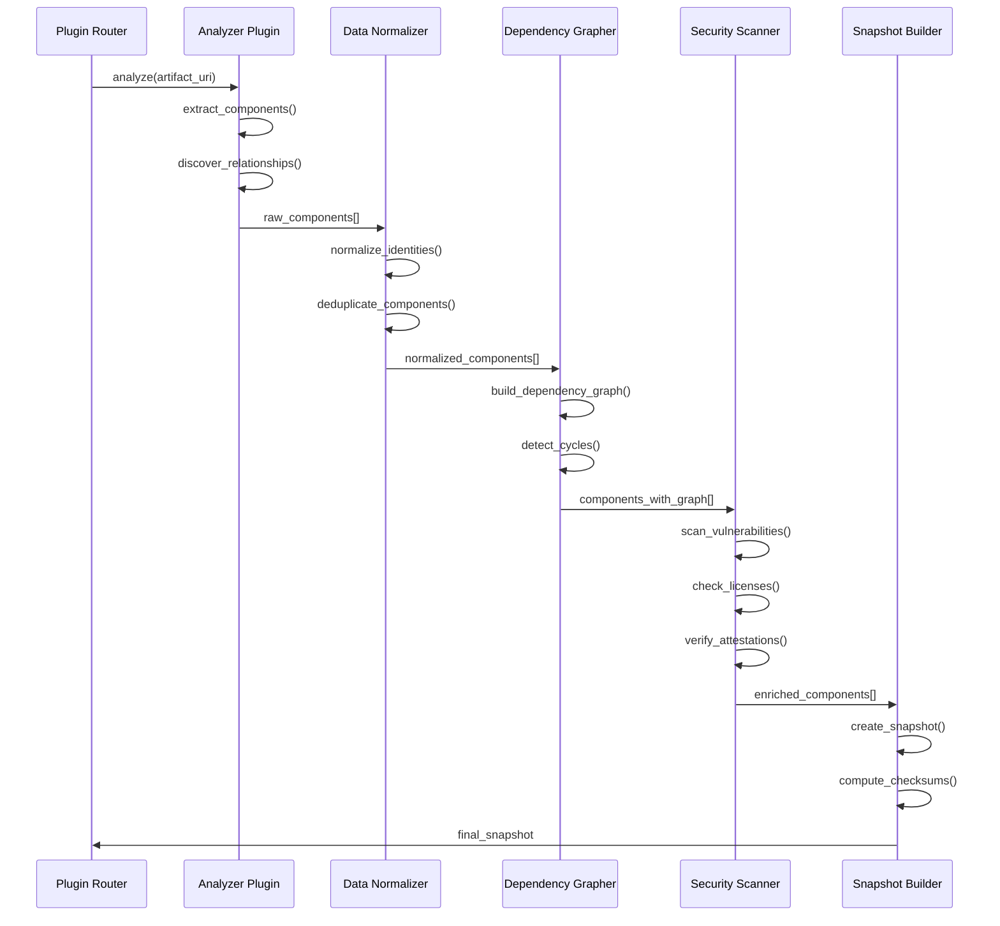
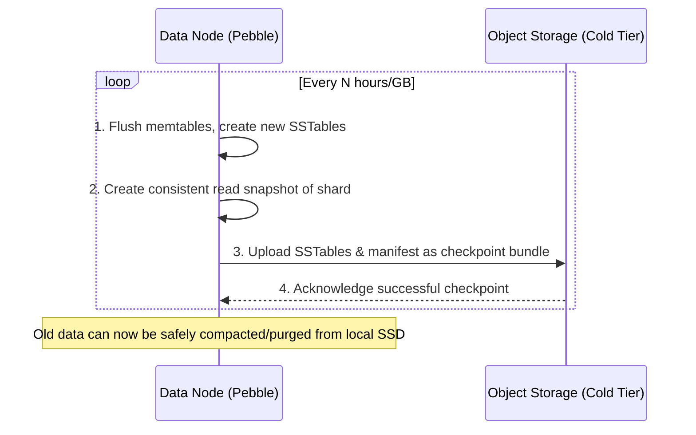

# Deputy Index v1: A Universal Security Intelligence Platform

> **Status**: Architecture Specification | **Implementation**: `internal/index/v1/` | **Target**: 2025 Q2-Q4

Deputy Index v1 evolves Deputy from a Git dependency scanner into a unified "code→cloud" security intelligence substrate. It delivers a single data + query plane for source, build artifacts, deployed infrastructure, and emerging AI assets.

**Mission**: Open-source, developer-first alternative to closed security platforms—max visibility, minimal friction.

---

## Table of Contents

1. [Vision & Scope](#vision--scope)
2. [Core Architectural Principles](#core-architectural-principles)
3. [Stable Primitives & Invariants](#stable-primitives--invariants)
4. [System Architecture](#system-architecture)
5. [Developer Experience & User Journeys](#developer-experience--user-journeys)
6. [Scalability & Distribution Model](#scalability--distribution-model)
7. [Unified Data Model](#unified-data-model)
8. [Tags & Grouping Metadata](#tags--grouping-metadata)
9. [Artifact Analysis Framework](#artifact-analysis-framework)
10. [Storage & Distribution](#storage--distribution)
11. [Ingestion Scaling & Dedupe](#ingestion-scaling--dedupe)
12. [Query Engine](#query-engine)
13. [Query Planner & Cost Model](#query-planner--cost-model)
14. [Consistency & Data Guarantees](#consistency--data-guarantees)
15. [Performance Envelope & Stress Scenarios](#performance-envelope--stress-scenarios)
16. [Verification Matrix](#verification-matrix--guarantees--evidence)
17. [Core Interface Catalog](#core-interface-catalog)
18. [Security & Multi-Tenancy](#security--multi-tenancy)
19. [Threat Model](#threat-model-v1-focus)
20. [Failure Modes & Recovery Matrix](#failure-modes--recovery-matrix)
21. [Operations & Observability](#operations--observability)
22. [Implementation Roadmap](#implementation-roadmap)
23. [Capacity & Sizing Guidance](#capacity--sizing-guidance)
24. [Conclusion](#conclusion)
25. [Appendix: Advanced Capacity Planning](#appendix-advanced-capacity-planning)
26. [Appendix: Deferred / Post-v1 Enhancements](#appendix-deferred--post-v1-enhancements)

---

## Vision & Scope

### The Challenge: Fragmented Intelligence

Modern organizations face a critical visibility gap. Their technology landscape is a sprawling ecosystem of code repositories, container images, Kubernetes clusters, serverless functions, and AI models. Security and operational intelligence is fragmented across dozens of specialized, disconnected tools, making it impossible to answer fundamental questions about risk, dependency, and blast radius.

Deputy Index v1 directly addresses this challenge by creating a **single, unified source of truth** for security intelligence across all digital artifacts.

### The Artifact Universe



### Design Philosophy

1.  **Unified Query Language**: A single, expressive language (CEL) to query everything.
2.  **Unified Data Model**: A consistent data model, regardless of the artifact's origin.
3.  **Unified API**: A single, consistent interface for all interactions.
4.  **Infinite, Cost-Effective Scale**: From a developer's laptop to a global, multi-cloud enterprise.
5.  **Radical Portability**: Zero vendor lock-in. Deployable on any infrastructure.

### Non-Goals (Explicit Exclusions)

These clarify boundaries to prevent scope creep in v1:

- **Real-Time Runtime Telemetry Streaming**: Continuous process/network/socket streaming is out of scope (only snapshot-style acquisition supported). 
- **Inline Policy Enforcement**: We do not block builds, deploys, or runtime activity—only observe and report. 
- **Full SIEM Replacement**: Log ingestion/correlation at SIEM scale is out of scope; we integrate with, not replace, SIEM platforms.
- **Behavioral Anomaly ML**: No generic anomaly detection or unsupervised learning in v1; targeted heuristics only. 
- **Package Registry Mirroring**: We index what’s used, not maintain mirrors of upstream ecosystems.
- **Custom UI Portal**: v1 focuses on CLI + API surfaces; a rich web dashboard can layer later without architectural changes.
- **Secret Scanning**: Out-of-scope for v1 (can be added as a plugin later).
- **Agent-Based Deployment Enforcement**: No host/sidecar agents for runtime prevention—only optional pull-based collectors.

---

## Core Architectural Principles

### 1. Deterministic and Verifiable
Every analysis is perfectly reproducible. Snapshot IDs are cryptographic hashes of content and configuration, guaranteeing idempotency, data integrity, and a verifiable audit trail. This eliminates drift and ensures that `scan(A)` always equals `scan(A)`.

### 2. Artifact-Agnostic by Design
The core platform makes no assumptions about the artifacts it indexes. The same data model, storage format, and query language apply equally to a Git repository, a running Kubernetes pod, or an AI model. New technologies are supported via plugins, not by re-architecting the system.

### 3. Horizontally Scalable via Tiered Storage
The architecture is built on a two-tier storage model that combines the speed of local Pebble KV stores (hot tier) with the infinite durability and low cost of object storage (cold tier). This allows the system to scale from a single node to a globally distributed cluster with near-limitless capacity.

### 4. Secure by Default
The system is multi-tenant from the ground up. All data is protected through tenant-based isolation, encryption at rest and in transit, fine-grained access control (RBAC/ABAC), and comprehensive audit logging. Analyzer plugins are sandboxed to prevent supply chain attacks against the platform itself.

### 5. Developer-Centric Experience
Despite its enterprise-grade capabilities, the system is optimized for developers. A simple and intuitive CLI, clear documentation, and sensible defaults make it immediately productive for individual contributors, fostering a culture of proactive security.

### Stable Primitives & Invariants
These are intentionally minimal, composable building blocks—future features must layer atop them without mutation.

| Primitive | Definition | Invariant | Evolution Path |
|-----------|------------|-----------|----------------|
| Snapshot | Immutable analysis result of one artifact at a time | Content-addressed; never mutated after commit | Add delta snapshots referencing a base |
| Component | Atom within a snapshot (package, file, resource) | ID stable within snapshot; scoped by tenant | Extend metadata sub-doc w/ versioned schema |
| Relationship | Typed edge between components | Direction + type immutable; no cross-tenant edge | Add new relationship types via registry |
| Shard | Logical partition of tenant keyspace | Owns disjoint key ranges at any time | Split/merge: produces new shard ids, old retired |
| Checkpoint | Immutable materialization of shard state | Manifest + objects are append-only; verified | Introduce incremental/differential layers |
| Plan | Concrete query execution blueprint | Deterministic hash for identical inputs | Adaptive cost model refinements |
| Tenant Context | Security + scoping envelope | Single tenant enforced; cannot be widened | Add residency / policy attributes |
| TagSet | Bounded key/value labels | Normalized + size/cardiinality constraints | Hierarchical & derived tags |

Non-Negotiable Rules:
1. Mutations create new versions; existing artifacts remain addressable.
2. No hidden cross-tenant data dependencies.
3. All externally observable data transformations are deterministic given inputs.
4. Feature additions cannot require rewriting historical checkpoints.
5. Query correctness prioritized over latency under ambiguous cost conditions.

---

## System Architecture

### Distributed Node Design

Deputy Index v1 uses a **data plane / control plane separation** that scales seamlessly from single-laptop deployment to global multi-region clusters.



### Deployment Modes

| Mode | Service Nodes | Data Nodes | Use Case |
|------|---------------|------------|----------|
| **Local** | 1 (embedded) | 1 (same process) | Developer laptop, CI/CD |
| **Team** | 1-2 | 2-4 | Department, shared cache + object storage |
| **Enterprise** | 3+ (load balanced) | 10+ (sharded) | Multi-region, compliance, high availability |
| **SaaS** | Auto-scaling | Auto-scaling | Managed service with tenant isolation |

**Local Mode**: Single binary runs both service + data node roles. Perfect developer experience—no external dependencies except optional object storage.

**Distributed Mode**: Service nodes route queries; data nodes own shards + handle ingestion. Clean separation enables independent scaling.

### Service Architecture Flow



### High-Level Component Flow



---

## Developer Experience & User Journeys

### The Natural Evolution Path

Deputy Index v1 is designed to **just work** locally, then seamlessly scale to team and enterprise use without configuration burden or data migration.

#### Journey 1: Solo Developer (5 minutes to value)

```bash
# Install + start local instance
$ brew install deputy
$ deputy index start
✓ Local data node started (port 8080)
✓ Object storage: using ~/.deputy/storage
✓ Ready for ingestion

# Analyze your first repository
$ deputy index ingest git://github.com/myorg/myapp
✓ Snapshot d4f2a8b3... created (247 components, 12 vulnerabilities)

# Query immediately
$ deputy index search 'vulnerabilities.critical.count > 0'
Found 3 critical vulnerabilities:
- log4j-core@2.14.1 (CVE-2021-44228)
- jackson-databind@2.12.3 (CVE-2021-20190)
...

# Add container scanning
$ deputy index ingest docker://myorg/myapp:latest
✓ Snapshot a8c3d9f1... created (157 components, 8 vulnerabilities)

$ deputy index graph --from 'pkg:maven/org.apache.logging.log4j/log4j-core@2.14.1'
Dependencies using log4j:
├── myapp:backend → log4j-core@2.14.1
├── myapp:worker → log4j-core@2.14.1 (transitive via spring-boot)
└── myapp:analytics → log4j-core@2.14.1
```

#### Journey 2: Team Adoption (attach S3, shared intelligence)

```bash
# Attach team's S3 bucket for persistence
$ deputy index config set storage.backend s3://myteam-deputy-storage
✓ S3 bucket verified, checkpointing enabled
✓ Local cache retained for speed

# Set project context
$ deputy index config set project myteam-backend

# Team member queries shared knowledge  
$ deputy index search 'project == "myteam-backend" && tags.env == "prod" && snapshot.analyzed_at > now() - duration("7d")'
Found 23 production snapshots from last week...

# Tag critical services for team visibility
$ deputy index tag snapshot d4f2a8b3 tier=critical env=prod team=backend
```

#### Journey 3: Enterprise Scale (multi-region, compliance)

```bash
# Deploy distributed cluster
$ deputy index cluster deploy --nodes 5 --regions us-east,eu-west
✓ Service nodes: 2 (load balanced)
✓ Data nodes: 3 (auto-sharded)
✓ Object storage: multi-region S3 with encryption

# Enable tenant isolation
$ deputy index admin create-tenant enterprise-corp
✓ Tenant enterprise-corp created
✓ API key: deputy_sk_... (store securely)

# Configure compliance retention
$ deputy index admin set-tenant-policy enterprise-corp \
    --retention 7-years \
    --encryption customer-managed \
    --audit-log enable
```

#### Journey 4: SaaS Consumer (zero operational burden)

```bash
# Connect to managed service
$ deputy index auth login --provider deputy-cloud
✓ Authenticated as user@company.com
✓ Connected to tenant: company-com

# Everything else identical to local workflow
$ deputy index ingest git://github.com/company/product
$ deputy index search 'tags.team == "security"'
```

### Auto-Tuning Intelligence

The system **learns and adapts** without manual intervention:

| Scenario | Automatic Behavior | Manual Override Available |
|----------|-------------------|---------------------------|
| **Local disk 80% full** | Aggressive checkpoint + cleanup | `deputy index config set retention.local 30d` |
| **Query fanout too high** | Planner reduces scope + warns | `deputy index config set query.max-fanout 50` |
| **Shard getting large** | Advisory: "Consider splitting shard-001" | `deputy index admin split-shard shard-001` |
| **New artifact type detected** | Suggests community analyzer | `deputy index analyzer install kubernetes` |
| **Tenant usage spike** | Rate limiting + backpressure | `deputy index admin set-limits --burst-allowance 2x` |

### Configuration Minimalism

**Zero-config defaults** for 90% of use cases:
- Local mode: `~/.deputy/` directory, auto-sized caches
- Team mode: S3 bucket + IAM role, everything else automatic  
- Enterprise: Helm chart with sensible resource requests
- SaaS: Just authentication, everything managed

**Expert tuning** available when needed:
- Custom analyzers, retention policies, query budgets
- Per-tenant encryption keys, audit sinks, network policies
- Performance envelope tuning, compaction schedules

### Failure Recovery is Seamless

No complex disaster recovery procedures:
- **Data node crash**: Automatic shard reassignment, restore from last checkpoint
- **Service node crash**: Stateless, traffic routes to healthy nodes immediately  
- **Object storage outage**: Continue serving from hot tier, checkpoint queue builds up
- **Network partition**: Graceful degradation, cross-region fallback for reads

**Recovery time is bounded** and **data loss is impossible** (checkpoints are immutable + replicated).

---

---

## Unified Data Model

### Core Entities: The Protobuf Source of Truth

The v1 data model is formally defined in `indexv1.proto`. This file is the single source of truth for all data structures, ensuring consistency between the specification, the API, and the implementation. The model revolves around three core entities: `Snapshot`, `Component`, and `Relationship`.

> **Design Principle**: By defining the data model in Protobuf, we gain a language-agnostic, strongly-typed, and evolvable schema. All data persisted in the storage tiers or transmitted over the API MUST conform to these definitions.

Key messages defined in `indexv1.proto`:

-   `message Snapshot`: The outcome of one analysis of one artifact at a specific point in time. It is the root of the data hierarchy.
-   `message Component`: Any discrete, analyzable unit within an artifact (e.g., a package, a service, a config file).
-   `message Relationship`: A typed edge capturing the connection between two `Component` entities (e.g., `depends_on`, `contains`).
-   `message TenantContext`: The security and isolation envelope that accompanies every API call, ensuring strict data partitioning.

All entities are designed for a multi-tenant environment and include `tenant_id` and optional `project_id` fields.

### Key-Value Storage Schema (Tenant-Aware)

Data is stored in Pebble using a tenant-scoped key structure that enables:
1. Hard logical isolation (no cross-tenant key collisions)
2. Efficient predicate pushdown (tenant + time / artifact prefixes)
3. Optional physical separation (large tenants can be mapped to dedicated shard groups without changing logical keys)

```
# Tenant root prefixes every datum; enables fast range restriction per request context
t/{tenant_id}/meta/snap/{schema_ver}/{snapshot_id}              → SnapshotMeta

# Components & Relationships (shard id retained for locality + rebalancing)
t/{tenant_id}/comp/{shard_id}/{snapshot_id}/{component_id}      → Component
t/{tenant_id}/rel/{shard_id}/{snapshot_id}/{relationship_id}    → Relationship

# Optional project scoping (only materialized if ProjectID present)
t/{tenant_id}/proj/{project_id}/snap/{schema_ver}/{snapshot_id} → SnapshotMeta (secondary)

# --- Query Acceleration Indexes (tenant-scoped) ---

# Find snapshots by artifact identity
t/{tenant_id}/idx/artifact/{artifact_type}/{namespace}/{name}            → []SnapshotID

# Find all occurrences of a specific component (e.g., log4j)
t/{tenant_id}/idx/component/{ecosystem}/{name}/{version}                → []ComponentID

# Find components affected by a specific vulnerability
t/{tenant_id}/idx/security/vuln/{cve_id}                                → []ComponentID

# Temporal bucketing (enables rapid time slicing)
t/{tenant_id}/idx/temporal/{yyyy-mm-dd}                                 → []SnapshotID

# Multi-tenant usage / billing counters (append-only, aggregated offline)
t/{tenant_id}/acct/usage/{yyyy-mm}/{counter_name}                       → Varint deltas
```

This schema lets the planner prune 100% of unrelated tenants before touching shard iterators, supporting strict per-request tenant enforcement and efficient multi-tenant SaaS operation.

### Tags & Grouping Metadata

Tags provide flexible yet bounded classification for both snapshots and components (e.g., `env=prod`, `team=payments`, `tier=critical`). They intentionally avoid becoming an unbounded secondary schema surface.

Design Goals:
1. Fast predicate pushdown on common filters (env/team/app/service/tier).
2. Prevent tag explosion (bounded cardinality per entity + per-tenant advisory).
3. Avoid multi-valued list complexity—prefer additive single key→value pairs; multiple values require distinct keys (e.g., `language.go=true`).
4. Deterministic ordering & hashing for snapshot identity reproducibility (tags included in content hash after normalization).

Enforcement Constraints (configurable defaults in parentheses):
| Constraint | Value | Rationale |
|-----------|-------|-----------|
| Max tags per entity | 32 | Bound memory + index fanout |
| Max key length | 40 | Prevent pathological keys |
| Max value length | 80 | Keep indexes lean |
| Reserved key prefixes | `deputy.*`, `system.*` | Internal use segregation |
| Total serialized size | 4KB | Prevent abuse via large metadata |

Normalization:
1. Keys lowercased.
2. Trim surrounding whitespace.
3. Reject empty keys or values after trim.
4. Stable lexical sort before hashing.

Indexing Strategy:
```
t/{tenant_id}/idx/tag/{key}/{value} → []ComponentID (or SnapshotID for snapshot-level query)
t/{tenant_id}/idx/tag-snap/{key}/{value} → []SnapshotID
```
Indexes are only materialized for tags that pass a **selective cardinality heuristic** (e.g., key cardinality ratio < 0.2 of total entities). High-cardinality keys (like `commit` if misused) are soft-blocked or downgraded to scan-only (warning emitted in diagnostics).

Project vs Tag:
- `ProjectID` offers a structured segregation boundary (authz & routing hint).
- Tags complement by expressing orthogonal dimensions (env/team/compliance domain).

Query Integration Examples:
```console
# All production snapshots for a given project
deputy index search 'project == "proj-payments" && tags.env == "prod"'

# Find critical vulns in components tagged as externally exposed
deputy index search 'tags.exposure == "public" && vulnerabilities.critical.count > 0'

# Combine temporal + tag filter
deputy index search 'tags.team == "ml" && snapshot.analyzed_at > now() - duration("168h")'
```

Abuse Mitigation:
- Per-tenant rolling window monitors tag cardinality growth; emits advisory if > X% week-over-week.
- Query planner caps multi-tag conjunction fanout (e.g., more than 5 distinct tag equality predicates triggers merge strategy instead of raw intersection explosion).

Future (Post-v1) Enhancements:
1. Tag key-level opt-in global dictionary compression.
2. Hierarchical tags (e.g., `env/prod/eu`) with automatic prefix rollups.
3. Policy-driven tag enrichment (derive `risk=tier1` when `env=prod && tier=critical`).


---

## Artifact Analysis Framework

### Plugin Architecture

The analysis framework is built around a simple but powerful plugin system that can handle any type of digital artifact.



### Analyzer Interface

```go
type ArtifactAnalyzer interface {
    // Identify supported artifact types
    CanAnalyze(ctx context.Context, uri ArtifactURI) (bool, error)
    
    // Perform analysis and return structured results
    Analyze(ctx context.Context, req AnalysisRequest) (*AnalysisResult, error)
    
    // Provide metadata about capabilities
    Info() AnalyzerInfo
}

type AnalysisRequest struct {
    URI      ArtifactURI
    Options  AnalysisOptions
    Context  SecurityContext
    Deadline time.Time
}

type AnalysisResult struct {
    Artifact      ArtifactIdentity
    Components    []Component
    Relationships []Relationship
    Metadata      map[string]interface{}
    Diagnostics   []Diagnostic
}
```

### Analysis Pipeline



---

## Storage & Distribution

The core of Deputy Index v1's scalability and durability lies in its **two-tier storage architecture**. This design provides the speed of local SSDs for recent data while leveraging the infinite scale and cost-effectiveness of cloud object storage for historical data. This is not a simple cache; it's a deeply integrated system where the boundary between "hot" and "cold" is fluid and managed by the query planner.

### Tier 1: The Hot Tier (Pebble on Local SSDs)

The "hot" tier consists of sharded [Pebble](https://github.com/cockroachdb/pebble) key-value stores running on local SSDs of the Data Nodes.

-   **Purpose**: High-performance ingestion and low-latency querying of recent or frequently accessed data.
-   **Mechanism**: All new data is written directly to a local Pebble shard. Queries for recent snapshots (e.g., from the last 30 days) are served directly from this tier. Pebble's LSM-tree structure is optimized for high-throughput writes and efficient range scans, making it ideal for ingestion and time-series-based queries.
-   **Sharding**: Data is distributed across shards using consistent hashing on a composite key derived from `(tenant_id, artifact_uri)`. This ensures tenant data locality while still distributing load.

### Tier 2: The Cold Tier (Object Storage - S3/GCS/Azure)

The "cold" tier uses cloud object storage as a durable, long-term repository for all historical data.

-   **Purpose**: Infinite-scale, cost-effective, and durable storage for the entire history of all artifacts. It serves as the system's immutable source of truth.
-   **Mechanism**: Data is stored as immutable **checkpoint bundles**. A checkpoint is a complete, point-in-time snapshot of a Pebble shard's data (a collection of SSTables) plus a manifest file, stored in the object storage bucket.
-   **Global Availability**: Checkpoints are replicated across regions, providing disaster recovery and enabling "follow-the-sun" query capabilities where data is accessed from the nearest regional replica.

### The Checkpoint Bridge: Hot-to-Cold Data Flow

Data seamlessly transitions from the hot tier to the cold tier via an automated checkpointing process. This is the bridge that connects local performance with global scale.



### Lazy Hydration: The Cold-to-Hot Data Flow

When a query requests data not resident in the hot tier, the system does **not** pull the entire old shard back into memory. Instead, it uses a "lazy hydration" strategy that leverages the structure of SSTables and object storage.

1.  **Plan Generation**: The Query Planner identifies which parts of the query can be satisfied by the hot tier and which require data from cold storage. For cold data, it generates a plan that specifies the exact checkpoint bundles and key ranges needed.
2.  **Index-First Fetch**: The Data Node first fetches only the *index blocks* of the required SSTables from the object store. These are small and contain the map of keys to data block locations.
3.  **Ranged Reads**: Using the fetched index, the node calculates the minimal set of *data blocks* it needs to satisfy the query. It then issues ranged `GET` requests to the object store to fetch only those specific byte ranges.
4.  **Streaming Results**: The retrieved data blocks are processed, and results are streamed back to the client immediately. The full historical data is never fully loaded onto the Data Node's disk, minimizing I/O and memory pressure.

This approach makes querying historical data highly efficient, as it avoids costly data transfers and allows the system to operate on datasets far larger than the local storage capacity of any single node.

### Cache Layers for Performance

To optimize repeated access patterns, several cache layers exist:

| Layer | Contents | Eviction Policy | Purpose |
|-------|----------|-----------------|---------|
| **Pebble Block Cache** | In-memory cache of SSTable blocks from the *hot tier*. | LRU | Accelerate reads on local SSD, reducing disk I/O. |
| **Cold Block Cache** | In-memory cache of data blocks fetched from the *cold tier*. | Size + Aging | Serve repeated queries on historical data without re-fetching from object storage. |
| **Query Result Cache** | Materialized results of expensive queries (e.g., aggregations). | TTL + Usage | Accelerate identical dashboard queries and common API calls. |

### Multi-Region Architecture

This two-tier model is the foundation for a robust multi-region deployment. A global control plane tracks shard locations and checkpoint manifests, allowing any region to query any data, whether it's hot in a local shard or cold in object storage.

```mermaid
graph TB
    subgraph "Global Control Plane (e.g., CockroachDB/etcd)"
        A1[Shard & Checkpoint Registry]
        A2[Tenant & Schema Metadata]
        A3[Access Controller]
    end

    subgraph "Region: US-East"
        B1[Service Nodes (Stateless)]
        B2[Data Nodes (Stateful)]
        subgraph "Hot Tier (Local SSD)"
            B3[Pebble Shards]
        end
    end

    subgraph "Region: EU-West"
        C1[Service Nodes (Stateless)]
        C2[Data Nodes (Stateful)]
        subgraph "Hot Tier (Local SSD)"
            C3[Pebble Shards]
        end
    end

    subgraph "Cold Tier (Global Object Storage)"
        E1[Checkpoint Bundles (S3/GCS)]
        E2[Cross-Region Replication]
        E3[Disaster Recovery Archive]
    end

    A1 & A2 & A3 -- Replicated --> B1 & C1

    B2 -- Ingests & writes to --> B3
    C2 -- Ingests & writes to --> C3

    B3 -- Checkpoints to --> E1
    C3 -- Checkpoints to --> E1

    B1 -- Queries --> B2
    C1 -- Queries --> C2

    B2 -- Lazy Hydrates from --> E1
    C2 -- Lazy Hydrates from --> E1

    E1 --> E2 --> E3
```

---

## Ingestion Scaling & Dedupe

### Overview

To achieve infinite scale and efficient deduplication, Deputy Index v1 employs a multi-faceted ingestion architecture. This ensures that data from various sources can be continuously ingested, indexed, and made queryable with minimal latency and maximal integrity.

### 1. High-Throughput Ingestion Pipeline

The ingestion pipeline is designed for speed and resilience, capable of handling massive bursts of data from multiple sources.

- **Parallel Fetching**: Artifacts are fetched in parallel from multiple sources (e.g., Git, container registries) to maximize bandwidth utilization.
- **Streaming Uploads**: Data is uploaded in a streaming fashion to the data nodes, allowing for continuous processing.
- **Batch Processing**: Received data is processed in batches to optimize resource usage and reduce per-transaction overhead.

### 2. Deduplication Strategies

Deduplication is critical in a multi-tenant environment to save space and reduce query complexity.

- **Content-Addressable Storage**: All data is stored using content-addressable identifiers, ensuring that identical content is only stored once.
- **Snapshot Deduplication**: Within a tenant's namespace, identical snapshots are deduplicated at the block level.
- **Cross-Tenant Deduplication**: Enabled by default, this feature deduplicates data across tenants, further saving space in the cold storage tier.

### 3. Intelligent Shard Management

Efficient sharding is key to scaling the ingestion system.

- **Dynamic Sharding**: As data volume grows, additional shards are automatically created. The system supports splitting and merging of shards without downtime.
- **Load-Aware Sharding**: Shards are assigned based on the current load and data distribution, ensuring even distribution of data and query load.
- **Tenant Isolation**: Strong isolation guarantees that tenants cannot access each other's data, with no performance impact from noisy neighbors.

### 4. Resilient Data Nodes

Data nodes are designed to be stateless and resilient, with all state stored in the underlying storage layers.

- **Stateless Design**: Data nodes do not store any persistent state. All data is either in-flight or stored in the hot/cold tiers.
- **Automatic Recovery**: In the event of a failure, data nodes can automatically recover their state from the latest checkpoint.
- **Health Monitoring**: Continuous monitoring of node health ensures that any degraded nodes are quickly identified and remedied.

### 5. Performance Optimization

To ensure high performance at scale, several optimization techniques are employed.

- **Query Caching**: Results of frequently run queries are cached in memory, significantly speeding up response times.
- **Index Tuning**: Indexes are automatically tuned based on query patterns to ensure optimal performance.
- **Resource Quotas**: Dynamic adjustment of resource quotas (CPU, memory, I/O) for ingestion processes based on current system load.

### 6. Security and Compliance

Security is integrated into every layer of the ingestion system.

- **Data Encryption**: All data is encrypted in transit and at rest using strong encryption standards.
- **Access Controls**: Fine-grained access controls ensure that only authorized users and services can access or modify data.
- **Audit Logging**: Comprehensive logging of all access and modification events for compliance and forensic purposes.

---

## Query Engine

### Overview

The query engine in Deputy Index v1 is responsible for executing queries against the indexed data and returning results to the user. It is designed for high performance, flexibility, and ease of use.

### 1. Unified Query Language

At the heart of the query engine is the unified query language, which allows users to express complex queries over heterogeneous data sources.

- **CEL (Common Expression Language)**: A powerful, flexible language for querying and manipulating data. It supports rich data types, functions, and operators.
- **Standard Library**: A comprehensive standard library provides common functions and macros for tasks like string manipulation, mathematical calculations, and date/time processing.
- **Custom Functions**: Users can define custom functions in CEL to encapsulate reusable logic.

### 2. Query Planning and Optimization

Efficient query execution is achieved through advanced query planning and optimization techniques.

- **Cost-Based Optimization**: The query planner uses a cost-based approach to generate efficient execution plans. It considers factors like data distribution, available indexes, and system load.
- **Dynamic Re-Optimization**: Queries are continuously monitored, and if execution characteristics change (e.g., due to data skew), the query can be re-optimized on the fly.
- **Adaptive Query Execution**: The engine can adaptively change the execution strategy of a query based on real-time feedback.

### 3. Execution Engine

The execution engine is responsible for carrying out the query plan and producing the final results.

- **Distributed Execution**: Queries are executed in a distributed manner across all relevant data nodes, maximizing parallelism and resource utilization.
- **Result Streaming**: Results are streamed back to the client as they are produced, allowing for low-latency responses.
- **Intermediate Result Caching**: Intermediate results of query execution can be cached to speed up subsequent query stages.

### 4. Security and Access Control

Security is enforced at the query engine level to protect sensitive data and ensure compliance.

- **Role-Based Access Control (RBAC)**: Access to data and operations is controlled through RBAC, ensuring that users can only access data they are authorized to see.
- **Row-Level Security**: Fine-grained access control at the row level, allowing for policies like "only show data from my department".
- **Audit Logging**: All query executions are logged for auditing and compliance purposes.

### 5. Monitoring and Observability

Comprehensive monitoring and observability features are integrated into the query engine.

- **Query Performance Metrics**: Detailed metrics on query performance (latency, throughput, etc.) are collected and exposed.
- **Slow Query Logging**: Queries that exceed a certain latency threshold are logged for investigation.
- **Real-Time Query Monitoring**: Administrators can monitor running queries in real-time, with the ability to cancel queries if needed.

---

## Query Planner & Cost Model

### Overview

The query planner and cost model in Deputy Index v1 are responsible for generating efficient execution plans for queries and estimating the resources required to execute them. This ensures that queries are executed in the most efficient manner possible, minimizing resource usage and maximizing performance.

### 1. Cost-Based Query Planning

The query planner uses a cost-based approach to generate execution plans for queries.

- **Statistics Collection**: The planner collects and maintains statistics about data distribution, table/column cardinality, and index usage.
- **Cost Estimation**: It uses these statistics to estimate the cost of different execution strategies for a query.
- **Plan Selection**: The planner selects the execution plan with the lowest estimated cost.

### 2. Dynamic Query Re-Planning

Queries are continuously monitored during execution, and the plan can be dynamically adjusted if necessary.

- **Adaptive Query Execution**: If the data distribution is not as expected or if there is a significant change in system load, the query planner can adaptively change the execution plan of a running query.
- **Re-Optimization Triggers**: Conditions for re-optimization can include changes in data skew, unexpected cardinality estimates, or significant differences between estimated and actual row counts.

### 3. Resource Estimation and Management

Accurate resource estimation is critical for efficient query execution.

- **Memory Usage Estimation**: The planner estimates the memory required for sorting, hashing, and other operations.
- **CPU and I/O Cost Estimation**: It also estimates the CPU and I/O costs based on the operations in the query plan.
- **Dynamic Resource Allocation**: Resources are allocated dynamically based on the current system load and the estimated cost of the query.

### 4. Execution Plan Caching

To improve performance, execution plans for frequently run queries can be cached.

- **Plan Reuse**: Cached plans can be reused for identical queries, eliminating the need for re-planning.
- **Adaptive Plan Caching**: The system can adaptively decide to cache or evict plans based on their execution frequency and the current workload.

---

## Consistency & Data Guarantees

### Overview

Deputy Index v1 provides strong consistency and data guarantees to ensure the integrity and reliability of the data being indexed and queried. This is critical in a security context, where accurate and reliable data is essential for effective decision-making.

### 1. Strong Consistency Model

Deputy Index v1 employs a strong consistency model to ensure that all reads and writes are atomic and isolated.

- **ACID Transactions**: All data modifications are performed within ACID transactions, guaranteeing atomicity, consistency, isolation, and durability.
- **Serializable Isolation**: The default isolation level is serializable, the highest level of isolation, which prevents phenomena like dirty reads, non-repeatable reads, and phantom reads.

### 2. Data Integrity Guarantees

Strong data integrity guarantees are enforced to protect against data corruption and ensure the reliability of the indexed data.

- **Content-Addressable Storage**: Data is stored using content-addressable identifiers, ensuring that identical content is only stored once and can be reliably retrieved.
- **Cryptographic Hashing**: All data is cryptographically hashed, and the hashes are stored and checked to detect any data corruption.
- **Immutable Snapshots**: Data is organized into immutable snapshots, which are cryptographically linked to prevent tampering.

### 3. Read and Write Quorums

To ensure data availability and consistency, read and write quorums are used.

- **Quorum Reads**: A read requires a response from a majority of the replicas (quorum) to ensure that the read is accurate and up-to-date.
- **Quorum Writes**: A write is only considered successful if it is acknowledged by a quorum of replicas, ensuring that the data is durably stored.

### 4. Conflict Resolution

In the event of conflicting updates, a robust conflict resolution mechanism is employed.

- **Last Write Wins**: The default conflict resolution strategy is last write wins, where the most recent write (based on timestamp) is accepted.
- **Custom Conflict Handlers**: Users can define custom conflict handlers to implement application-specific conflict resolution logic.

---

## Performance Envelope & Stress Scenarios

### Overview

The performance envelope defines the expected performance characteristics of the system under various conditions. Stress scenarios are used to test the system's behavior under extreme conditions, ensuring that it can handle unexpected spikes in load or data volume.

### 1. Performance Envelope

The performance envelope specifies the expected latency, throughput, and resource utilization for different types of queries and data volumes.

- **Query Latency**: The expected latency for common query patterns, including both cold and hot data accesses.
- **Throughput**: The expected throughput for data ingestion, indexing, and querying.
- **Resource Utilization**: The expected CPU, memory, and I/O utilization under normal operating conditions.

### 2. Stress Scenarios

Stress scenarios are used to test the system's behavior under extreme conditions.

- **Spike in Ingestion Rate**: Simulate a sudden spike in the rate of data ingestion to test the system's ability to handle bursty workloads.
- **Sudden Query Surge**: Simulate a sudden surge in the number of concurrent queries to test the query engine's scalability.
- **Node Failure**: Simulate the failure of a data node to test the system's resilience and self-healing capabilities.

### 3. Performance Tuning

Based on the observed behavior under stress scenarios, various performance tuning parameters can be adjusted.

- **Resource Quotas**: Adjusting the CPU, memory, and I/O quotas for ingestion and query processes.
- **Cache Sizes**: Tuning the sizes of various caches (e.g., query result cache, cold block cache) to optimize performance.
- **Shard Configuration**: Adjusting the number and configuration of shards to optimize data distribution and query performance.

---

## Verification Matrix

### Overview

The verification matrix defines the tests and checks that are performed to verify the correctness and integrity of the system. It ensures that all components of the system are working correctly and that the data is accurate and reliable.

### 1. Test Categories

The verification matrix includes several categories of tests:

- **Unit Tests**: Tests that verify the correctness of individual components or functions.
- **Integration Tests**: Tests that verify the correctness of interactions between components.
- **System Tests**: End-to-end tests that verify the correctness of the entire system.
- **Performance Tests**: Tests that verify the performance characteristics of the system under various conditions.

### 2. Test Coverage

The verification matrix specifies the required test coverage for each component and feature of the system.

- **Code Coverage**: The percentage of code that is exercised by the tests.
- **Feature Coverage**: The percentage of features or user stories that have associated tests.

### 3. Verification Process

The verification process includes the following steps:

- **Test Execution**: Running the specified tests in each category.
- **Result Analysis**: Analyzing the results of the tests to identify any failures or issues.
- **Issue Resolution**: Resolving any issues or failures identified during testing.
- **Regression Testing**: Re-running the tests to ensure that resolved issues do not reoccur.

---

## Core Interface Catalog

### Overview

The core interface catalog defines the APIs and interfaces that are exposed by the system for interaction with external clients or systems. It specifies the available operations, their parameters, and the expected results.

### 1. API Categories

The core interface catalog includes several categories of APIs:

- **Data Ingestion APIs**: APIs for ingesting data from various sources (e.g., Git, container registries).
- **Query APIs**: APIs for querying the indexed data.
- **Management APIs**: APIs for managing the system (e.g., configuring settings, managing tenants).
- **Monitoring APIs**: APIs for retrieving monitoring and performance metrics.

### 2. API Specifications

Each API in the catalog is specified with the following information:

- **Endpoint**: The URL or URI of the API endpoint.
- **Method**: The HTTP method (e.g., GET, POST, DELETE) used to access the API.
- **Parameters**: The input parameters accepted by the API, including their types and constraints.
- **Response**: The expected response from the API, including the data format and any error codes.

### 3. Example APIs

Here are some examples of APIs that might be included in the core interface catalog:

- **Ingest API**: `POST /v1/index/ingest`
  - Parameters: `source` (string, required), `type` (string, optional)
  - Response: `202 Accepted` (async ingestion started)
- **Search API**: `GET /v1/index/search`
  - Parameters: `query` (string, required), `limit` (int, optional)
  - Response: `200 OK` with search results
- **Tenant Management API**: `POST /v1/tenants`
  - Parameters: `name` (string, required), `settings` (object, optional)
  - Response: `201 Created` with tenant details

---

## Security & Multi-Tenancy

### Overview

Security and multi-tenancy are core design considerations in Deputy Index v1. The system is designed to be secure by default, with strong isolation and protection mechanisms for multi-tenant environments.

### 1. Multi-Tenant Architecture

Deputy Index v1 is built from the ground up as a multi-tenant system.

- **Tenant Isolation**: Strong isolation between tenants is enforced at all levels, including data, metadata, and query processing.
- **Tenant Context**: Every operation is executed within a tenant context, which defines the security and scoping boundaries for the operation.
- **Shared Nothing Architecture**: Tenants do not share any resources (e.g., database connections, file handles) to prevent data leakage or interference.

### 2. Security Features

The system includes several security features to protect data and ensure compliance.

- **Encryption**: All data is encrypted at rest and in transit using strong encryption standards.
- **Access Control**: Fine-grained access control (RBAC/ABAC) is enforced for all operations, ensuring that only authorized users and services can access or modify data.
- **Audit Logging**: Comprehensive audit logging of all access and modification events for compliance and forensic purposes.

### 3. Compliance Support

Deputy Index v1 is designed to support various compliance requirements.

- **Data Residency**: Support for data residency requirements, including the ability to restrict data to specific geographic regions.
- **Retention Policies**: Configurable data retention policies to support regulatory requirements.
- **Audit Trails**: Detailed audit trails of all data access and modification events.

---

## Threat Model

### Overview

The threat model for Deputy Index v1 identifies and analyzes potential threats to the system and defines the security controls and mitigations that are in place to protect against these threats.

### 1. Threat Identification

Potential threats to the system include:

- **Unauthorized Access**: Attempts to access data or operations without proper authorization.
- **Data Breaches**: Unauthorized disclosure or access to sensitive data.
- **Data Loss**: Loss of data due to accidental deletion, corruption, or other reasons.
- **Service Disruption**: Disruption of service availability due to attacks or failures.

### 2. Vulnerability Assessment

The system is assessed for vulnerabilities that could be exploited by attackers.

- **Static Analysis**: Source code and configuration are analyzed for security vulnerabilities.
- **Dynamic Analysis**: The running system is tested for vulnerabilities using automated tools and manual testing.
- **Dependency Scanning**: All dependencies are scanned for known vulnerabilities.

### 3. Security Controls

Security controls are implemented to mitigate the identified threats and vulnerabilities.

- **Authentication and Authorization**: Strong authentication and authorization mechanisms are enforced for all users and services.
- **Encryption**: All sensitive data is encrypted at rest and in transit.
- **Network Security**: Firewalls, security groups, and other network security measures are used to protect the system.
- **Monitoring and Logging**: Comprehensive monitoring and logging are implemented to detect and respond to security incidents.

---

## Failure Modes & Recovery Matrix

### Overview

The failure modes and recovery matrix defines the potential failure modes of the system and the corresponding recovery procedures and mechanisms. It ensures that the system can recover from failures quickly and with minimal impact on availability and data integrity.

### 1. Failure Modes

Potential failure modes of the system include:

- **Data Node Failure**: Failure of a data node due to hardware or software issues.
- **Service Node Failure**: Failure of a service node responsible for query planning and routing.
- **Network Partition**: Network partitioning that isolates nodes or regions.
- **Storage Failure**: Failure of the underlying storage system (e.g., object storage, Pebble KV store).

### 2. Recovery Procedures

Recovery procedures are defined for each failure mode.

- **Data Node Recovery**: 
  - Automatic reassignment of shards to healthy nodes.
  - Restoration from the latest checkpoint.
- **Service Node Recovery**: 
  - Stateless design allows for quick replacement or restart.
  - Automatic detection and removal of unhealthy nodes from the load balancer.
- **Network Partition Recovery**: 
  - Graceful degradation of service, with automatic failover to healthy regions.
  - Re-establishment of network connections and resynchronization of state.
- **Storage Failure Recovery**: 
  - Automatic failover to replica storage or cold storage.
  - Restoration of lost data from the latest checkpoint.

### 3. Testing Recovery Procedures

Recovery procedures are regularly tested to ensure their effectiveness.

- **Simulated Failures**: Controlled simulations of failures are conducted to test the system's response and recovery.
- **Recovery Time Measurement**: The time taken to recover from failures is measured and analyzed.
- **Post-Recovery Validation**: Validation of data integrity and system functionality after recovery.

---

## Operations & Observability

### Overview

Operations and observability in Deputy Index v1 focus on ensuring the reliable and efficient operation of the system and providing visibility into the system's behavior and performance.

### 1. Monitoring

Comprehensive monitoring is implemented to track the health and performance of the system.

- **Infrastructure Monitoring**: Monitoring of the underlying infrastructure (e.g., CPU, memory, disk I/O) using tools like Prometheus and Grafana.
- **Application Performance Monitoring (APM)**: Monitoring of application-level metrics (e.g., query latency, throughput) using APM tools.
- **Log Monitoring**: Centralized logging and monitoring of logs for error detection and troubleshooting.

### 2. Alerting

Alerting mechanisms are in place to notify operators of potential issues or incidents.

- **Threshold-Based Alerts**: Alerts based on predefined thresholds for key metrics (e.g., high CPU usage, slow query latency).
- **Anomaly Detection Alerts**: Alerts based on the detection of anomalous patterns or behaviors in the system.
- **Incident Escalation**: Automated escalation of alerts to on-call personnel based on the severity and impact of the incident.

### 3. Incident Response

Defined procedures and playbooks for responding to incidents or outages.

- **Incident Detection**: Automated detection of incidents based on monitoring and alerting.
- **Incident Investigation**: Investigation of incidents to determine the root cause and impact.
- **Incident Resolution**: Resolution of incidents through predefined procedures and playbooks.
- **Post-Incident Review**: Review and analysis of incidents to identify improvements and prevent recurrence.

---

## Implementation Roadmap

### Overview

The implementation roadmap outlines the planned phases and milestones for the development and deployment of Deputy Index v1. It provides a high-level view of the key activities, deliverables, and timelines.

### 1. Phased Implementation

The implementation is planned in multiple phases, with each phase delivering incremental value and capabilities.

- **Phase 1: Core Infrastructure** (2025 Q2)
  - Set up the core infrastructure and development environment.
  - Implement the basic architecture and core components.
- **Phase 2: Data Ingestion and Storage** (2025 Q3)
  - Implement the data ingestion pipeline and storage tiers.
  - Enable basic data indexing and querying capabilities.
- **Phase 3: Query Engine and API** (2025 Q4)
  - Implement the query engine and unified query language.
  - Expose the core APIs for data ingestion and querying.
- **Phase 4: Security and Multi-Tenancy** (2026 Q1)
  - Implement security features and multi-tenancy support.
  - Conduct security testing and validation.
- **Phase 5: Performance Optimization and Scaling** (2026 Q2)
  - Optimize performance and scalability of the system.
  - Conduct load testing and performance tuning.
- **Phase 6: Documentation and Training** (2026 Q3)
  - Prepare comprehensive documentation and training materials.
  - Conduct training sessions for users and administrators.
- **Phase 7: General Availability** (2026 Q4)
  - Release Deputy Index v1 for general availability.
  - Provide ongoing support and maintenance.

### 2. Milestones

Key milestones for each phase are defined to track progress and ensure timely delivery.

- **Milestone 1**: Completion of core infrastructure setup.
- **Milestone 2**: Completion of data ingestion and storage implementation.
- **Milestone 3**: Completion of query engine and API implementation.
- **Milestone 4**: Completion of security and multi-tenancy implementation.
- **Milestone 5**: Completion of performance optimization and scaling.
- **Milestone 6**: Completion of documentation and training.
- **Milestone 7**: General availability release.

---

## Capacity & Sizing Guidance

### Overview

Capacity and sizing guidance provides recommendations for sizing the various components of Deputy Index v1 based on expected workloads and performance requirements. It helps ensure that the system is appropriately sized to handle the anticipated data volume, query load, and performance objectives.

### 1. Sizing Guidelines

General guidelines for sizing the key components of Deputy Index v1:

- **Service Nodes**: Size based on the expected query load and concurrency.
  - Small: 2 vCPU, 8 GB RAM (suitable for development or small teams)
  - Medium: 4 vCPU, 16 GB RAM (suitable for medium-sized teams or departments)
  - Large: 8 vCPU, 32 GB RAM (suitable for large teams or enterprise use)
- **Data Nodes**: Size based on the expected data volume and ingestion rate.
  - Small: 2 vCPU, 8 GB RAM, 100 GB SSD (suitable for development or small datasets)
  - Medium: 4 vCPU, 16 GB RAM, 500 GB SSD (suitable for medium-sized datasets)
  - Large: 8 vCPU, 32 GB RAM, 2 TB SSD (suitable for large datasets)
- **Cold Storage**: Size based on the expected historical data volume.
  - Use object storage (S3, GCS, Azure) with capacity based on data retention requirements.

### 2. Performance Considerations

Factors to consider when sizing for performance:

- **Query Complexity**: More complex queries (e.g., with multiple joins or aggregations) may require more CPU and memory.
- **Concurrency**: Higher concurrency (more simultaneous queries) will require more resources, especially CPU and memory.
- **Data Volume**: Larger data volumes will require more memory for caching and processing, and more disk space for storage.

### 3. Scaling Recommendations

Recommendations for scaling the system as usage grows:

- **Horizontal Scaling**: Add more service nodes and data nodes to handle increased load.
- **Vertical Scaling**: Upgrade existing nodes with more CPU, memory, or storage as needed.
- **Auto-Scaling**: Enable auto-scaling for service nodes in cloud deployments to automatically adjust capacity based on load.

---

## Conclusion

Deputy Index v1 represents a significant evolution of the Deputy project, transforming it into a comprehensive security intelligence platform. With its unified data model, powerful query engine, and flexible deployment options, Deputy Index v1 is well-equipped to meet the security and compliance challenges of modern organizations.

The detailed architecture and design presented in this document provide a solid foundation for the implementation and deployment of Deputy Index v1. The phased roadmap and comprehensive testing and verification plans ensure a high-quality, reliable, and secure product.

---

## Appendix: Advanced Capacity Planning

### Overview

This appendix provides advanced guidance and considerations for capacity planning and sizing of Deputy Index v1. It includes detailed formulas, examples, and additional factors to consider for accurate capacity planning.

### 1. Service Node Sizing

Service node sizing is based on the expected query load, concurrency, and query complexity.

- **Base CPU and Memory**: Start with the medium service node configuration (4 vCPU, 16 GB RAM) as a baseline.
- **CPU and Memory per Query**: Estimate the additional CPU and memory required per query based on query complexity.
  - Simple Query: +0.5 vCPU, +1 GB RAM
  - Moderate Query: +1 vCPU, +2 GB RAM
  - Complex Query: +2 vCPU, +4 GB RAM
- **Concurrency Factor**: Multiply the total CPU and memory by the expected concurrency factor (number of simultaneous queries).
- **Scaling Buffer**: Add a scaling buffer (e.g., 20%) to accommodate spikes in load and ensure smooth operation.

**Example Calculation**:
- Expected load: 100 concurrent simple queries
- Base CPU and Memory: 4 vCPU, 16 GB RAM
- Additional CPU and Memory per Query: 0.5 vCPU, 1 GB RAM
- Concurrency Factor: 100
- Scaling Buffer: 20%

```
Total vCPU = (Base vCPU + (Additional vCPU per Query * Concurrency)) * Scaling Buffer
           = (4 + (0.5 * 100)) * 1.2
           = 64 vCPU

Total RAM = (Base RAM + (Additional RAM per Query * Concurrency)) * Scaling Buffer
          = (16 + (1 * 100)) * 1.2
          = 140 GB RAM
```

### 2. Data Node Sizing

Data node sizing is based on the expected data volume, ingestion rate, and query performance requirements.

- **Base Configuration**: Start with the medium data node configuration (4 vCPU, 16 GB RAM, 500 GB SSD) as a baseline.
- **CPU and Memory for Ingestion**: Estimate the additional CPU and memory required for the expected ingestion rate.
  - Low Ingestion Rate: +1 vCPU, +2 GB RAM
  - Medium Ingestion Rate: +2 vCPU, +4 GB RAM
  - High Ingestion Rate: +4 vCPU, +8 GB RAM
- **Disk Space for Data**: Estimate the disk space required based on the expected data volume and retention period.
  - Use the formula: `Disk Space (GB) = Expected Data Volume (GB) * Data Retention Period (months)`

**Example Calculation**:
- Expected data volume: 10 TB
- Data retention period: 12 months
- Base configuration: 4 vCPU, 16 GB RAM, 500 GB SSD

```
Total Disk Space = Expected Data Volume * Data Retention Period
                 = 10,000 GB * 12
                 = 120,000 GB

Number of Data Nodes = Total Disk Space / Disk Space per Node
                     = 120,000 GB / 500 GB
                     = 240 Data Nodes
```

### 3. Cold Storage Sizing

Cold storage sizing is based on the expected historical data volume and retention requirements.

- **Storage Type**: Use object storage (S3, GCS, Azure) for cold storage.
- **Capacity Planning**: Estimate the total capacity required based on the expected data volume and retention period.
- **Cost Considerations**: Consider the cost of storage, retrieval, and data transfer when selecting the storage class and configuring lifecycle policies.

**Example Calculation**:
- Expected historical data volume: 100 TB
- Data retention period: 24 months

```
Total Cold Storage Capacity = Expected Historical Data Volume * Data Retention Period
                           = 100,000 GB * 24
                           = 2,400,000 GB

Number of Storage Buckets = Total Cold Storage Capacity / Bucket Capacity
                          = 2,400,000 GB / 5,000 GB
                          = 480 Storage Buckets
```

### 4. Additional Considerations

- **Network Bandwidth**: Ensure sufficient network bandwidth for data ingestion, replication, and query traffic.
- **Backup and Disaster Recovery**: Plan for backup storage and disaster recovery solutions to protect against data loss.
- **Monitoring and Alerting**: Implement monitoring and alerting for capacity utilization, performance metrics, and error rates.

---

## Appendix: Deferred / Post-v1 Enhancements

### Overview

This appendix lists potential enhancements and features that are deferred to post-v1 releases. These enhancements are not part of the initial v1 scope but are considered for future versions based on customer feedback, market trends, and technological advancements.

### 1. Advanced Query Optimization

- **Query Rewriting**: Automatic rewriting of queries to improve performance or reduce resource usage.
- **Index Recommendations**: Suggestions for creating or modifying indexes based on query patterns.

### 2. Data Enrichment and Transformation

- **ETL Capabilities**: Extract, Transform, Load (ETL) capabilities for enriching data during ingestion.
- **Data Masking**: Masking of sensitive data fields for compliance with data protection regulations.

### 3. Enhanced Security Features

- **Fine-Grained Access Control**: More granular access control policies at the column or row level.
- **Data Loss Prevention (DLP)**: DLP features to prevent unauthorized data sharing or exposure.

### 4. Multi-Cloud and Hybrid Cloud Support

- **Cross-Cloud Replication**: Data replication and synchronization across different cloud providers.
- **On-Premises Integration**: Integration with on-premises data sources and systems.

### 5. User Interface and Experience Enhancements

- **Web-Based UI**: A rich web-based user interface for managing and monitoring the system.
- **Visual Query Builder**: A visual interface for building and optimizing queries.

### 6. Community and Ecosystem Engagement

- **Open Source Contributions**: Encouraging community contributions and extensions.
- **Marketplace for Plugins and Integrations**: A marketplace for third-party plugins, analyzers, and integrations.

### 7. Performance and Scalability Enhancements

- **Query Result Caching**: Caching of query results at the edge for faster access.
- **Cold Storage Tiering**: Automated tiering of data between different cold storage classes based on access patterns.

### 8. Compliance and Regulatory Features

- **Automated Compliance Reporting**: Generation of compliance reports for audits.
- **Data Residency Controls**: Controls to enforce data residency requirements.

### 9. Support and Services

- **Managed Service Offering**: A fully managed service option for Deputy Index.
- **Premium Support Plans**: Enhanced support plans with faster response times and dedicated account management.

---
