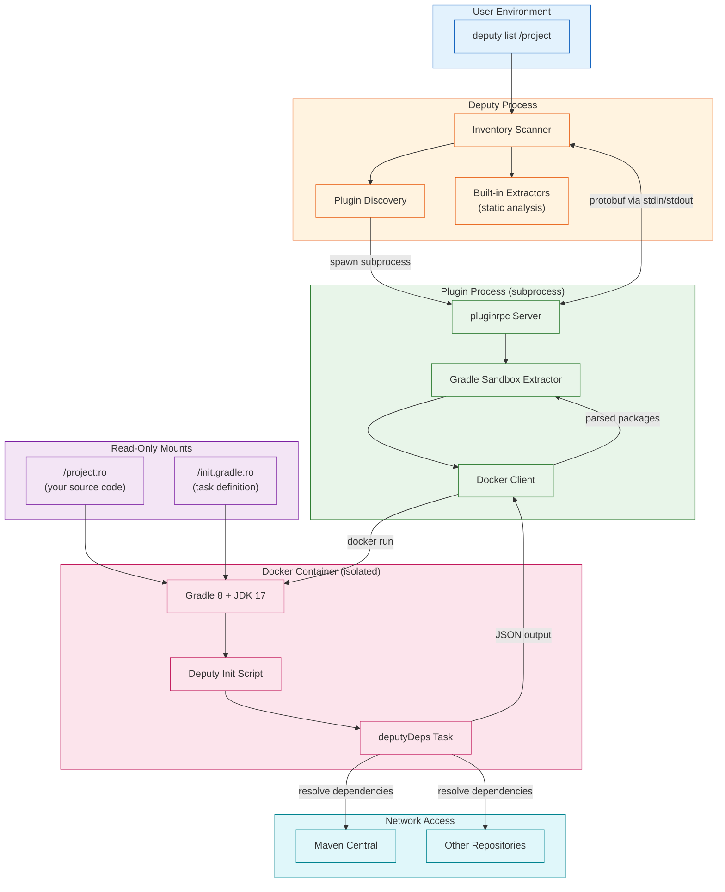
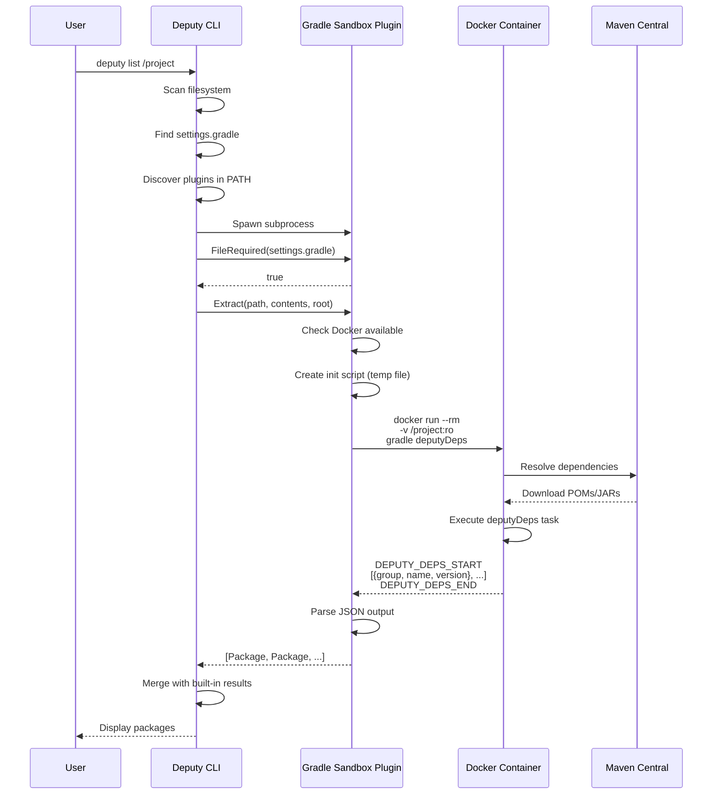
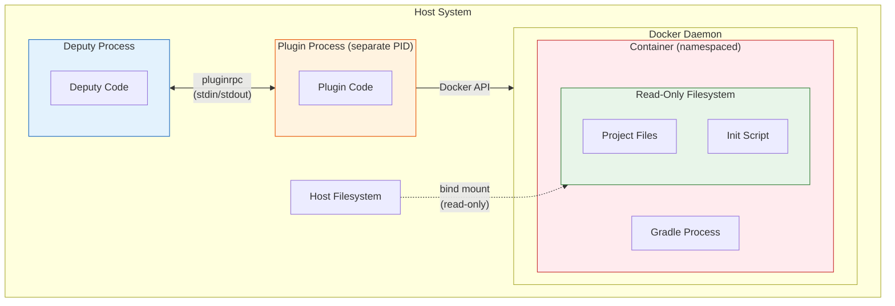

# deputy-extractor-gradle-sandbox

An external Deputy plugin that extracts Maven dependencies by running Gradle in a Docker container.

## Overview

This plugin provides the most accurate dependency resolution by actually running Gradle to resolve all dependencies, including:

- BOM-managed versions (e.g., Spring Boot, gRPC BOMs)
- Version catalog references (`libs.versions.toml`)
- Dynamic versions resolved to concrete versions
- Transitive dependencies
- Platform constraints

The plugin runs a custom Gradle task in a sandboxed Docker container with:

- Read-only access to the project source
- Network access for dependency resolution
- No access to host filesystem beyond the project
- Configurable timeout to prevent hangs

## Requirements

- Docker daemon must be running and accessible (uses Docker SDK, not CLI)
- Network access to download dependencies from Maven Central/other repositories
- Sufficient disk space for Docker images (~500MB for gradle:8-jdk17)

## Installation

### Option 1: Install from source

```bash
# Clone the Deputy repository
git clone https://github.com/picatz/deputy.git
cd deputy/plugins/gradle-sandbox

# Build the plugin
go build -o deputy-extractor-gradle-sandbox .

# Move to a directory in your PATH
sudo mv deputy-extractor-gradle-sandbox /usr/local/bin/

# Verify installation
which deputy-extractor-gradle-sandbox
```

### Option 2: Go install (when published)

```bash
go install github.com/picatz/deputy/plugins/gradle-sandbox@latest
```

The binary **must** be named `deputy-extractor-gradle-sandbox` (starting with `deputy-extractor-`) for automatic discovery.

## How Deputy Discovers Plugins

Deputy automatically discovers extractor plugins at runtime by scanning your `PATH` for executables matching the pattern `deputy-extractor-*`. Here's how it works:

1. **At scan time**, Deputy searches all directories in your `PATH` environment variable
2. **For each executable** starting with `deputy-extractor-`, Deputy spawns it as a subprocess
3. **The plugin responds** with its metadata (name, ecosystem, file patterns) via the pluginrpc protocol
4. **During file walking**, Deputy calls `FileRequired()` on the plugin to check if it wants each file
5. **For matching files**, Deputy calls `Extract()` and the plugin returns discovered packages

```
PATH lookup
     │
     ▼
┌────────────────────────────────────┐
│  /usr/local/bin/                   │
│  /usr/bin/                         │
│  ~/go/bin/                         │  ◄── Find deputy-extractor-* binaries
│  ...                               │
└────────────────────────────────────┘
     │
     ▼
┌────────────────────────────────────┐
│  deputy-extractor-gradle-sandbox   │  ◄── Spawn subprocess, get metadata
│  deputy-extractor-other-plugin     │
└────────────────────────────────────┘
     │
     ▼
┌────────────────────────────────────┐
│  FileRequired("settings.gradle")   │  ◄── Plugin says "yes, I want this file"
│  Extract(path, contents, root)     │  ◄── Plugin runs Gradle in Docker
│  [Package, Package, ...]           │  ◄── Plugin returns discovered deps
└────────────────────────────────────┘
```

### Common Installation Locations

| Location | How to install | Notes |
|----------|---------------|-------|
| `/usr/local/bin/` | `sudo mv binary /usr/local/bin/` | System-wide, requires root |
| `~/go/bin/` | `go install ...` | Go default, add to PATH |
| `~/.local/bin/` | `mv binary ~/.local/bin/` | User-local, add to PATH |

### Verifying PATH

```bash
# Check if the plugin directory is in PATH
echo $PATH | tr ':' '\n' | grep -E "(go/bin|local/bin)"

# Verify the plugin is discoverable
which deputy-extractor-gradle-sandbox

# Test that Deputy can invoke it
deputy-extractor-gradle-sandbox --spec  # Should output pluginrpc spec
```

## Configuration

Environment variables:

| Variable | Default | Description |
|----------|---------|-------------|
| `GRADLE_SANDBOX_IMAGE` | `gradle:8-jdk17` | Docker image to use for Gradle builds |
| `GRADLE_SANDBOX_TIMEOUT` | `300` | Timeout in seconds for dependency resolution |

### Custom Gradle Images

You can use different Gradle/JDK versions by setting the image:

```bash
# Use Gradle 7 with JDK 11
export GRADLE_SANDBOX_IMAGE=gradle:7-jdk11

# Use a custom corporate image
export GRADLE_SANDBOX_IMAGE=myregistry.example.com/gradle:custom

deputy list /path/to/project
```

## Usage with Deputy

### Basic Usage

Once installed and in your PATH, Deputy automatically discovers and uses the plugin:

```bash
# Scan a Gradle project
deputy list /path/to/gradle-project

# Scan with JSON output
deputy list /path/to/gradle-project --format json

# Scan for vulnerabilities
deputy scan /path/to/gradle-project
```

### Verifying Plugin Discovery

```bash
# Check if Deputy finds the plugin
ls $(which deputy-extractor-gradle-sandbox)

# The plugin should appear in scans that include settings.gradle
deputy list . --format json | jq '.packages[] | select(.ecosystem == "Maven")'
```

### Example: Scanning temporalio/sdk-java

```bash
# Clone a Gradle project
git clone https://github.com/temporalio/sdk-java.git /tmp/sdk-java
cd /tmp/sdk-java

# Without the sandbox plugin (static analysis + deps.dev BOM resolution):
# - Gets ~63 Maven packages (direct dependencies)
# - BOM-managed versions are resolved via deps.dev API
# - Some complex variables may still be unresolved
deputy sbom . --format cyclonedx-json | jq '[.components[] | select(.purl | startswith("pkg:maven"))] | length'

# With the sandbox plugin installed:
# - Gets ~236 Maven packages (including all transitives)
# - All versions are concrete (no nulls or variables)
# - Complete dependency tree for deep security analysis
deputy sbom . --format cyclonedx-json | jq '[.components[] | select(.purl | startswith("pkg:maven"))] | length'
```

## How It Works

### Architecture Overview



### Communication Flow



### Isolation Boundaries



### The Init Script

The plugin injects a Gradle init script that:

1. Adds a `deputyDeps` task to all projects
2. Iterates through all resolvable configurations
3. Extracts resolved artifact coordinates (group:name:version)
4. Outputs as JSON between marker lines for easy parsing

### Container Configuration

The plugin uses the Docker SDK (not CLI) to create containers with:

- **Read-only project mount**: `/project:ro` prevents any modifications to source code
- **Read-only init script mount**: `/init.gradle:ro` for the extraction task
- **Tmpfs cache directory**: `/tmp/gradle-cache` provides a writable space for Gradle's cache without touching the host
- **Host network mode**: Allows Gradle to resolve dependencies from any repository
- **Automatic cleanup**: Container is removed after extraction completes

## Comparison with Built-in Static Analysis

Deputy includes built-in static parsers for Gradle files that work without Docker. The built-in parser includes **deps.dev integration** which uses the deps.dev API for:
- BOM version resolution (Spring Boot, gRPC, Jackson, JUnit, etc.)
- Transitive dependency resolution via the dependency graph API

| Feature | Static Analysis (built-in) | Sandbox Plugin |
|---------|---------------------------|----------------|
| **Speed** | Fast (seconds, API calls) | Slower (30s-2min, runs Gradle) |
| **Accuracy** | Good (~55% of packages) | Complete resolution |
| **BOM versions** | Resolved via deps.dev API | Fully resolved via Gradle |
| **Version variables** | Best-effort resolution | Fully resolved |
| **Transitive deps** | Via deps.dev API | All transitives from Gradle |
| **Build plugins/tools** | Not included | Included |
| **Requirements** | Network (deps.dev API) | Docker + Network |
| **Build execution** | No | Yes (read-only) |
| **Private repositories** | No | Yes (with config) |

### Example: Temporal SDK Java

Testing on [temporalio/sdk-java](https://github.com/temporalio/sdk-java):

| Method | Maven Packages | Notes |
|--------|----------------|-------|
| Built-in (with deps.dev) | ~130 | Direct deps + deps.dev transitives |
| Docker sandbox | ~236 | All configurations, all transitives |

The built-in finds ~55% of packages. The gap comes from:
- **Build/test tools**: ktlint, error_prone, protoc
- **Multiple versions**: Different subprojects may resolve different versions
- **Deep transitives**: Some transitive chains not in deps.dev

### Built-in deps.dev Integration

The built-in extractor uses deps.dev for:

1. **BOM Resolution**: Detects BOMs from `platform()`, `enforcedPlatform()`, and plugins (Spring Boot, Quarkus, Micronaut), then fetches managed versions.

2. **Transitive Resolution**: For packages with resolved versions, fetches the dependency graph from deps.dev to discover transitives.

Example log output:
```
BOM resolver: resolved BOM bom=io.grpc:grpc-bom:1.58.1 managedDeps=31
BOM resolver: resolved version dependency=io.grpc:grpc-api version=1.58.1
Maven resolver: resolving transitives for existing nodes count=57
Maven resolver: transitive resolution complete resolved=27 total_nodes=188
```

### When to Use Each

**Use static analysis (default, no plugin):**
- Quick CI checks and development workflows
- Lightweight scanning without Docker overhead
- Projects with explicit versions or standard BOMs
- When ~55-60% package coverage is sufficient
- Vulnerability scanning (most CVEs affect direct/common transitives)

**Use the sandbox plugin:**
- Security audits requiring complete dependency trees
- SBOM generation for compliance (NTIA minimum elements)
- Projects with complex version variable resolution
- Deep transitive analysis for supply chain security
- Private repositories that deps.dev doesn't have access to
- When you need 100% package coverage

## Troubleshooting

### Plugin not discovered

```bash
# Verify the binary name starts with deputy-extractor-
ls -la $(which deputy-extractor-gradle-sandbox)

# Verify it's executable
deputy-extractor-gradle-sandbox --help
# Should output: args not recognized (this is expected - it uses pluginrpc)
```

### Docker errors

```bash
# Check Docker is running
docker info

# Check you can pull the Gradle image
docker pull gradle:8-jdk17

# Check Docker permissions
docker run --rm alpine echo "Docker works"
```

### Timeout errors

```bash
# Increase timeout for large projects
export GRADLE_SANDBOX_TIMEOUT=600  # 10 minutes
deputy list /path/to/large-project
```

### Debug logging

Enable verbose output to see plugin activity:

```bash
# See plugin discovery, FileRequired checks, and extraction results
deputy scan /path/to/project --log-level debug 2>&1 | grep -E "(gradle-sandbox|gradlesandbox)"
```

Example output:
```
gradle-sandbox: FileRequired(settings.gradle) = true
gradle-sandbox: extracting from settings.gradle (root=/path/to/project)
gradle-sandbox: container exited with code 1 but extracted 30 dependencies
gradle-sandbox: found 30 dependencies
```

### Gradle build failures

The plugin gracefully handles Gradle failures:

- If the dependency extraction task completes but Gradle fails later (e.g., during reporting), the extracted dependencies are still returned
- If extraction fails entirely, the plugin returns an empty result and the built-in static parser provides fallback results
- Stderr output from the plugin is visible when Deputy runs

```bash
# Run manually to debug
docker run --rm \
  -v /path/to/project:/project:ro \
  -w /project \
  gradle:8-jdk17 \
  gradle --project-cache-dir /tmp/gradle-cache dependencies
```

## Security Considerations

- The project directory is mounted **read-only** - the plugin cannot modify your source code
- Network access is required for Gradle to resolve dependencies
- The container runs with default Docker isolation
- No credentials are passed to the container (public repositories only by default)

For private repositories, you may need to mount a `~/.gradle` directory or use a custom image with credentials baked in (not recommended for security reasons).

## License

Same as Deputy (see repository root for license).
